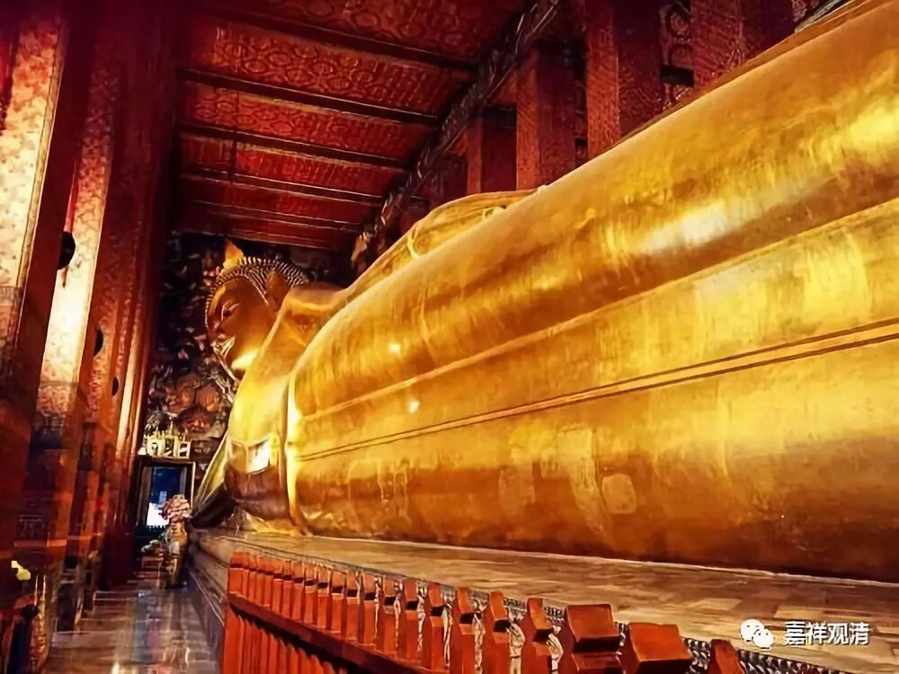

**卧佛寺——泰式按摩的鼻祖**

在泰国，寺院就像一所所学校，是传承多种文化的纽带，包括很多世间技艺，也是在寺院传承与发展，比如泰拳，比如按摩。

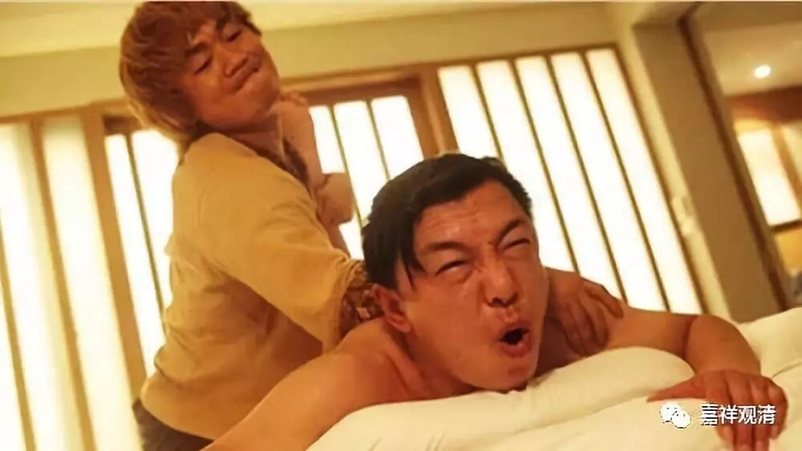

** 《泰囧》里也出现了泰式按摩。**

泰式按摩现在已非常有名，可是要知道，它的出处是泰国的一所著名的寺院——曼谷的卧佛寺。

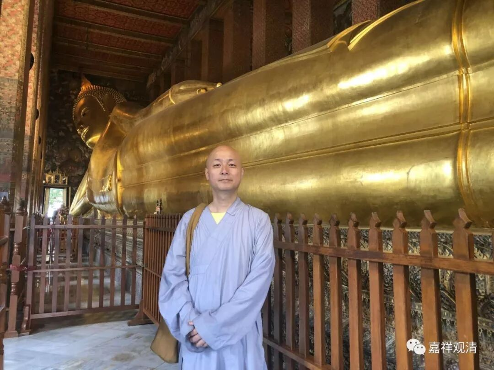

** 卧佛寺的大卧佛**

卧佛寺最有名的显然就是那尊大卧佛，还有，就是他的按摩学院了——他是泰式按摩的摇篮。

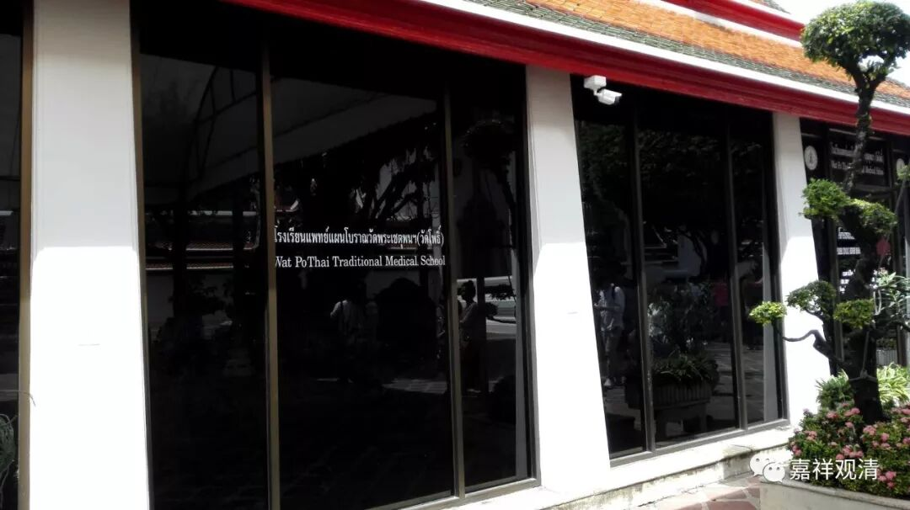

** 卧佛寺的按摩学院**

其实泰式按摩的背景和从印度传过来的医学、瑜伽的传承有关。据说在卧佛寺，原先教授瑜伽术，而瑜伽里包括了被动瑜伽和部分医学内容。于是慢慢地，教授瑜伽的卧佛寺变成了按摩的教学机构，慢慢地整理出了按摩的教材、技法……并不藏私地，他们专门盖了一个建筑，把按摩教材画成壁画，让大家学习，那些瑜伽体式，也做成雕像摆在寺院里面……不过，大家还是偷懒地直接去学院按摩——据说要提前预约哦。

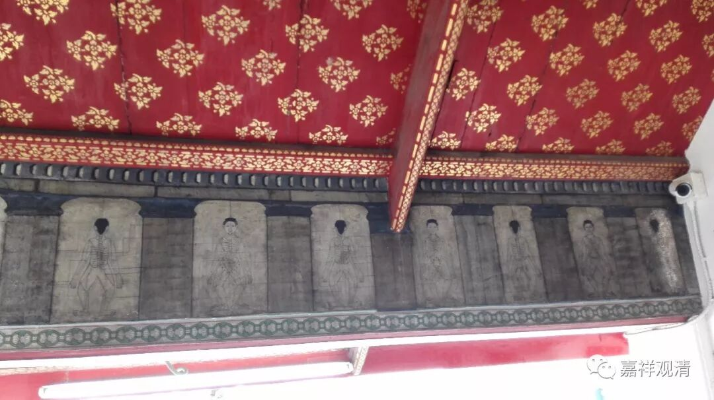

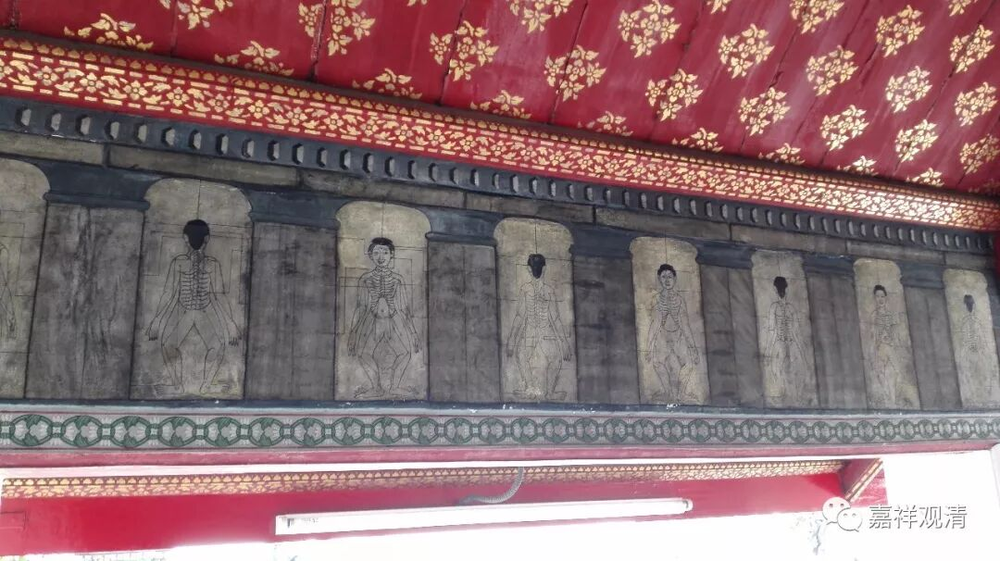

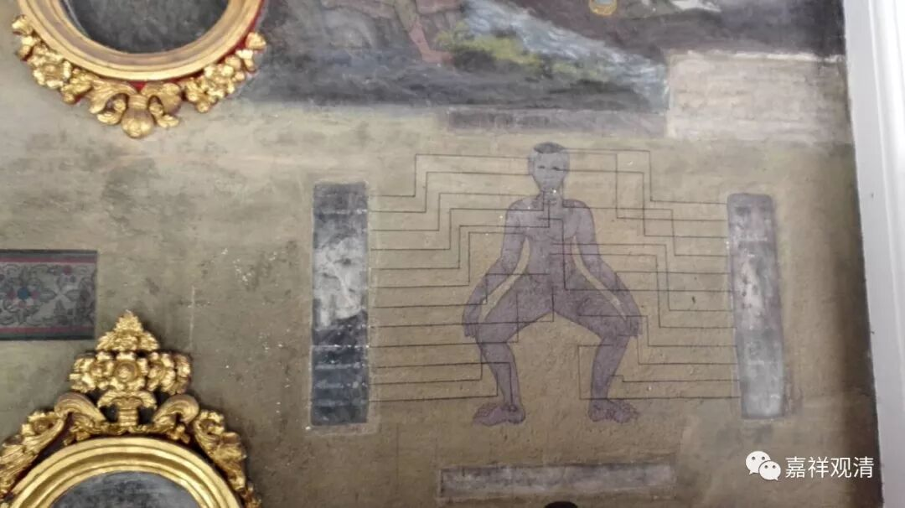

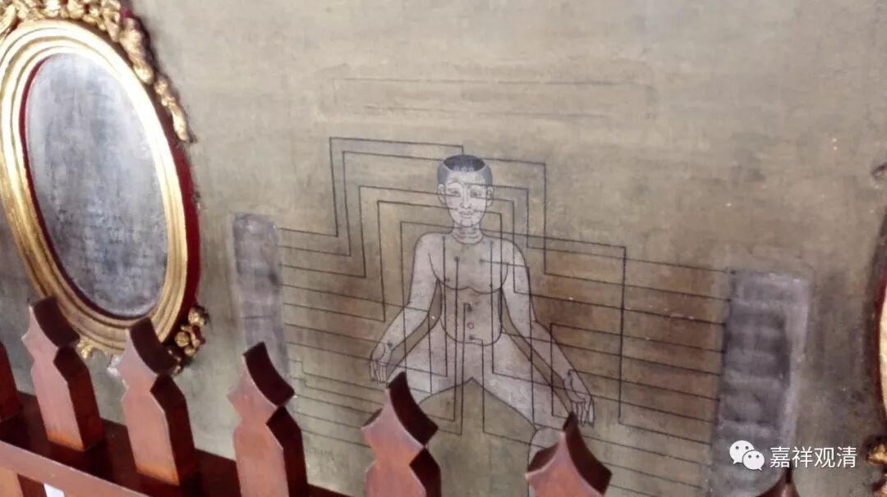

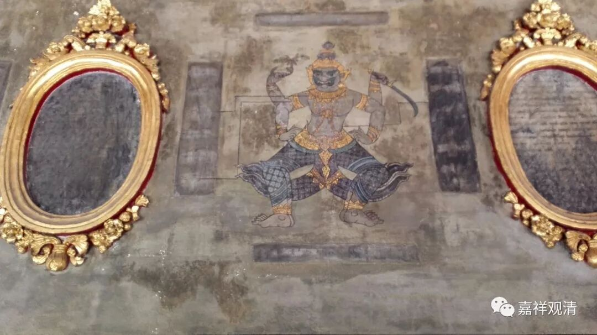

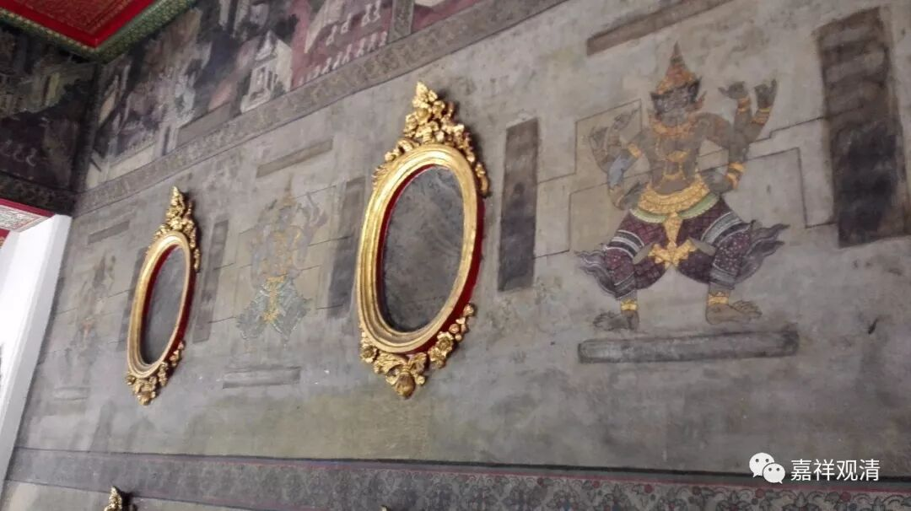

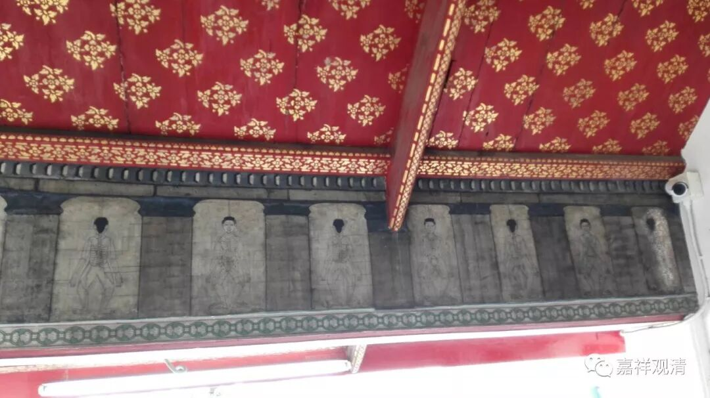

** 按摩图谱壁画**

 今天宾馆的网络不太好，不如前两天大学里的网络，今天图片又多，发得不爽快……

