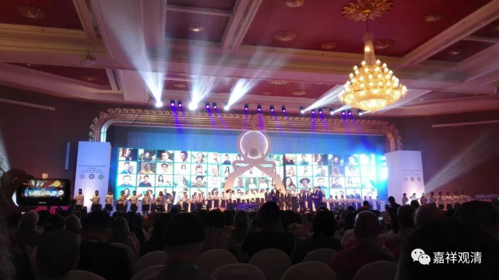

**泰国纪行（四）**

** 一不留神搞大了**

**
**

应邀来泰国参加佛教会议，原本以为就是一个佛教学术论坛，一不留神，参加了一个联合国级别的佛教大会——原来我们的佛教学术论坛是大会的一个分论坛（当然是最学术风格的，都是硬货）。

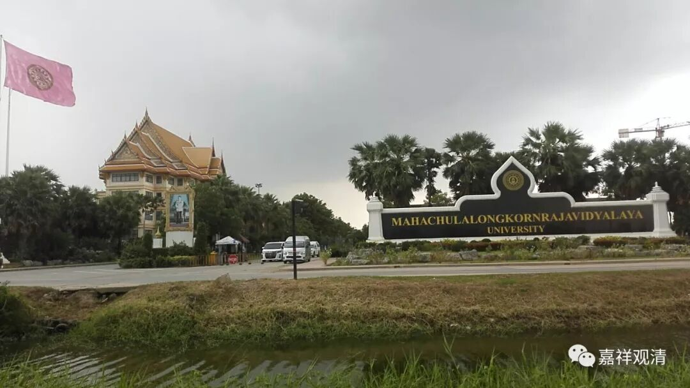

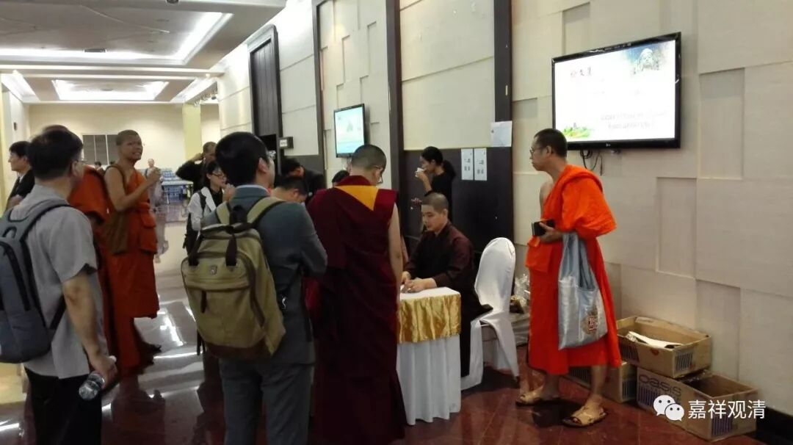

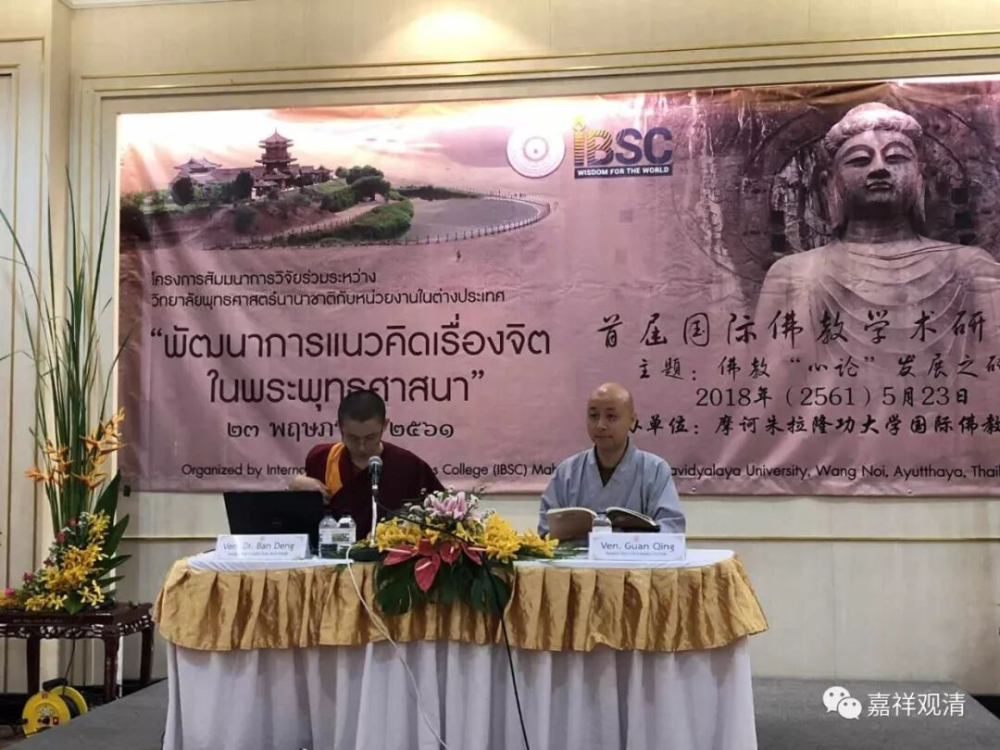

会场设在摩诃朱拉隆功大学

我们分论坛的名字是“首届国际佛教学术研讨会”，主题“佛教‘心论’发展之研究”。我的论文题目是《心所分类定型史》，前几天已经在微信公众号平台连载过了。

从上面会场风格来看（和之后的主会场对比），我们还是蛮低调的。

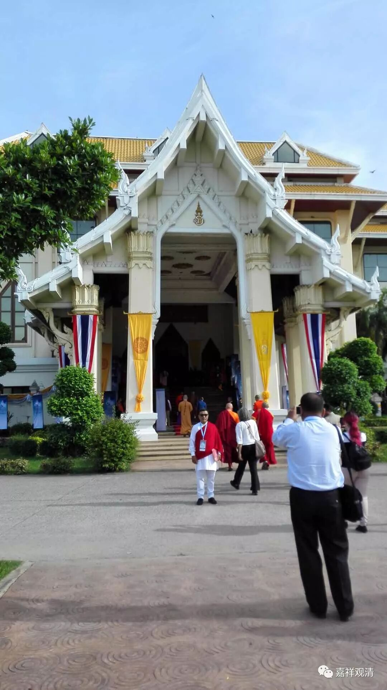

** 今天会议的主会场
**

大会的名字叫——

** The 15th United Nations Day of Vesak Celebration 2018**

2018第十五届联合国卫塞节庆祝日

** Theme: “Buddhist contribution for Human Development”**

大会主题: "佛教对人类发展的贡献"

来的都是——

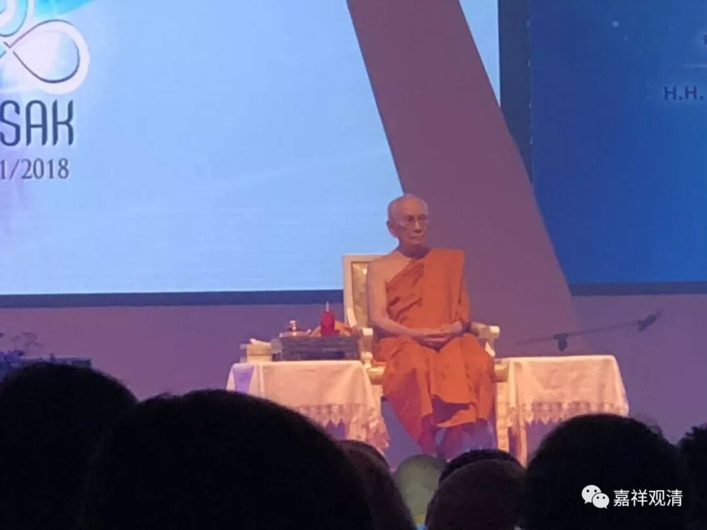

** 泰国僧王**

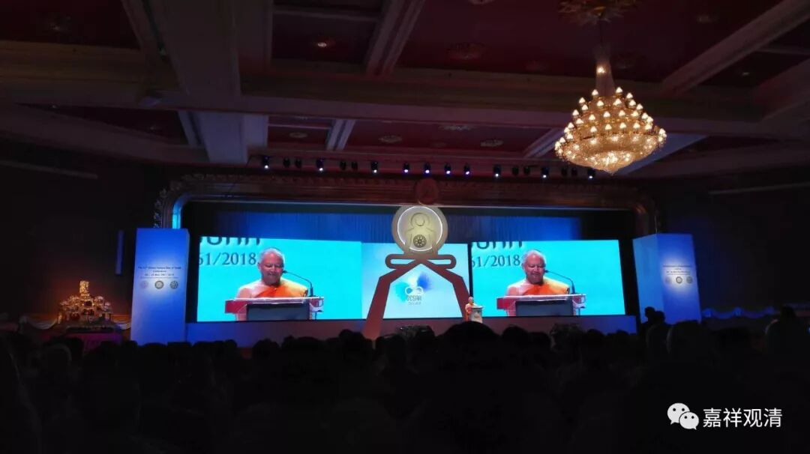

** （皇家）摩诃朱拉隆功大学校长梵智大长老**

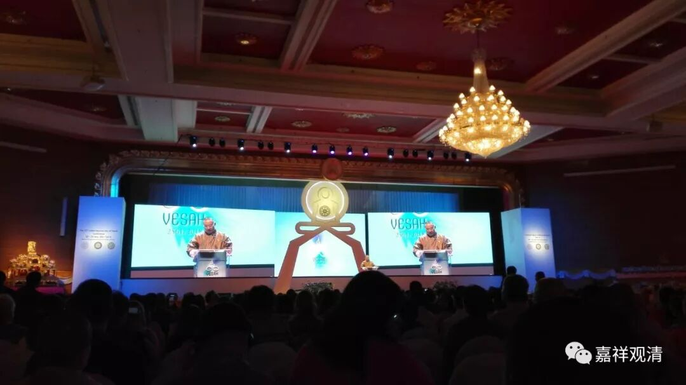

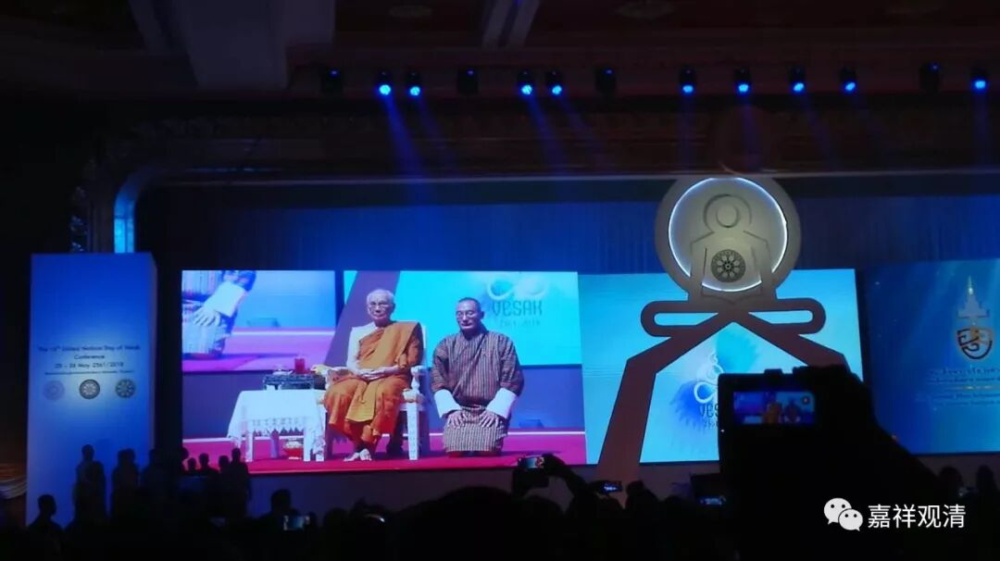

** 不丹总理才让多杰**

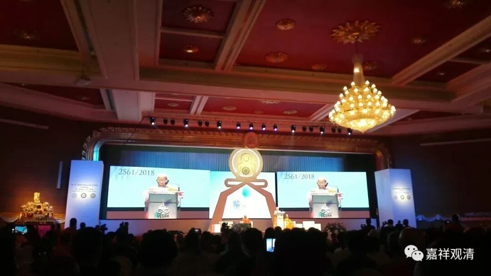

** 柬埔寨僧王**

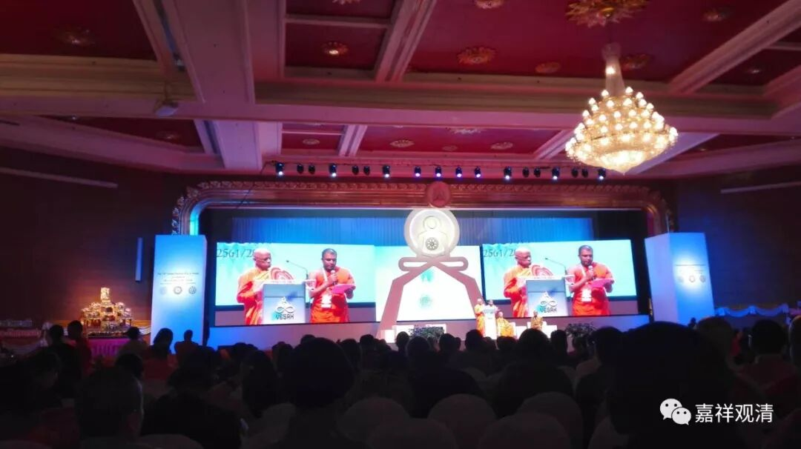

** 斯里兰卡僧王**

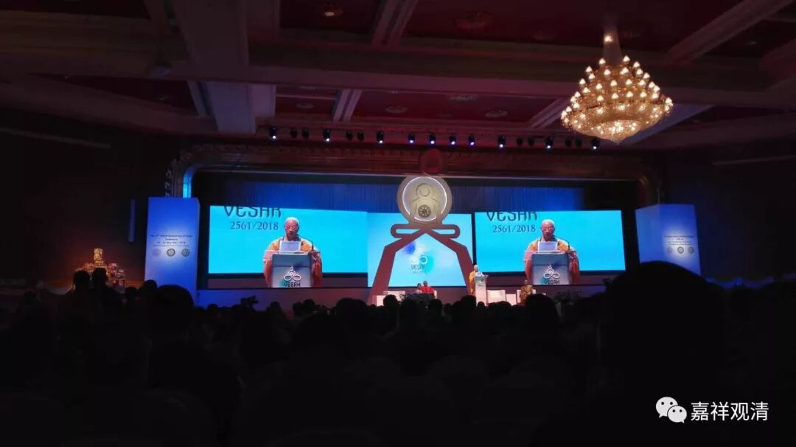

** 越南僧界领袖**

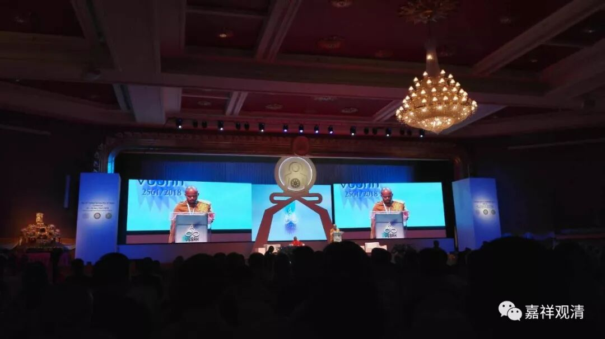

** 等等……（不好意思，上面这位大师是哪个国家的忘了）**

**
**

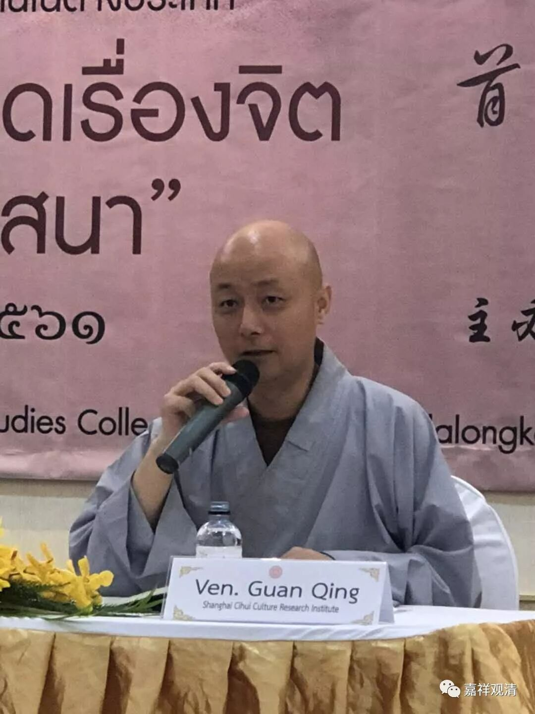

** 观清大师（哈哈哈哈……）**

 ……

今天还有泰国国王代表、皇室成员及泰国副总理出席，我们低调地抽身了……

后天，泰国总理巴育·占奥差、联合国亚太经社会执行秘书--联合国秘书长古特雷斯安东尼奥、教科文组织总干事伊莲娜博科娃都会与会致辞。我向来低调，就不占用大家时间发言了。到时候再直播……

今天我们几个参加学术论坛的弟兄们都说：一不留神，参加了个高规格的大会……

