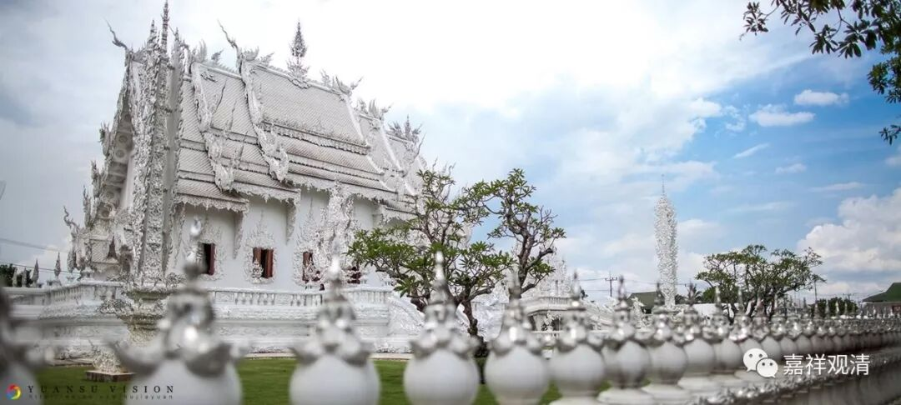

**《菩提速道》051（下）**

** “《时轮根本续》中说：**

** ‘嗔师刹那数，即摧尔劫善，’”**就是这么多刹那劫的善根。** “‘如是数劫中，当受地狱苦。’”**有这么多时间的地狱的果报在等着你。吓死人啊！这么多劫的善根都被摧毁了。

** “就是说，若于一刹那间嗔恚上师，则摧毁一劫中所集的善根，当住地狱一劫的时间受诸大苦等。如此类推，乃至百劫。**

** 另外，功德未生起者不会生起，已生起者渐趣泯灭，而且是一年年、一月月、一天天，乃至朝夕间，损耗殆尽。”**

** **

就算你在师父那里学了很多东西，最后你嗔恨了师父，也对师父所讲的很多东西产生了怀疑，那么你以前所获得的这些证德确实都会退失，因为你对于所学的这些东西都不相信了。所以从某种角度上来说，某些活佛们如果出了大事，会造成很大的法难，也是一样的道理。你以前做了很多的事情，你以前说的其实都是正法，但是你一旦出现了大的问题，比如说还俗等等，你的教区就会对整个教法产生怀疑，而如果对整个教法产生怀疑之后，已经生起的功德都会退失，没有生起的功德也就不会生起。所以有时候，大的活佛们真的是要为众生或者为更多的人去想一想。诶，我们怎么说反了呢？应该在说我们，是吧？我却追究到上面去了。这是在说我们……

** “若问：‘那么，弟子应当如何观待阿阇黎呢？’”**“观待”，就是观察、对待阿闍黎。

** “如《金刚手灌顶续》中说：‘秘密主，然当云何观阿阇黎？当视如佛世尊。’”**应该把他当作佛一样看待。

我们现在应该是做不到的，主要是我们对佛也不怎么了解，即使佛出现在我们面前，我们所求的东西可能也挺怪的。假如告诉你，在你面前真的是佛，大家也全都确定是佛，你也确定他是佛，恐怕你会请求的是：“佛，请你帮帮忙，我的儿子咳嗽到现在都好不了，你能不能帮帮忙？有什么密方吗？”“我需要多少多少银子”……很少有人会想“我要解脱”或者“我要发菩提心”……因为我们对佛的理解就这么点，所以我们能够获得的加持也就这么点。那么，我们对师父的看待是这么点，能够获得的加持大概也就这么点，一样的。

其实，现在这个阶段，对大家来说，视师如佛现实的做法就是——听师父话！

