**泰国纪行（五）**

** ——不可战胜之城**

今天参观了我们的驻地——阿育塔亚（AYUTTHAYA），AYUTTHAYA是不可战胜的意思，今称大城。

阿育塔亚（AYUTTHAYA）原先是泰国的首都，它四面环水，实际是一个岛。首都虽取名“不可战胜”，历史上却被缅甸战胜过多次。这是因为，泰国和缅甸虽是邻邦，却是世仇，双方数百年来大战多次，小战无数，虽互有胜负，但这些胜负多次达到几乎（甚至已经）亡国的地步，今天的大城古迹多处留下了战争的痕迹。

两百多年前，缅甸王朝第五次攻陷阿育塔亚城，这次不仅令大城王朝灭国，而且对阿育塔亚的破坏和掠夺比以往更严重（据泰国人的说法）。即使交战的双方都是佛教国家，大城众多壮丽的佛寺也未能幸免，据说寺院的黄金被洗劫，诸多寺院被付之一炬。今天阿育塔亚Ayutthaya还处处可以看到劫后的遗迹……

只剩下无常的痕迹

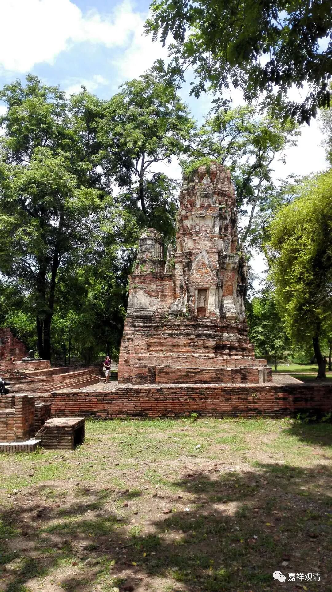

依稀还看得出寺院、佛塔的样子

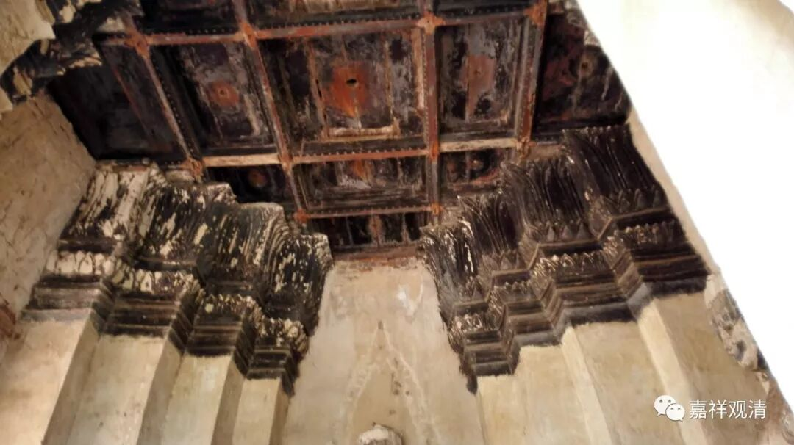

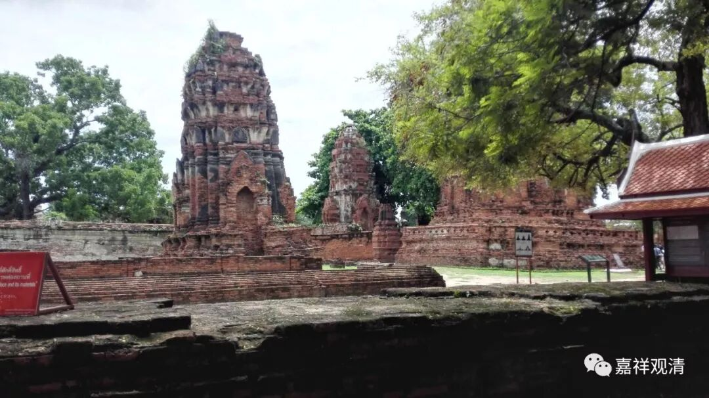

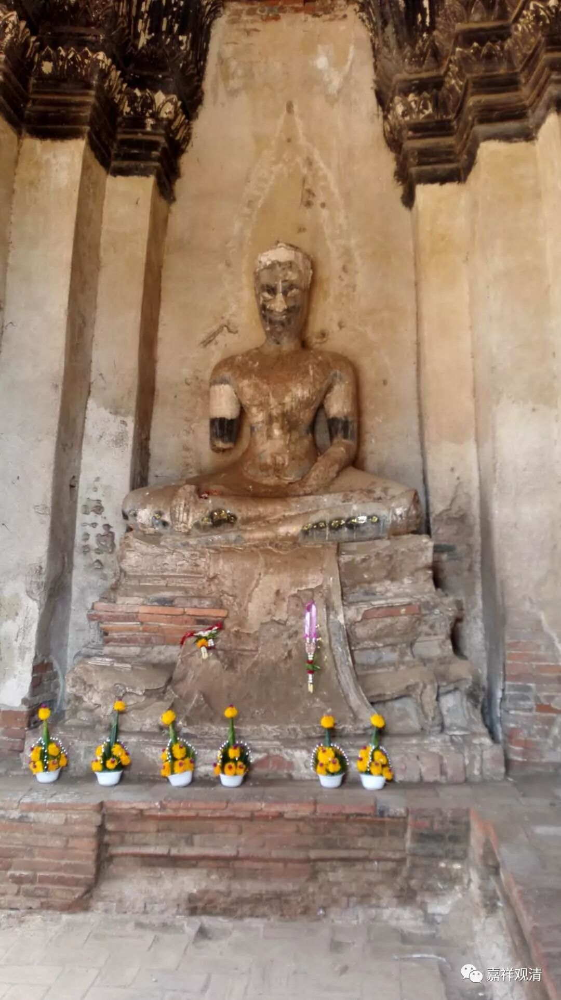

信仰让位给了仇恨

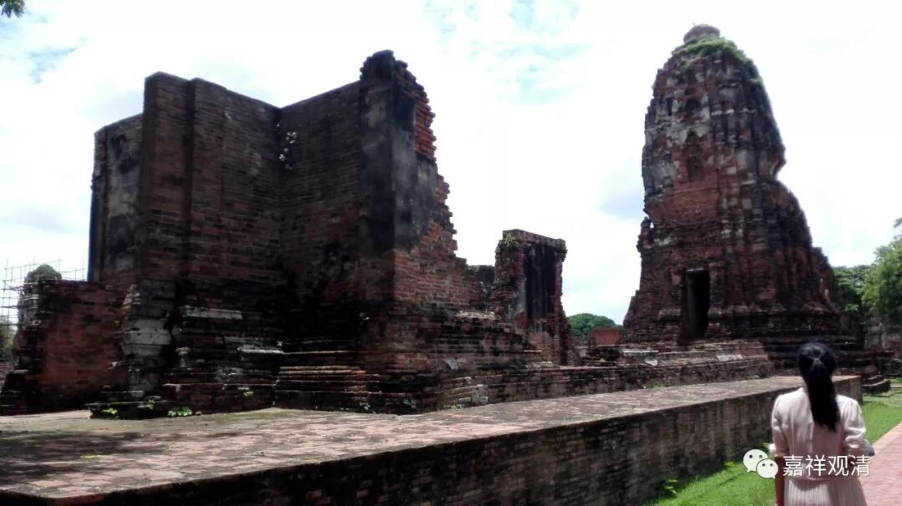

只怕这样的“历史”更深地刻下了仇恨

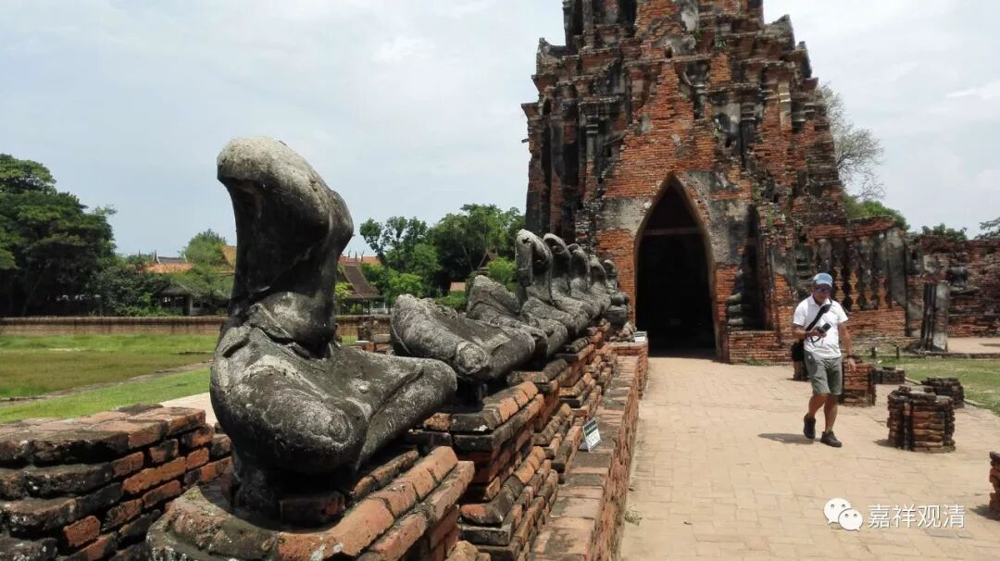

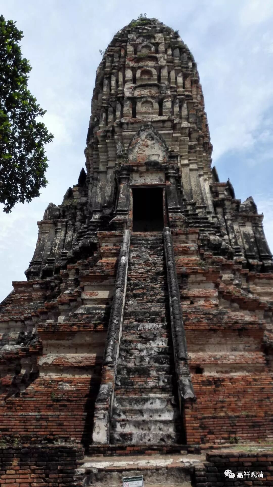

也许这就是佛陀的启示——所有辉煌必将无常！

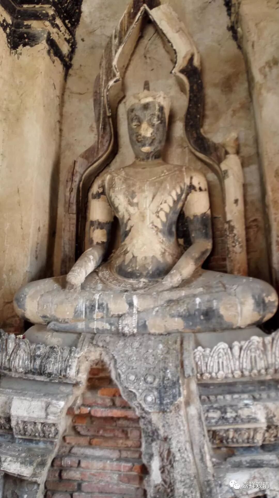

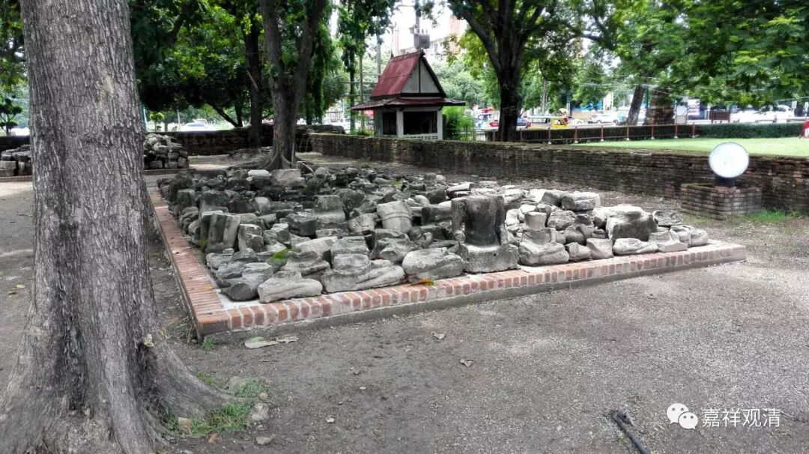

两百多年未能清理的古迹

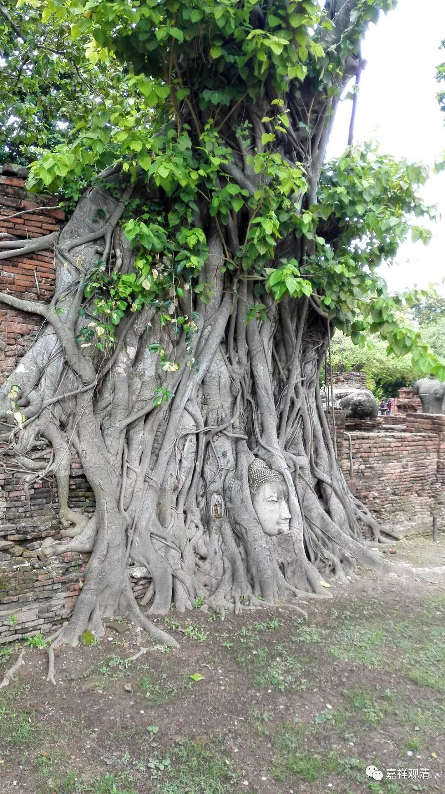

头像暗示着什么？

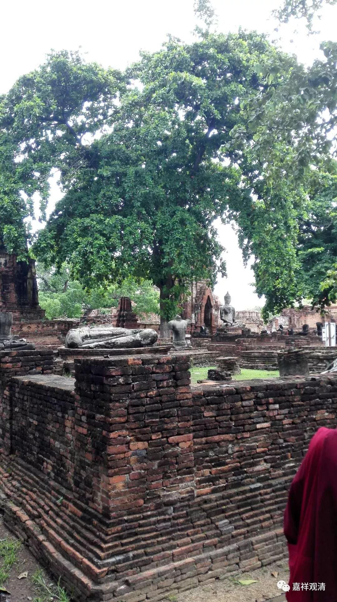

烧毁的痕迹……

我们不禁感叹，历史的黄页上写满了贪婪和仇恨……

此后，由于阿育塔亚实在被毁严重，后来的泰国遂定都今天的曼谷Bangkok。

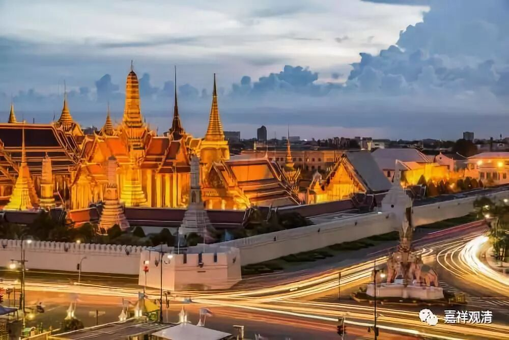

再后来，泰国转败为胜，这和一个汉人有关……

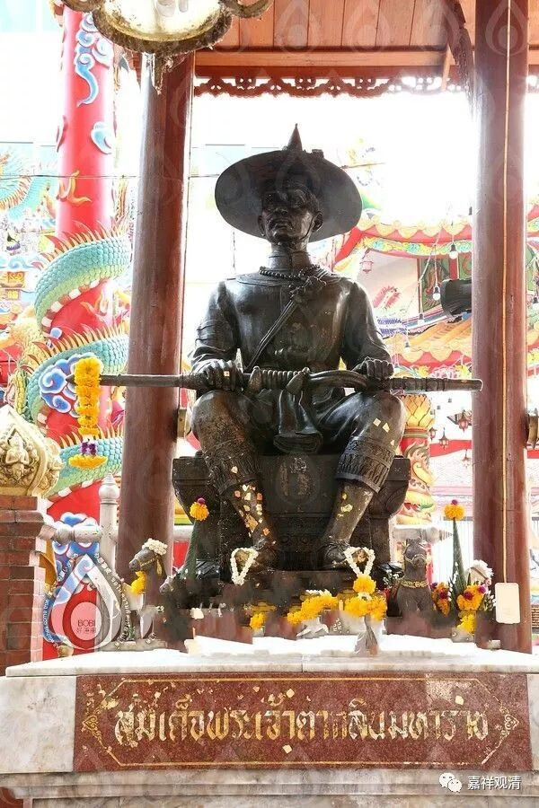

