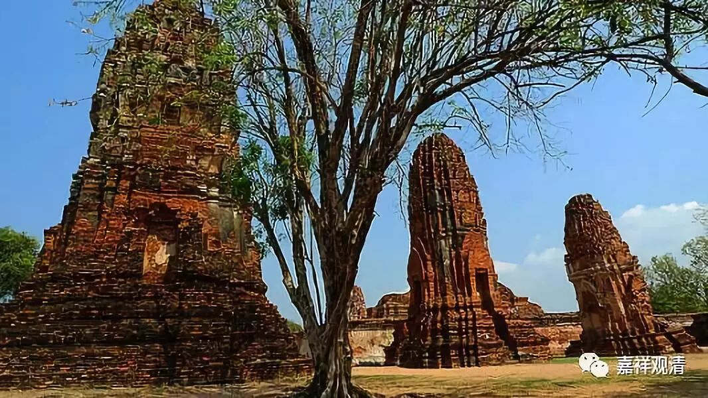

**《菩提速道》052（下）**

** “另外，《念住经》中说：‘一切贪嗔痴的根本，即是恶友，犹如毒树。’”**恶友，是一切贪嗔痴的来源。这个恶友，就理解来说，其实不见得真正都指向人，引发贪嗔痴的，都可以把它当作是恶友、恶知识。

** “《涅槃经》中说：‘如诸菩萨，怖畏恶友，非醉象等；此唯坏身，”**菩萨怕遇到恶知识，对“醉象”等并不太担心。（醉象，就是疯了的大象。）“醉象”呢，唯独坏你的身体，也就是最多把你踩死。** “前者俱坏，”**前者，恶知识，却既能坏你的身，也能坏你的慧命。把你扔到地狱里面去的就是这个恶知识，当然还有你自己随顺恶知识的心。

你真的要说的话，应该是外因通过内因起作用——马克思讲的非常好，这个就是缘起论啊！你不能只怪对方，对吧？即使有外因，你自己内因不起作用也没所谓嘛。马克思菩萨，他有好几个观点我都很接受的。比如，“人是一切社会关系的总和”，说得多好啊！人是什么呢？他就是这些社会关系——大家共同认同的这样一个人总总社会关系——的总和。

他还说，我们现在这些繁荣的背后是自私，现代经济学是建立在自私的背景下的，马克思说这个是有问题的，这个“贪”的背后是会造成崩溃的。我们前两年不就是因为金融大鳄们的贪心，导致金融危机，整个世界的经济都出现大的问题吗？马克思是菩萨来的吗？所以把他的画像挂在那里，大家都礼拜嘛。

而且他拒绝经营，是吧？他炒股炒得很好啊，但后来他不炒股了，花大力气写了《资本论》。他真的很伟大，他预言了世界的发展，今天的机器人技术、AI的发展、大数据的运用……如果能加上教育的推广，贪嗔痴的对治，那我看共产主义——各尽所能、按需分配——就会以科学和社会、人心进步的方式实现了！

