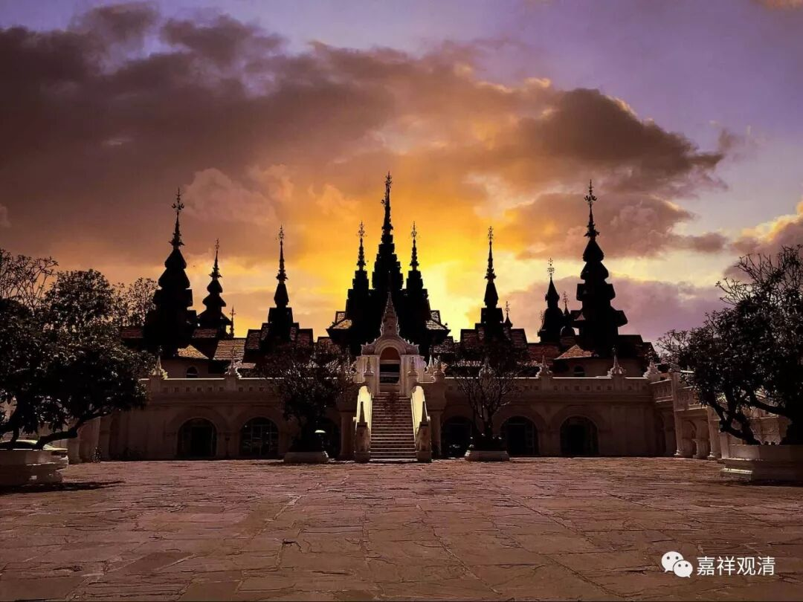
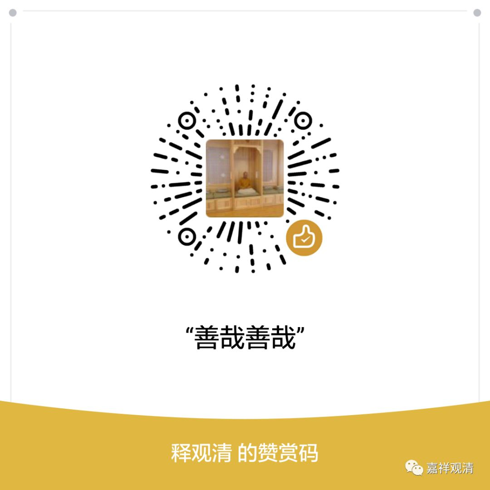

**《菩提速道》讲记053（上）**

中国的农民工其实根本不是无产阶级，他们是有生产资料的，他们跟美国的无产阶级——工人，是完全不一样的。中国的农民回家照样可以耕地，可以拿着在城市打工的存款，在农村中打五年麻将、十年麻将都不成问题的。等经济好些了，他还可以再出来。他们不是无产阶级，所以中国的经济情况和美洲、欧洲的西方发达国家的经济背景其实是完全不一样的。

中国所谓的农民工下岗等等，全是可以消化掉的。真正的无产阶级应该是不占有生产资料的。我们大概可以算小资。生产资料没有，调调已经往那儿靠了（哈哈）。大学时候有一次去见教我们佛教禅定的老师，我代表兄弟们去的，好像是替“峰师父”出头，他不敢去……老师批评我们这堆大学生“理想主义、小资产阶级思想”，回来路上，陪我去的某某终于爆笑——在老师面前憋了半天了都。我说“我都快农民工了咋还小资了？说我小资不承认。”人笑着说：“说的非常对，你们就是小资调调……”“哦，小资调调，大概有点吧……”

** “如《亲友集》中说：**

** ‘无信而悭吝，妄语及嫉妒，**

** 智者不应亲，勿共恶人住。’”**

** **

在我们水平很差的时候，不要跟恶人在一起。等你水平高了的时候，随便跟他们在一起，就是你变成他们的善知识了嘛！当然，我们每个人对自己的期许都很高，都觉得自己是去度众生的，而最后却被众生所度，是吧？

** “‘若自不作恶，近诸作恶者，**

** 亦疑为作恶，恶名亦增长。’”**

** **

你就算自己不作恶的话，你去跟这些人在一起，江湖上的名气也差了。

所以，我们这样的人在目前这个水平，还是应该洁身自好。有人就说我清高，包括还有活佛也说我清高，我这是有原因的。江湖上有很多假活佛，你跟他们混在一起，多丢面子啊！内心也会很抗拒啊！汉人知识分子还是很抗拒同流合污的。我觉得藏人好像不是很在乎，已经知道他是假活佛了，还跟他在一起嘻嘻哈哈的，一般也不捅破。可是我们真的做不到啊！江湖上的名气也会差——“谁谁谁跟某某假活佛在一起，两个人一起在外面混。哎呀！一定也不是好东西。”你就是不作恶，别人也认为你是作恶的。就是这里的“若自不做恶……恶名亦增长”，就是这样的，所以一定要洁身自好。

