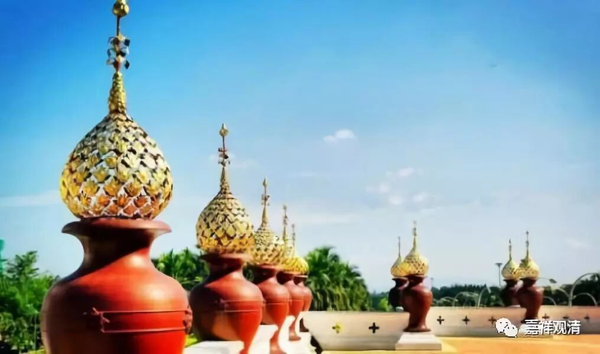

**《菩提速道》053（中）**

** “善知识敦巴说：‘下劣人与善友共住，不过达到中等，上等人与下劣人共住，不用费力就成为下劣之人。’”**但是这里面不是有矛盾吗？按照对等的思路，一方面说我们要跟上善人在一起——我们会提高；一方面又说上等的人和下等人在一起，他不励力地就会下堕——那我会害了他……那这个事情到底怎么处理呢？这就是个话头，大家可以参。

** “戊三、意乐依止，分二：”**前面的“加行依止”是你该干的，后面的“意乐依止”是你该想的。为什么把该干的放在前面，把该想的放在后面呢？前面你虽然做到了，但是你必须要领会精神，你把精神全部领会了，自然就会把前面的做好，你的行为就会做到。如果你的心里面没有把自己催眠到位的话，你是做不到的。

** “己一、修信为根本：**

** 在面前清晰地观想诸位善知识后，思惟：**

** ‘我的这些善知识，其实是真正的佛。’”**哇，这个催眠的！他们其实是真正的佛。** “‘如圆满正觉的佛陀在诸多大宝密续中开示说，胜者金刚持在浊世示现为善知识的身相，以饶益有情。因此，我的这些善知识确确实实就是真佛。’”**

我觉得这个话不周遍，佛陀有在师父当中，但不代表所有的师父都是啊！问题是，你知道谁是谁不是吗？这里的逻辑实际上是类似蒋介石的逻辑——“宁可错杀一千也不放过一个”，我绝不能放过一个，所以，我不能放过这一千，对吧？看来蒋介石依止善知识学得很好啊。师父里面有佛，所以我要他们都是——这样不会漏掉，是吧。

