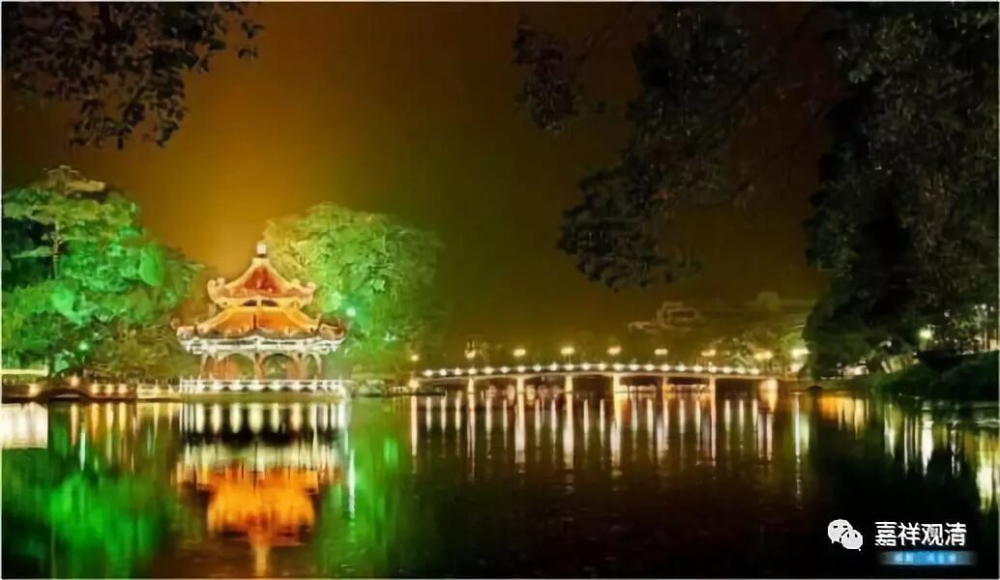

**《菩提速道》054（中）**

** “有一次玛尔巴尊者睡在那若巴上师前，黎明时分，上师在天空中变化出喜金刚本尊能依所依的坛城，对玛尔巴说：‘法智，玛师，我的孩子，不要睡了，快起来！你的本尊喜金刚能依所依的坛城也已经降临到了面前的空中，你是向我顶礼，还是向本尊顶礼呢？’”**

** **

这个时候，人家正睡着呢，你把人家叫醒，人家正懵着呢：“啥事体？”就是为了考验他，故意变的。“孩子”的头被摸着还不知所措呢：“师父想干嘛？俺师父想干嘛？”

** “当玛尔巴向本尊欢喜金刚坛城顶礼时，那若巴上师说：‘未值上师前，佛名亦不闻，千劫一切佛，依师而出生，本尊乃师化！’说完，把坛城收摄融入心间，上师说：‘由此缘起，你的父子世系传承不会长远，但这也是众生的因缘所致。’”**

** **

这是一个著名的公案了……但是，这个冤不冤啊？当时玛尔巴就是没睡醒嘛，如果睡醒了，就应该说：“师父啊，我认为他就是你啊！”那后来的克珠杰不就是这样嘛，他看到的某个骑着狮子的很奇怪的形象，他也认为是宗喀巴大师，他就说：“师父，我认为他就是你啊，你们无二无别啊！”

看起来就是他师父先设了一个局，让他跳进去了，然后他的世系就不会长远——这是一个故事。其实中国有很多话真的蛮有道理，特别是像西藏的这些故事，以汉地的观点来看，就很轻松。一个就是，我们前一段时间一直在讲的，“亮独观其大略”，是吧？“崔周平勿求精熟，亮独观其大略”——知道他们有这么一个说法，这样也就可以了，领会精神，“抽象地继承”。也可以说，这是“理有固然，事未必然”。道理上可能是这样的，但实际上未必真有这个事情，这个事情，可能更是一个小说、演义。……我们好像造反得有点多哦。

以我中观顺唯物主义者的看法，实际的真相是：马尔巴的儿子醉后骑马意外丧生事件，引发出了一连串的故事版本：有些从因上讲，比如这里马尔巴顶礼坛城的故事；有的从功夫高低上演绎，于是有了热罗大师修诛法的故事；有的从结果上展开，比如马尔巴之子死后夺舍一只鸽子然后到某地转世为某大师……这些都是想解释一场意外。

