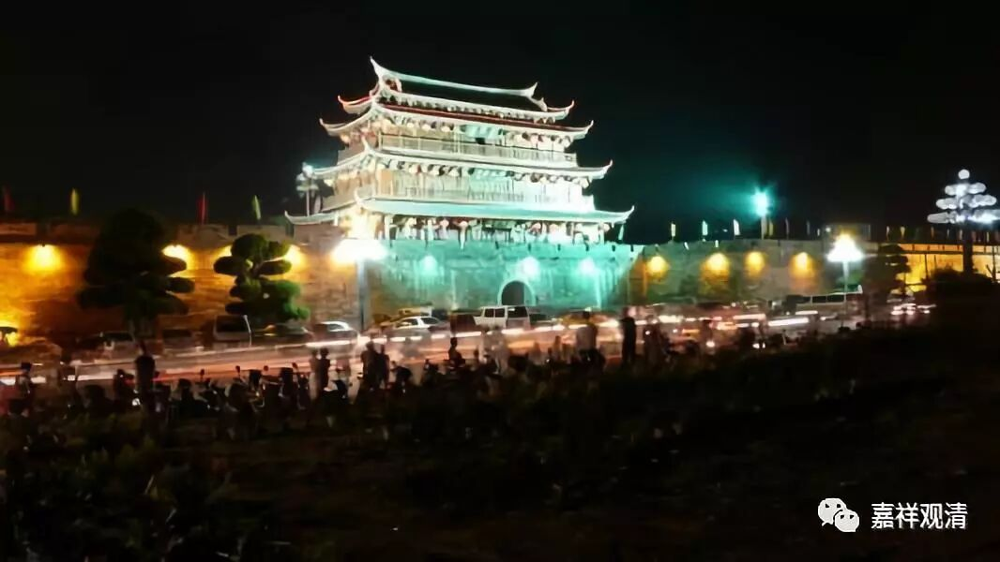

**《菩提速道》055（中）**

那么，如果你拜了师父后，就跑远了，你又得不到很好的加持。有人说，“那我拜完哪个师父后，就赶紧学哪个法，学完赶紧跑，不要一次把学习的目标定那么多。”但是记住有一点，你不要以为你这么聪明，不要以为我可以把所有糖衣炮弹的糖衣刮下来，然后把炮弹都扔回去。每个“聪明”的人都是这么想的，结果失败的就是他们。我们真的把自己想得太聪明了，实际上这个真的很难做到。所以，今天这个时代，依止师父真的不容易做好呢。

虽然我说话人微言轻，但是我真的祈求这些在外面弘法的善知识们，不要过分地考验我们，我们这些人的水平其实是很差的。请你们至少把几条大的根本戒守守好，至少让我们多看到一点正面的东西。这个世界负面的东西已经太多了，还是多给佛教争一点光比较好。当然，我们自己也尽量要做到。否则真的是太考验了，太累了，对吧？出现这种破戒的情况，难道我要观想面前的上师，肚子很大，身上爬满了七个孩子？

** “这是由于自己的显现没有清净的缘故。”**怎么看这个问题呢？这是我的错，这是我们的错。为什么呢？是我自己的显现不好，是我的眼睛的问题？海涛法师就讲：“……门一开，看到了什么什么事情，那就是我的错，是我的眼睛的问题。这是我错了，业债深重！”（这里是开玩笑，是正话还是反话，自己读读看咯……）

当然了，所有的事情都是果，所有的果都有因。如果有问题的话，这完全是自己以前的因的果的表现，这是必然的。那么，从某种角度来说，海涛法师讲的也没错，先不说眼睛对不对，至少是你自己以前所造的业，这点应该是对的。但是把自己催眠成傻瓜，也亏他也想得出来。

** “在过去，也是由于自身显现不清净的缘故，善星妄见佛的一切行为都是虚伪狡诈的行为；”**有一种说法，说善星比丘是佛的儿子，也有说他是佛的儿子的一个。我查了南传的史料，佛陀是称他为“我的孩子”，当然没有直接指向说就是他的儿子。但是在汉传的一些说法里，就说“善星也是佛的一个儿子”，至于具体是不是，我也不敢说。

善星比丘和罗侯罗尊者都是佛的儿子，都是他亲生的，差别就那么大。有时候就是一转念之间，有时候就是被带坏了。一个就看到他的爹是“都在骗人”，另外一个就看到“爹的修行很好”，就是这样的情况。

真的，很多事情就是转念之间，一个仇人变成恩人，一个恩人变成仇人。也有的时候一转念：“原来他那么长时间一直这样对我好啊！我一直都没感觉。”对吧？电影里经常都是这样的，那些恋爱的片子里很多都是——原来最好的朋友在他身边，关注了他这么久，他一直没有注意到。是吧？

所以，这是由于自身显现不清净的缘故，善星妄见佛的一切行为都是虚诈的。说的是“自身显现不清净”，其实是自心分别不清净！

