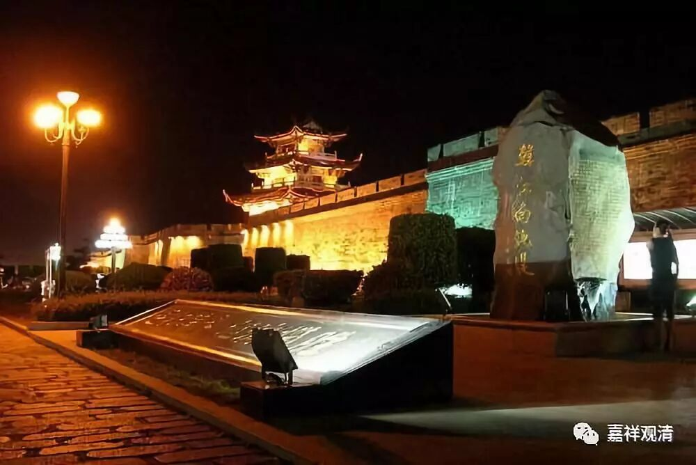

**《菩提速道》055（下）**

** “无著见至尊弥勒是一条母狗；”**无著菩萨有个故事，说当时看到的弥勒菩萨是一条母狗，坏人也看到的是一条母狗。** “梅者巴看见瑜伽自在夏瓦热巴作着杀猪等残忍的行为；”**他看到的是杀猪。** “那若巴看见谛洛巴作着烧烤活鱼等疯疯癫癫的行为；”**这在另外一个版本中不是这么说的，说是在吃刮下来的鱼的内脏。

** “沙弥柴吾瓦看到金刚亥母为一个麻风女人；金刚铃尊者看到金刚亥母为一个牧女；阿阇黎佛智看到阿阇黎妙音亲显现为袈裟缠头正在耕地的在家僧人相。”**“袈裟缠头”，就是看起来就是经营在家的事业。

** “大商主子善财童子依大仙胜暖处的教言，前往国王火处学菩萨行，正碰到国王火在审理案件，看见国王坐在高大的宝座上，万名大臣以及犹如地狱狱卒般可怕的刽子手，正在对犯人行着挖眼珠剁手足等酷刑，心想：“这个国王火没有善法，唯造恶业，哪里会有菩萨行呢？”这时空中诸天说：“你不记得大仙胜暖处的教言了吗？”**这段是《华严经》里面的内容。

** “善财于是绕王三匝，国王将他领入里面，说：‘我已证得菩萨解脱幻化游戏三昧，在我国土上的人多行种种不善之业，我向他们示现幻化的刽子手，杀死幻化的犯人，令我国中的人们怖畏恶业，生起有力的厌离心。’”**

** **

这是一种化现。不过读到这里的时候，我这种知识分子又开始有其他想法了，就是他对这个国王火生起信心的依据是什么呢？是基于一种神秘现象——空中的天人向他暗示“这个是菩萨”。也就是说，这么大的一位菩萨——善财童子，他都需要靠神圣境来指点他。而他是怎么判断空中的声音就是真话呢？经典里很多地方都听到空中说blablabla就相信了，比如《般若经》里的萨托波伦菩萨，为什么呢？（知识分子好难度呀……）

** **

