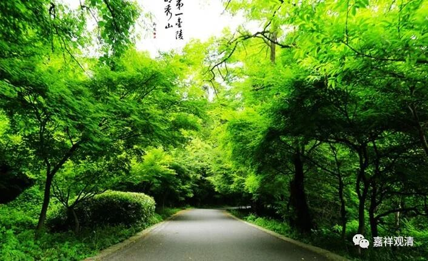

**《菩提速道》056（中）**

我也相信佛菩萨可以表现为这种情况，那么，在经典当中这个也是可以成立的，完全没有问题。佛菩萨、天人既然存在，他们总得闹出点动静来吧？他们肯定有各种不同的方法，就是不同的教化方式，也确实我不见得每一个都懂。如果他们的所有东西我都懂的话，那我比他们厉害多了！就像那天我讲过，根敦群培说对他的师父喜饶嘉措说：“你讲的东西我都懂。”这就说明他自己认为比喜饶嘉措大师厉害嘛。假如佛菩萨的每一步我都能看破，就像下围棋的时候，对方的每一步我都看破的话，我比对方高了不是一点半点的了。我承认我真的不是每一步都看得破……所以佛菩萨和大师们的行为我经常看不懂。

** “圣者无著菩萨在《菩萨地》中说，菩萨可以夺取暴君的国政，自己如法地治理它。”**这个一般的人还做不到，真的做不到。这个在哪部经当中有呢？在《地藏十轮经》当中有、在《涅槃经》当中也有这个文字，就是“菩萨可以夺取暴君的国政”。这在菩萨戒里面也有，否则就是盗了。

** “过去理域有两位沙弥修习文殊本尊法，历经十二年不见本尊圣容，他们心想：‘这位圣者悲心也太小了吧！’这时文殊降临空中说：‘我与你们因缘不深，’”**大概文殊菩萨自己也实在熬不下去了：“这两个人居然敢小看我？”然后他出来说：“我与你们因缘不深。”

** “‘大悲观世音菩萨现在受生为雪域法王松赞干布，去他那里吧！’于是他们来到藏地，”**

呃，他们也不带一个翻译就去了。

** “在朵隆沟尾看到许多被国王治罪砍下的人头和手足，在旦波的帐篷间看到人头墙、眼珠堆和放置手足的刑房，惨不忍睹，二人心想：‘那个文殊应是魔变化的，这个藏王哪里是什么的化身，分明是杀人的魔君。’正准备返回故里，松赞干布王把他们召摄来相见，解开头巾，现出阿弥陀佛，说：‘我是西藏的观世音，你二人不要害怕。’沙弥问：‘那么，杀死这么多有情的就是大悲观世音菩萨吗？’”**

** **

这两个沙弥胆子也很大啊！不管对方是大魔王还是观音菩萨，他们居然敢这样质问，他们也是不怕死啊。估计在被松赞干布请进去的时候已经觉得必死无疑了。

