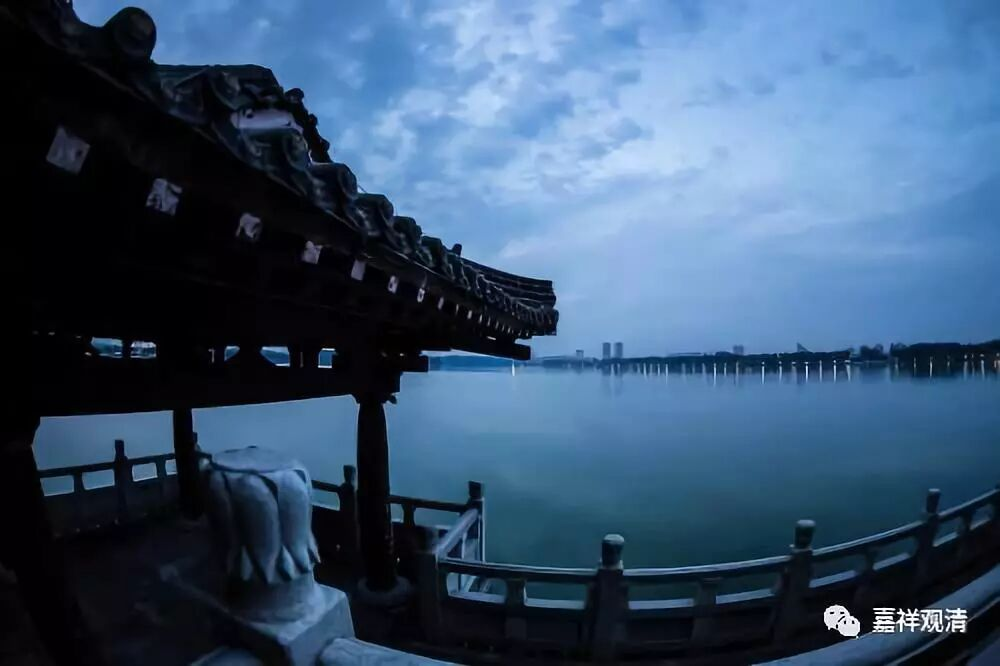

**“同样的道理，具相的上师令具相的弟子以四力的方式忏悔往昔所集将堕恶趣的不善业，防护今后不令更造，令唯求今生的荣华，转变为求取后世的义利，令求取人天果报的善根，转变为解脱及一切智的胜因。对于弟子而言，没有比这更为重要的事情，恩德的深重，也更无其他能逾越这位上师的了！”**

** **

这个师父呢，可以让弟子把之前错的都改成对的，把对的再改成解脱的，又把解脱的，改成究竟解脱的——这样的师父太厉害了！（当然徒弟也得听话才行。）

** “就像赈济施食救活那些为饥饿逼迫濒临死亡的灾民一样，我们的善知识，对于我们这些不能被诸佛菩萨及诸先觉亲自教导的众生，令学习闻思修的法则等，明白甚深道的窍要，恩德之大，邱山难喻！”**

** **

文字这么好啊！缘宗师厉害！厉害！

这些善知识如此地循循善诱，不容易啊！等到大家都做了母亲、做了父亲、做了老师，最后就会觉得了。其实做老师挺累的，做师父也挺累的，最轻松的就是那些不肯做老师的罗汉们，太轻松了：“我看着你们头都大了，累死了。反正咱烦恼断完了，我去山上坐着就算了。”——这样的最轻松。

** “考虑到这层意义，怙主龙树菩萨在《五次第》中说：**

** ‘自然薄伽梵，唯一天中天；**

** 亲授窍诀故，师恩较彼殊。’”**

** **

师父的恩比薄伽梵——世尊对我们的恩更为殊胜，在我们的面前直接给予教导。这个只是从某种角度上来谈的，并不是全部、全方位地进行比较。师父对于我们有直接的教导。

** “假如不能随念大恩，生起恭敬报恩之心，即使是文殊、观音亲自降临对自己说法，自己的心中也不会生起任何的功德。”**

** **

你可能还会认为：“文殊菩萨，那是你应该做的吧？你应该来度我的吧？”“观音菩萨，你咋这晚才到咧……”你可能不念他的这个恩德。但是，我们应该要念这个恩德啊！有时候想到太虚法师的那些说法，真的是挺好的——“仰止唯佛陀，完成在人格……”。他说：“你先要学会做人啊，如果连做人都不会做，那么后面的做师父、做徒弟就都不会做了。”

