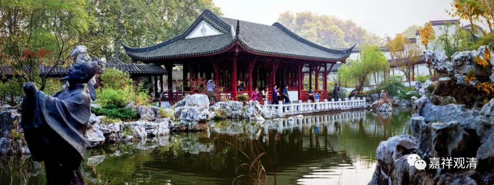

**《菩提速道》060（下）**

** “博多瓦的《蓝色手册》中说：‘上师加持力的大小，并不在于（上师是否）真实，而全在于自己，自己若报恩心及深深的信心，即使文殊菩萨、观世音菩萨亲临加持，也不会对自己有什么义利。但如果心存感恩及敬信心，上师功德虽不圆满，自己也会得到极大的加持，最关键的完全是自己的感恩及敬信心呀！’”**

** **

这个昨天也讲过了，师父的功德可能是这一点，而你的认知是这一点，那么就获得这一点加持。比如说，师父本来是100分，但是你认知到的只有20分，那么你就获得20分的加持。如果你认为是40分，就会获得40分的加持。如果你的认知超过了师父本身实际有的，比如你对师父的认知达到了200分，只要是正确的认知，那你就会获得相应的加持。

我们看佛菩萨的像也是这样，是吧？那也是会获得加持的，拜得好了以后可能真的会。“咦？这尊佛像我真的已经拜了很多了，突然看到佛像放光了。”或者，“咦？拜得多了以后，佛像面前出现了一粒舍利子。”拜佛像都可以有这样的好处，更别说在师父面前了。

** “其中又说：‘如果不恭敬上师，即使去依止无上圆满正觉的佛陀，也没有什么帮助。’”**

** **

因为你的心是那样的，即使在你面前换个人，也没什么用。到时候你也会在他面前生出种种奇怪的想法，奇怪的想法不满足，也会丧失“信心”的。

有个事情我已经说过好几次了，后来发现别的法师也碰到过这个事情，就是有一些弟子，曾经很可笑地以为师父是不用上厕所的。我是碰到过不止一个，但是最近两年才发现其他的法师也有这个经验，就是他们的弟子曾经认为师父是不用上厕所的。所以当那些弟子第一次看到师父去上厕所，会觉得自己差不多都快崩溃了。我可以给大家证明一下，我这里是专门有个厕所的啊。

** “‘说最为重要的即是：放下傲慢的架子，谦卑地恭敬上师。’”**

** **

就是把自己放到下面去。理论上来说，辩论也是一样的，是吧？辩论的时候也应该要尊重对方，把对方当作自己教学的对境一样，但实际上做起来有点困难。即使在西藏的辩论场上，理论上要把对方观想为文殊菩萨，是吧？但实际上很少有人能够做到的，只有极个别的人才能做到，一般都是做不到的。

还有一点，就是在修行的时候，你们不要对自己太苛刻了。在修行的时候，我觉得我们应该要保持一颗阿Q的心，给自己留一点余地，不要真的认为我花了时间、花了精力，就一定马上能够拿到100分。这个不太可能的，至少在短时期内是不可能的。不要急，慢慢来，“渐渐小小行”，一点点地来。

修行如果太苛刻了，大概就要得忧郁症的：“怎么还做不到呢？我这个人怎么这么笨？这么坏？”其实在一定的范围内，应该允许自己犯错。

总的来说，昨天讲的那个正知的心很重要，你要有不断地反省自己的心，反省自己的能力很重要。其实这个就是不放逸嘛，放逸就是你放弃了对自己的心的监管。

