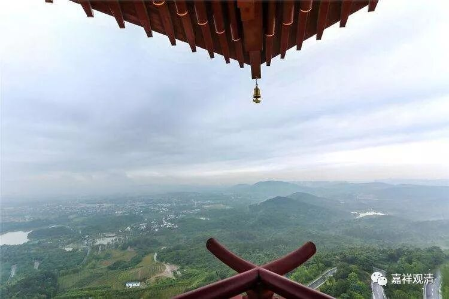

**《菩提速道》061（中）**

总的来说，善知识的恩德很大，确实如此。在心中生起定解的时候，就在上面安住一会。如果想到其它地方去了，有两种方式：一种是再想一遍，把这个内容重新再想一遍，然后安住在上面；还有一种是，既然已经想到其它地方去了，那就把之前所说的佛菩萨、师父都观想起来，然后观想甘露降净、去除障碍……就这样。

** “在此随念上师恩德的情况者，应当如是思惟：这位上师给我传授这种法时，纠正了我这样那样的种种过失；遮止了我这样那样的种种罪行；”**

** **

我们在思维这个内容的时候，可以把具体的事情想起来。这里的文字是“种种的罪行”，就是一个一个的，这个师父以前曾经怎么讲，然后遮止了我哪个罪行。这个时候想想自己这么不是东西，师父的话居然这么不听，眼泪就下来了。

** “令我生起信心等这样那样的种种功德；过去未曾听闻的这种妙法今天得以听闻；过去未曾明白的这种道理今天得以明了；殷殷大悲自在故，惠施像这样那样的衣、食、卧具，循循善诱地开示这样现前、究竟的亲切教诫，恩德之大，昊天罔极！”**

** **

恩德很大啊！不过我说一句实话——我自己想过的，就是师父对我的恩德，和我们的心里面其实还是有很大的距离。我去想师父在法上给我的恩德，好像有点远，好像想不起来师父对我的恩德有多大。但是如果我想，师父昨天给了我60万，“哇！师父的恩德，昊天罔极！”我们真的是觉得60万比他的道次第的教授要深得多。

藏地的徒弟跟着师父的，有些住在一起，所以谈到“** 惠施像这样那样的衣、食、卧具**”，汉地师父在经济、生活上要管得更多些。

** “如是种种恩德可于念珠上——记数而作随念。”**

** **

这个意思就是说：师父在什么地方，对我教导过什么事情，纠正了我什么缺点，又让我生起了什么样的证悟等等。不过依照我们的修行——正面的获得和负面的改正，大概记不了几颗念珠的。一串念珠太长了，只能是那种大的念珠拨几颗，还有机会。主要是我们修行的证德实在是太少了！师父的恩德很多，能数出来我有进步的很少……

