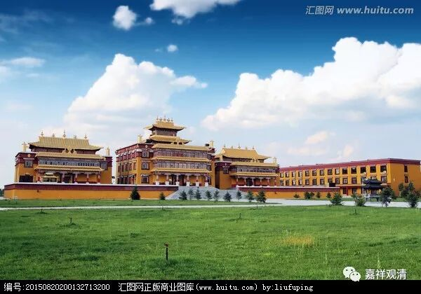

**《菩提速道》讲记064（上）**

** “丁三、结行：**

** 缘念顶上上师能仁，随力多诵：‘顶礼、供养、皈依上师释迦牟尼佛。’由这样的祈祷，观想上师能仁身中化现出第二尊上师能仁，”**

** **

就像从一个灯分出两个灯一样，上师能仁也分出第二尊。

** “融入自身，自己也瞬间变为上师能仁之身，自己显现的上师能仁心间‘吽’字放光，照触周围的一切有情，把一切有情也安立于能仁的宝位。”**

** **

这是什么意思呢？就是自己的心间放光，这个光碰触到周围的六道众生的时候，他们也变成佛了。“照触周围的一切有情，把一切有情安立于能仁宝位”，就是这个意思** 。**

** **

** “如是思惟后，观自身显现成的能仁，以及一切有情显现成的能仁心间月轮上，有白色的‘阿’字、黄色的‘吽’字作为标志，周围‘嗡摩尼摩尼嘛哈摩尼耶娑诃’环绕，心缘于此，随力念诵。”**

** **

就是心中观想着，然后一直念“嗡摩尼摩尼嘛哈摩尼耶娑诃，嗡摩尼摩尼嘛哈摩尼耶娑诃”。

** “其后，念诵**

** ‘此善愿令我，速成上师天，**

** 亦令诸众生，安置师佛地’**

** 等。”**

** **

这里说“此善”，就是指你放光度众生了。虽然说这是观想，但是也希望“速成上师天”，因为最好的孩子就是——“让我继承我爹的事业吧！”

这个在印度恐怕更加明显一点，因为他们的种姓跟他们的职业是有关的，一般都是继承他爹的职业，跟他的爹一样，所以印度人也比较容易理解自成上师，是吧？也就是跟上师的事业是一样的。

我记得以前有一首歌叫《长大后我就成了你》，是吧？这首歌是赞叹老师的是吧？还有一首歌也是教师节时候唱的，《我爱米兰》——老师窗前有一盆米兰，小小的黄花藏在绿叶间……

“长大以后我就成了你”的佛教版本就是“自成上师”。

