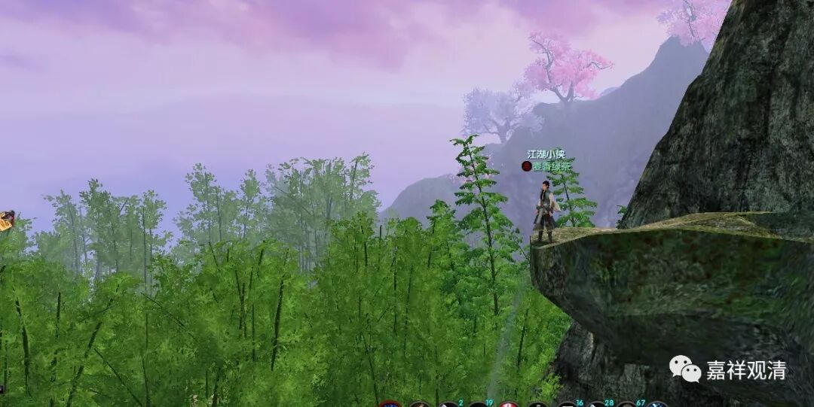

**《菩提速道》066（中）**

** “长寿天者，《亲友书释》中说为无想天及无色界天两种。前者指四禅广果天中的一处，”**无想天就是外道的、修无想定得到的那个天。** “对于广果天而言犹如村镇外的寺院；后者指生于无色界天的异生。”**这是属于长寿天的两类。

** “另外，《八无暇论》中说常为欲事散乱的欲界天也为长寿天。”**在《八无暇论》中，这就是对长寿天的解释。意思就是，这些欲界天也没有时间、没有闲暇来修习佛法。

当然，在这些当中其实还是指大部分的，如果让我来解释的话，我肯定不会解释说这个是绝对的，我只能说是大部分的。地狱、饿鬼、畜生当中也有碰到佛法的，否则佛菩萨就不会去了嘛。北洲也有碰到佛法的，比如说那些被发配到北俱芦洲的罗汉，是带着一帮几百个还是几千个罗汉在那里，我忘了是几百个还是几千个，到时候可以数一下。无想天好像的确是没有佛法的。欲界天就不用说了，肯定是有的，只是比较少，很少有人去。不过从这种比较少的情况来看，其实我们这个世界修行佛法的人更少。

我一直讲过，我有一次就在我出家的黄山的那个庙里哭得稀里哗啦的。有时候师父们看到弟子们在下面哭，不知道他们是什么原因哭的，简直莫名奇妙。其实当时如果以我师父的观点来看，那我真正是莫名奇妙地在那里哭的。

其实我是开小差了，在下面念《华严经》的时候就想：“啊，这个世界信佛的人有多少啊？不多。说起来有10亿，但实际上真正皈依过的人很少。皈依过的人当中，真正相信佛教的人有多少？很少。真正皈依过的人当中，受过五戒的人又有多少？更少。这当中能够念满80卷《华严经》的人有多少呢？太少……”

我一边在念，一边在开小差，想着想着，就被自己感动得哭了，然后在那里哭了半个小时。那个时候恰好没带餐巾纸，如果你当时在边上拍照，我的样子是很难看的——鼻涕流得很长很长，没东西擦，眼泪也老长老长的，又不知道拿什么东西去擦，然后一边还在念着经，手还要去翻经书，那就不能去擤鼻涕，是吧？于是，我就在那里哭得一塌糊涂。结果我哭完了那场之后，下一场就轮到戒胜师哭了。他哭的原因是什么啊？我有点忘了，下次碰到的时候再问他一下吧。

其实，我们人道当中真正能够获得这种有暇的，也很少，真是不见得比欲界天多，实际上也是少得很。苦的时候吧，你根本没时间修，是吧？快乐的时候吧，你根本想不到修，是吧？所以夏坝仁波切的那些老板弟子们也真的是很了不起啊，他们在夏坝仁波切讲完课以后，居然会问：“师父，我们什么时候去闭关？”就像我们前面讲到的那个禅宗的故事里面所说的“正好打坐”，那个是真正从心里面说出来的那种话。应该赞叹！

