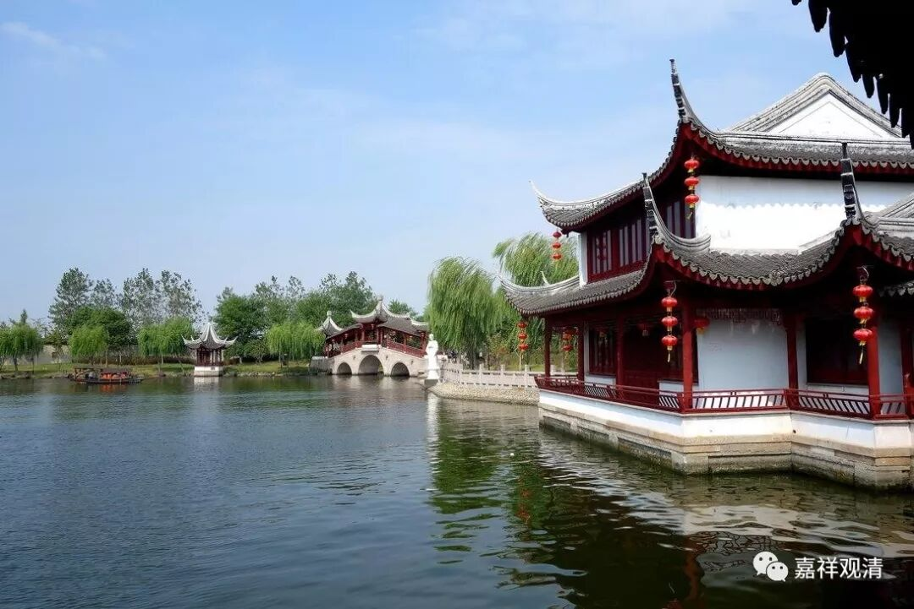

**《菩提速道》（下）**

** “甚至生于极乐世界的菩萨众也发愿说：‘此去东方的娑婆世界，有浊世短寿时一生即可成佛的殊胜之身，愿我投生于彼土！’”**

** **

这些菩萨们也在发愿要过来。不过……等他们发愿后来这个世界的路上，现在这个世界已经没了吧。

** “总之，这个身体可以生起三种律仪，”**

** **

关于三种律仪有两种讲法。可以讲声闻律仪、菩萨律仪和密乘律仪，对吧？或者是摄善法戒、饶益有情戒和律仪戒，也可以。

** “在浊世短短的一生中，也能容易地成办佛果，”**

** **

这个地方我又发生质疑了：“真的那么容易吗？恐怕是太少了吧。”这个世界短短的一生当中，有几个人能承办哦……有多艰难哦……容易的话，娑婆世界早就成净土啦！这是鼓励的话啦！

** “因而偶尔获得的这一次极为难得且具有极大意义的暇满之身，不可无意义地把它浪费了，应当依之受取心要，祈愿上师天加持令我能如此而行！”**

** **

“受取心要”就是把它真正当作一种核心，真正把它当回事儿，千万不要浪费它，浪费就有点可惜了。

这个有点像什么呢？（我现在觉得自己真的是老了，老是想起小时候的事情。）有点像保尔·柯察金说的，在自己死的时候，想想自己这一辈子有没有为了共产主义事业而奋斗终身，是吧？等我死的时候就想：“哎呀，我怎么没来得及修行？下辈子到哪里去啊？”那就糟糕了，是吧？

如果死的时候能够想：“哎呀，我这一辈子没有白白地浪费，我可以心安理得地去见我的师父了。”哇！如果死的时候能够有这句话，真的太满足了！如果真的能够在死的时候，带着这样一颗心——可以没有遗憾地去见我的师父或者见佛菩萨们，跟他们喝茶聊聊天，这个实在是太难得了！这辈子不知道是不是能够做到。

** “由这样的祈祷，观想上师天身分中降下五彩光明甘露，注入自他一切有情身心之中，自他一切有情无始以来所集的一切罪障皆得以净除，尤其能障心中生起暇满义大殊胜证悟的一切罪障皆得以净除，身体变为莹澈透明的光明之体，一切福寿教证功德皆得以增长，特别是自他一切有情心中皆生起暇满义大的殊胜证悟。”**

** **

这就是“己一、思惟暇满义大”。还是一样，我们要先把大的科判想起来。暇满义大，你可以把它分成几个，先是“暇”，把它放大，“八有暇”。再把“满”放大，“十圆满”。然后呢，义大又分成两个——现前和究竟，这两个都义大。

当然，首先你必须信佛，你不信佛的话，这些都没用。你信佛了以后，这些佛经才可以成为你的教证，就是证明了是有用的。如果你不相信的话，这些证明是没用的。

就是你通过其他的教证、理证，包括例证，都来证明说：确实暇满人身难得义大。然后再想想，生起了这样的心——有点像这辈子能够获得这个身体很难得的心，这个时候就在上面安住一下。如果安住不住了呢，还是一样，你再想一遍，按照前面的再想一遍，然后再安住在这个上面。或者在这个时候也想不起来了，又或者时间也差不多了，那就想甘露降净，除掉与此有关的所有障碍，生起与此有关的所有证德，然后获得这方面的证悟等等。

修心的正行部分的套路，整个道次第前面和后面都是一样的，只是相应的观修内容不一样。你也可以把它再分开，现在是把暇满人身难得义大都放在一起了，你可以先证明“有暇难得”，然后再是“圆满难得”，然后“有暇”和“圆满”放在一起，就变成“暇满难得”，然后是“人身义大”，最后全部拼起来也可以。这里面虽然把“暇满义大人身难得”是放在一起的，你完全把它拆开作为一部分来修。比如说修暇满：我现在不具备八有暇的这些障碍消除，然后生起今生和来世都能够获得八有暇的证德等等。这样也可以哦，把它放大、缩小都可以。等到以后这个已经习惯了，你就可以把“暇满义大人身难得”一起观修，也是可以的，也没有问题。

那么，今天上午先到这里。

愿以此功德，普及于一切，

我等与众生，皆共成佛道。

