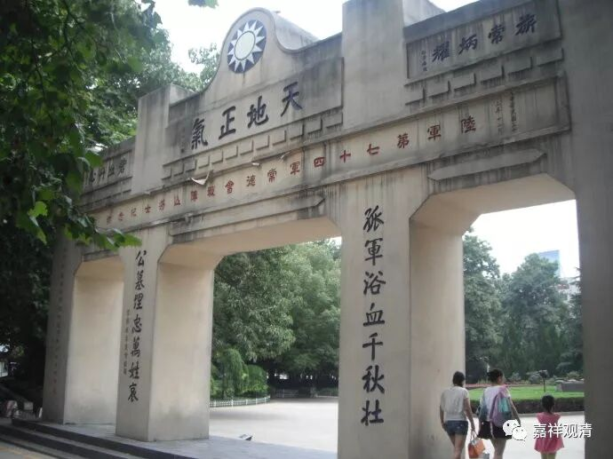

**《菩提速道》讲记072（上）**

最近好像某某宗派中，“佛陀”的比例有点高，因为他们当中经常会有人“融入法界”。比如现在某某寺院，经常聚集着几万名汉人，他们周围相关的人去世了以后会请活佛打卦。那么按照卦辞当中一定的比例呢（差不多有六分之一），就有很多人在死了以后，全都“融入法界”了。至少我耳朵里面已经听过好多人“融入法界”了。那你听了也很高兴啊：“哎哟！我爹这样连抽烟带喝酒的，他也融入法界了。啊，我爹是佛啊！我居然没把我爹当佛来看，我真不是东西！”格鲁派在这个方面是肯定不会打卦的。去世以后，还打什么卦啊？但是我们总是想要有个说法，所以老是愿意去打这种卦。

** “无论住于何处，没有死亡不到的地方。**

** 如《无常集》中说：**

** ‘住于何处死不入，如是方所定非有，空中非有海中无，亦非可住诸山间。’”**

** **

这个也是《法句经》当中的——前段时间我把这个也找出来了。没有什么地方是死找不到的。就是说，这个死一定会跟着你。“死不入”的地方，空当中也没有，海当中也没有，山当中也没有。这里还少一个——人群当中也找不到。

我们以前讲过这个故事，差不多应该是中唐时期吧，从印度来了一个婆罗门，反正这个人肯定不是佛教徒了，但是他有神通。然后，他就跟中国的皇帝说他有神通，无论你到什么地方，他都可以找到你。这个皇帝很喜欢这种类似于看戏一样的事情，就说：“哎，你厉害啊！不过我们大唐应该有高人。”于是皇帝就找来一位禅宗的高僧：“过来，有个事情需要你解决一下。这个家伙说，你随便想到什么地方，他都能找得到。”

结果那位禅宗师父也确实厉害。一开始让他想的时候，在他想了以后呢，这个会神通的外道就会说你在想什么事情，或者你想到了什么什么地方。前几次都说对了，然后那位禅宗的师父就说：“我要开始用功夫了啊！”之后那个婆罗门就找不到了：“哎呦，高僧！我找不到了。”大唐的皇帝就觉得很给面子。

但是大家对这个故事的解读就不一样了。通常大家来想，这个应该是什么问题呢？我估计应该是由于这位高僧缘念空性或者缘念无自性的背景，所以婆罗门找不到他。但是我看到过禅宗里面的不同解读，当然是近代的解读（在近现代有很多不同的人都来给禅宗的故事赋予一种很确定的——“就是这样”的解读）。这种解读是非常没有意义的，不仅是现在，好像以前禅宗的评唱——解释禅宗故事当中也有一些祖师是这么说的。是什么解读呢？他们说：“为什么这个外道婆罗门找不到高僧呢？因为他就藏在他的鼻子底下，所以就找不到了。”

这个一下子就变成水平很差了。因为缘念空性而找不到，那说明你功夫高嘛，估计这件事情本来的意思是指缘念空性，所以找不到的。如果是藏在鼻子底下，这个就太没意义，太小儿科了，玩脑筋急转弯啊。这样解释的人，也就暴露他的水平了。

