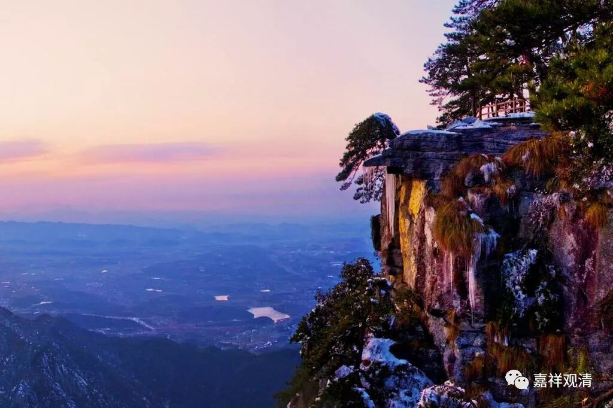

**《菩提速道》072（中）**

** “即使神行逃匿，或施以势力、财物、神咒、妙药等任何东西也不能回遮死亡的到来，并且没有安隐之处可以快速逃遁。”**

** **

我们都想这么做，用各种手段来躲避死亡……但实际上都做不到。

** “如经中说：**

** ‘大仙五神通，乘空能行远，**

** 然彼终不至，无死安隐地。’”**

** **

“大仙”，着里说的不是东北的那种，就是指能力很强的、有神通的人，他能够御风而行，“乘空能行远，然彼终不至，无死安隐地。”但是没有一个地方是不死的地方，这个是没有的。“大仙们”也做不到。

** “（二）以势力、财物、神咒、妙药等任何东西也不能遮除死亡的恐怖，”**

** **

对于死亡的恐怖，权势、财富、医药、神通……这些都不能遮挡。

** “无论内外何缘，都不能阻止死亡临近的脚步，并且寿量无有增加，唯是渐渐减少。”**

** **

这个“寿量无有增加”是从个人而言的，按照我们通常的认为，你的寿量是固定的——先业所感，以前的业得到的结果，那你每一秒钟每一秒钟都在走向死亡，所以说“唯是渐渐减少”。

** “假设以能活到六十岁而言，已满六十岁的人，死亡也只是今年现时、明日后日的事情而已；已五十的人则只有十年的光景了，如此有的人已过了三分之二的寿命，有的已过了一半的寿命……所剩的寿数又一年年，一月月，一天天，昼夜交替地消耗，白昼又随着上午、中午、下午而消失，上午等又随着分分秒秒而流逝。”**

** **

时间就是这样一点点地过去……滴答滴答……。

