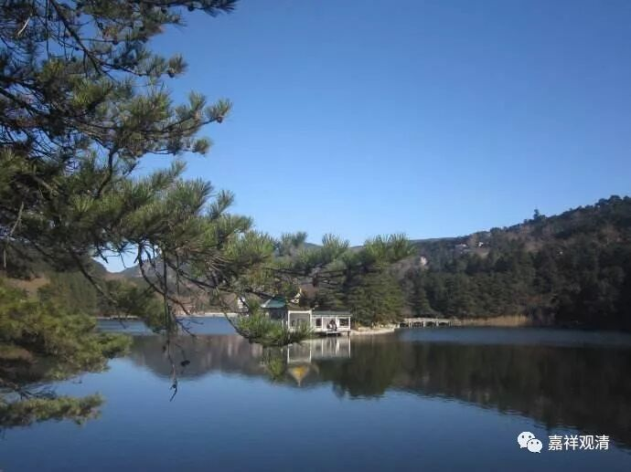

**《菩提速道》072（下）**

** “如《入行论》中说：**

** ‘昼夜不暂停，寿命恒衰减，**

** 额外无复增，若我怎不死？’”**

** **

没有一个人、没有一类事情不死的，这个不可能有，这种念头就不要想了。

我以前也去想过这个事情，道教不是先要修长寿的嘛，后来想想这个修起来实在也没有意义，为什么呢？修长寿是我用今天年轻的时候每天花上八个小时，来换什么呢？来换多活八十岁到九十岁的这十年，而这十年比起年轻的时候就太惨了。我用年轻的这点时间去换年老的痛苦的、颤颤巍巍连站都在站不起来的这种情况，不合算。这是我自己的想法，你们可以自己观察啊。

这是总的来说，老年比较惨，个别的什么身轻如燕我们另外再说。即使是锻炼的人，他也很明显是一点一点地在老去的。这个是规律啊！至少到今天，我们还没有攻克衰老的基因，这个是必然现象。我们的细胞在衰老，一天天地过去就是这样，这个程式就是这样设计的。这个程式，也可以说是这个因果，就是这样的背景。

即使衰老可以延缓，它还是一点点地到了。道教里面修长生不老，还讲什么飞升，他们这是在妄想。他们被杀就叫“兵解”，还有什么金木水火土各种“解”都可以，怎么都是对的。当时我也想过的，“飞升”……我想，飞到天上会不会爆掉呢？因为你里面的气压大，上面的气压小，那不是肚子要爆掉了吗？

佛教说的往生净土，肯定不是这样飞过去的。要不然中国航天局或者美国航天局都会说：“咦？看那里看那里，有几个肉身飞过去了。”那就天上飞来飞去全是肉身了。我们有一个朋友的老丈人，以前是信佛的，什么都信，后来有一次去了国外旅游，回来就不信了。因为他以前认为，云上面都是各路神仙、佛菩萨都在那里。结果那次坐了飞机以后，飞到云上面一看，啥都没有，觉得非常失望，回来就再也不信了。

** “（三）活着的时侯，无暇修习佛法，然而却必定会死去：”**

** **

死了以后更没时间去修了，是吧？死了以后会迎接我们的，通常是一盆大火呀什么的。

