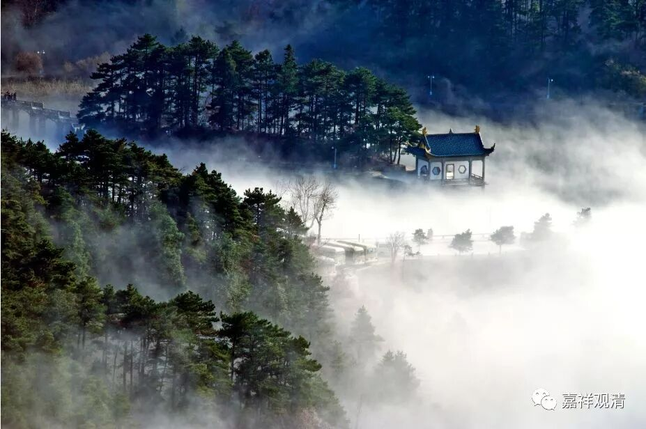

**《菩提速道》讲记073（上）**

** **

** “如《入胎经》中所说，最初十年为无知的幼童，不会生起修法的念头，最后衰老的二十年，身心衰竭，又无力修法，中间的岁月，又一半被睡眠占去，再除去病等不如意事所消耗的许多时光，真正能用来修法的大好光阴又有多少呢？只有那么一点点而已！”**

** **

真正修法的时间很少，有些地方说只有五年，是吧？我觉得还是这么说比较好——“只有那么一点点而已”。我们真正能修行的时间就这么一点点，少得可怜。

** “壬二、死期不定：**

** （一）不仅决定要死，而且不定何时就会死去。”**

前面是说肯定会死，我们还以为是会给一定的时间，比如我们出生的时候，出生证上就敲个图章——“80岁死！”然后我们玩到60岁，再开始学佛，然后再好好地念，最后79岁的时候开始努力修行，到80岁就走了……没有！不是这样的！我们不知道什么时候死。

在佛世的时候也有过这个情况。当时有一位比丘，佛就对他说：“你还剩7天的寿命。”我觉得他的心比我可强大得多了，他就玩了6天，最后一天在那里努力修行，然后成功升天还是做罗汉了。我觉得这个人真是太强大了！至少比我强大多了，我觉得从第一天开始我已经没有办法玩了。

** “一般而言，北俱卢洲人的寿量决定为一千岁。其他二洲虽不一定达到各自的寿量，但多数决定。”**

** **

另外两个洲一个是500岁，一个是250岁。我觉得我们这个世间的法则完全是按照数学来的，或者说数学是我们这个世间最重要的法则。不过，就像今天早上讲的，这到底是发现呢，还是发明呢？

** “而南赡部洲人寿量极不决定，劫初可达无数年，”**

** **

这个“无数年”的问题可就大啦。如果有人在劫初是“无数年”寿量的话，那今天我应该还能看到他。所以这里“无数年”就是说寿量比较长的意思，或者说佛教的传说当中有这样的说法。如果真是无量年的话，那今天绝对应该看得到。拿今天来说，人类的进化，也就是从智人到今天，是多少年？五万年？还是十万年？也就这点嘛。你如果说无量岁的话，我还能见到我爷爷的爷爷的爷爷的爷爷……

