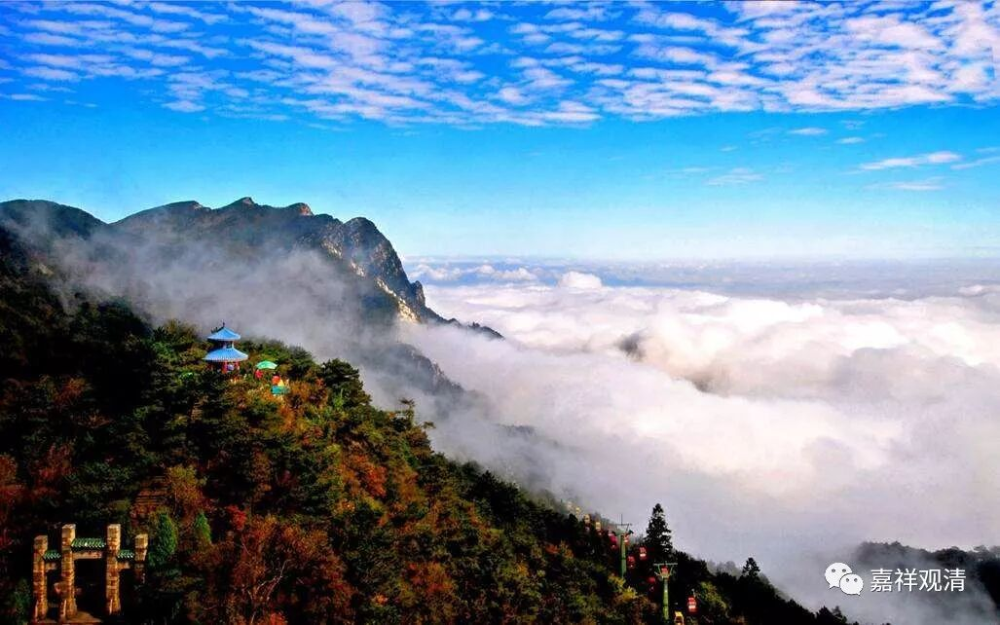

**《菩提速道》073（中）**

按照佛经上来讲，劫初的人大概类似是外星人了，说是从光音天下来的，大概是坐着飞碟下来的。然后一看：“哦哟！这里好东西太多了。”估计他们那个地方也是污染比较严重的，到这里一看：哇！全都是自然长出来的，一点污染都没有，全都是有机食品，就吃了。吃了以后，就开始拉肚子，再也没有力气飞了，于是就留下来了。就是要开始拉肚子了以后，才出现了二便什么的，出现了男女等等。看样子，就是这样的啊。

** “到劫末时十岁就算是最长寿的了。”**

** **

就是说我们这个世界，越来越变坏，大家互相看谁都不满意，后来就开始互相杀，我杀你，你杀我。杀到最后就是，人的寿命越来越短，十岁就已经算长寿的了。

现在从某种角度看起来，真的是有点像。以前的人，要成熟聪明，要开始有自我意识的话，可能要很长的时间，而现在的小孩一个比一个聪明啊。再举个例子——围棋，以前没有二十岁的冠军，只有五、六十岁的老棋手，来教训教训你这个孩子，说“不可以有二十岁的冠军”，他们是一定要把你杀败的。今天呢，三十岁的时候就可以退休了。现在人的进化太快了。

但是以后呢，就是看到别人就想互相杀，有点像我们武侠小说里面的境界了，所有的人都是“飞花摘叶皆可伤人”，随时随地要把人家干掉。到最后呢，大家觉得实在受不了，就是大家都想杀人的时候，这个生活实在太累了，随时随地要提防别人。

于是大家坐下来开个研讨会，类似众多黑社会大哥谈判……就说：“是不是我们首先别这么过分啊？我们先不要随随便便杀人，大家可以多活一点，否则大家都累。”大家同意试试……结果发现，咦？几年下来，生活质量有所提高了。然后就开第二届：“既然这样的话，那么上一届不杀人的这一条我们先继承下去，然后我们再增加第二条——不偷盗，行不行？偷来抢去大家也很累……”咦？发现生活质量又有所提高了。下面“那么不邪淫，行不行？”然后……我们这个世界的道德水准又慢慢慢慢地上升，人的寿命也越来越长，最后到了八万四千岁等等等等。这个是佛教的进化论。

