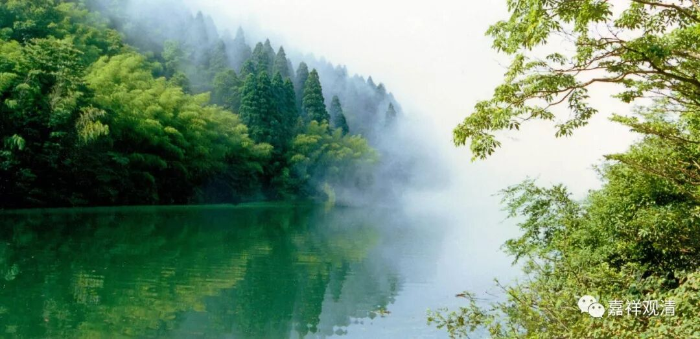

**《菩提速道》074（中）**

**
**

** “（死的）外缘中，有为刀剑所伤；有为毒药所害，或被夜叉、国王、精灵、鬼女等夺去性命；或自身四大失调、饮食不消、药物失宜；或突堕悬崖、房屋倒塌、船破舟翻；或者突然中风而亡……这样他人突然死亡的例子是那样的多，当念自己也将如此溘然死去。”**

** **

想想自己，死什么时候来，什么方式我们都是不知道的，谁都不知道的，谁都没有把握。我们认为饮食是我们的活缘，是吧？而这里的意思是：就是有些人认为饮食是我们的活缘，但是它们也可以成为死缘；有些人认为药物是我们的活缘，但药物也可以是死缘。

姜医生曾经讲过的那位医生倒是挺认真的，用自己试药，结果份量大了，把自己给毒死了。用的是附子，对吧？这个事情真是不知道的，因为可能药店里面在炮制的时候，这一批就炮制得不够好。他自己觉得：“诶？上一次我用了30克没问题，我这次用60克看看吧。”结果就走掉了。我们怎么死的我们不知道的（不过按佛教来说总的可以归结为无明——蠢死的），因为这些小的细节你是不知道的嘛，我们真的不可能全部都知道。

** “（三）此身犹如水中泡沫一样，十分脆弱，何时将死哪里有什么定数？”**

** **

我们的身体就像泡沫一样，啥时候爆掉似乎毫无征兆。

** “如《亲友书》中说：**

** ‘七日燃烧诸有身，大地须弥及大海，**

** 尚无灰尘得余留，况诸至极微弱人？’”**

** **

就是说，我们这个世界到时候都要消灭的，更何况我们人了，是很容易消灭的。不过这书里面很多都是为了让我们生起这个心，你如果多想一想的话，其实跟这个也没什么大的关系。“七日燃烧”——这个世界坏灭，又不是坏事，是好事，是吧？（你看哦，我净想些没用的。所以我应该修数息观，我想的东西太多了。）

我当初看到这一段就觉得其实没必要的，因为这一段对我来说，不能证明前面所讲的内容，没什么特别的。“七日燃烧”在我的佛教知识环节当中不是坏事，所以说这一段只是针对普通人的理解。普通人都会觉得世界坏灭是一件很恐怖的事情，但是对我们这些佛教徒来说，如果你学习比较多了，就会知道世界坏灭对佛教徒来说是件好事情。因为世界毁灭是在人变好的时候出现的，是增劫。普通人听到世界毁灭会很伤心，但是佛教徒则认为，现在世界的毁灭是人变得越来越好才出现的征象，生命都去了更高的境界，便不需要这个世界……这样来看，是没什么坏处哦。

班禅大师写过一篇文章，就是观死无常的时候，怎么样呢？就想像你自己躺在床上，别人都在哭，然后这个尸体如何腐烂等等，想这个死是多么地恐怖。但我再一想，实际上，死了以后，就跟我没关系了，再恐怖跟我也没关系啊。跟我有关吗？我已经跑了，所以我觉得想这个没什么意义。当然有些人会很有感触啦。

死了以后，就是自己留下一个烂摊子。你应该这么想：“这个烂摊子已经恶心别人去了，我干嘛还要恶心自己呢，是吧？我的脓烂想等等，可以恶心其他的修行者了，跟我没关系，我已经跑了。”啊呀，这种确实有点困难啊！

