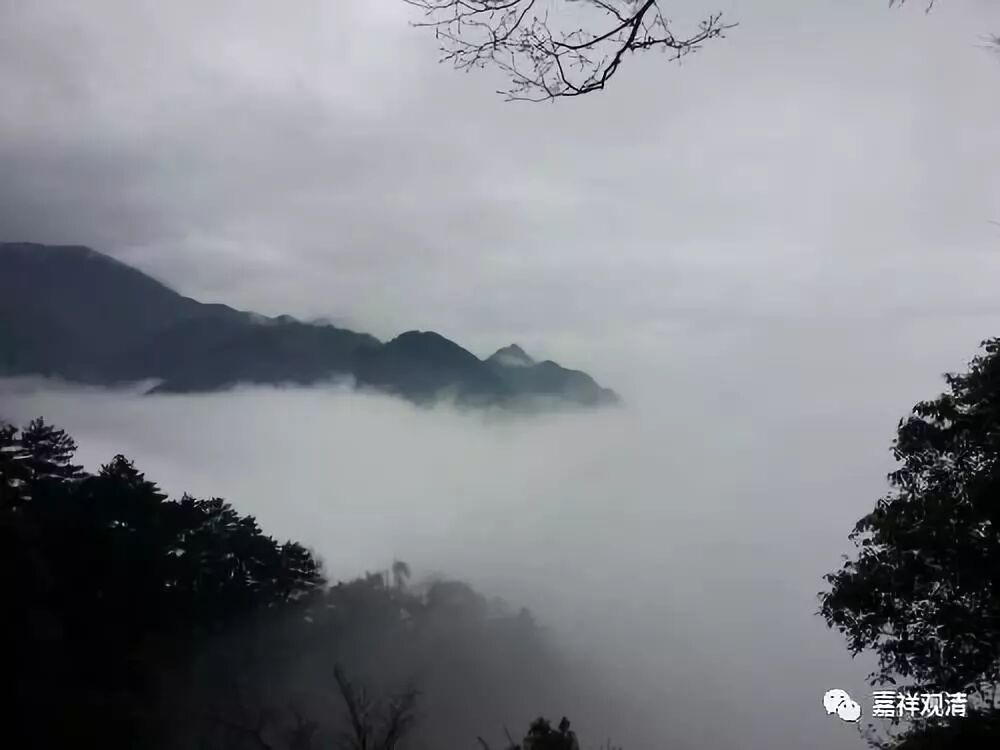

**“庚二、思惟恶趣苦：**

** 在自己顶上修习着上师天的状态中，这样思惟：**

** 如此难得而又具有极大意义的这个暇满人身，很快也就会坏灭，坏灭以后却不是什么都没有了，仍然还要受生，受生的处所无非善、恶二趣。如果受生恶趣，地狱中有着寒热及其代表的痛苦，饿鬼中有着饥渴及其代表的痛苦，而旁生则有着极为愚昧、相互吞噬等种种不可思议的痛苦。**

** **

思维三恶趣苦。

** **

** 辛一、思惟地狱苦，其中又分为四：**

** 壬一、大有情地狱。**

** 壬二、近边地狱。**

** 壬三、寒冰地狱。**

** 壬四、孤独地狱。”**

** **

我们中国人经常会讲“十八地狱”，那十八地狱就是“八寒”加“八热”——这就十六个，再加上近边地狱一个，再加上独孤地狱算一个，就是十八地狱。而且这十八个地狱并不是上下一层一层的，不是十八层地狱哦。八寒八热不是分别有八层，近边地狱是在边上，独孤地狱都不一定在什么地方呢。

** “初者，从此（金刚座）向下三万二千由旬有等活地狱，”**

** **

这个“金刚座”就是两个月后我们要去的地方，是释迦牟尼佛成佛的地方。这里的“三万二千由旬”，我们就想像成观念当中的吧，要不然就跑到地心去了。

** “依次向下每隔四千由旬有一地狱，有着其余的七大地狱，共八大地狱。”**

** “其中等活地狱中，有情聚在一起，手执业力所感的种种利刃相互残杀，皆昏死跌倒在地上，这时空中发声说：‘你们复活吧！’又重新站立起来，像以前一样相互残杀……受无量的大苦。”**

** **

这是地狱里面的一种情况。想想在我们这个世间的，比如说大兵灾的时候，差不多就是这样吧。哪怕你砍累了，睡过去了以后，再醒过来看到这场战争还没结束，你还得爬起来继续砍下去啊。

