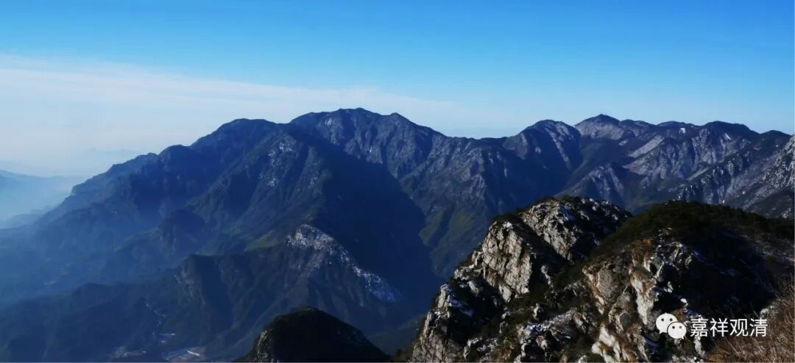

**《菩提速道》075（下）**

** “其下为黑绳地狱，狱卒在有情身上以黑绳标画成四角等许多形状，然后用利刃锯截等……受着无量的大苦。**

** 其下为众合地狱，有情相互聚在一起，形如绵羊头和山羊头的两座大山从两边挤压……受如是等无量的大苦。**

** 其下为号叫地狱，狱中的有情在炽热的铁屋中被火烧烤……**

** 其下为大号叫地狱，狱中的有情在双层的铁屋中被炽燃的烈火烧烤……**

** 其下为烧热地狱，狱中的有情在许多由旬大的铁锅中煎熬，或被单股的铁叉从下直贯至顶，一切根门烈焰炽燃……**

** 其下为极烧热地狱，有情被三尖的铁叉从下穿入，三尖分别从头顶和两肩穿出。或者以烧红的铁片缠在身上。还有的卧在铁地上，狱卒用铁钳撬开嘴后，灌入炽热的铁丸或滚沸的烊铜，口、喉、肠等被烧焦后，又从下身流出……**

** 最下是无间地狱，狱中的有情进入烈焰炽燃的大铁屋中，四面猛风鼓动烈火，无法分清究竟哪里是身体，哪里是火。**

** 地狱中烈火的热度是怎样的呢？**

** 坏劫时烈火的热度是人间之火的七倍，而地狱的烈火的热度又是劫末烈火的七倍。有说，比较起地狱的烈火，人间的火犹如冰雪般地清凉。譬如人间的火烧伤身体的任何一处要害时，若用清冽的白旃檀香水沾润，身体立刻会感到清凉，并且伤处得以恢复。同样，被地狱中的烈火所烧时，如果用人间的烈火来接触，也会立刻会得到清凉，所烧的伤处得以恢复。”**

** **

这个只是想像哦，上面这一段估计只是想像哦。我不知道这个想象怎么来的，完全不符合科学哦。这里讲的有些东西真的是没有的。你想想，用一千度的火是烧，用一百度的火就不烧了吗？只是烧得不那么厉害而已。这个说法我实在不能接受。而且这个事也是不可能的嘛，根本不是一回事儿。

另外你们看，这一整段都是对一般的人讲的，对世间的人讲的。为什么呢？你看他的预设是什么？在地狱当中，全都是人的样子。其实，在地狱当中不应该是人的样子，应该是地狱的样子，很苦的样子就行了，不一定是人的样子。

我们能够想像的是，比如说，我们会想像死后变成狗，就是一个人在狗的皮里面，人们就感觉自己很痛苦……其实不是这样的，你整个的都会变掉的，包括你的思想，包括你的阿赖耶识等等全部会变掉。

到了地狱以后也是一样的，你整个的都会变掉。我们认为好像是一个人的样子被烧烤，其实不是这样的，而且也不是我们身边这样的烧烤，这里就是一种比喻……可以确定的是，地狱的苦是非常苦，比我们周围的这些个要苦得多，这个苦比起地狱的苦，肯定是百分不及一，千万亿分乃至算数譬喻所不能及。

其实地狱的这些刑罚，也不是万年不变的，也有可能改变的。有可能科技很发达，就是，狱卒说：“哎，来了，又来一个人。好，把他直接输入电脑。”然后就用电脑里各种最新的惩罚来折磨他。

狱卒是化现的，其实也不见得有真正的狱卒。有些宗派说是有真正的狱卒，唯识派以上就说没有真正的狱卒。西藏有对此的辩论，说是如果有狱卒的话，那么狱卒死了以后到哪里去呢？他实在是太坏了。那都是假的狱卒，相当于机器人。

还有一点，地藏菩萨，他本来就不是在地狱当中的。民间的说法是说他在地狱当中，实际上他是他方世界的补处菩萨，就像我们这个世界的弥勒菩萨一样。

那么，地狱肯定是非常非常苦的地方。我们现在一听到这个名词呢，就觉得是地下的监狱——地狱，认为肯定是非常黑暗的地方。其实火这么烈的话，按照预设应该也不会黑暗了。以前汉代的时候就把地狱翻译成“泰山”，因为中国的传统说法就是，泰山上面是封禅的地方，是登天的地方，泰山下面就是地狱。所以东汉的时候，佛经里面的地狱就翻译成泰山，你们还敢去泰山玩吗？不过我还真没去过。

