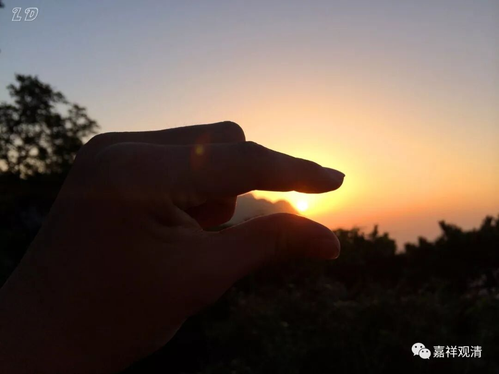

**《菩提速道》076（中）**

** “从此再往前行是利刃布满的道路，每走一步，皮肉被块块截断。之后为剑叶林，又会被利剑截肢断体。铁刺树林中，有情攀上攀下时，被锋利的刺贯穿皮肉。还有铁嘴鸟飞落到有情的头顶或肩上，啄食眼珠。**

**
**

** 紧隔着有弥满着沸腾灰水的无极河，有情堕入其中，被上下翻滚地煎煮。”**

** **

就是很苦很苦的意思，实际上肯定比这个还要苦。

** “壬三、寒冰地狱：**

**
**

** 八大热地狱横去一万由旬有寒冰地狱。从此向下三万二千由旬处为寒疱地狱，大地皆是厚厚的寒冰，空中弥满着狂风暴雪。在这里，身体被冻得满是疱疮。**

**
**

** 其下有疱溃烂地狱，这里更为寒冷，疱疮被冻得全部溃烂。**

**
**

** 其下依次有口歇哳言占地狱、赫赫凡地狱，这二地狱中的有情，被冻得无法发出大的哀号声，只能从喉的深处发出阿啾啾、嗟呼呼的声音。”**

** **

只能发出这样的声音，只能从喉咙里发出“吼吼”的声音。

** “其下有虎虎凡地狱，狱中的有情则连一点声音也发不出来了。**

**
**

** 其下为青莲花地狱，狱中极大寒风袭身，身体变为青瘀色。”**

** **

这个是什么呢？他们的皮肤全都裂开来，像莲花一样，因为是青瘀色嘛，所以就像青莲花一样，就叫“青莲花地狱”。

** “下有红莲花地狱，身体冻得转青为红，裂为十瓣或者更多。**

** 最下为大红莲地狱，身体冻裂为百瓣、千瓣等。”**

** **

就是冻得更碎了。

我以前也曾经劝人家行善，劝说一般的人就用这种方法。我说：“啊呀！不要做坏事了，做了坏事要下地狱的。地狱当中有个‘青莲花地狱’，好听吧？有个‘红莲花地狱’，也好听吧？”被劝说的人就【星星眼】说：“要不就去这个地狱？”于是我就说在那些地狱会被冻成什么什么样子，他们就说：“哦哦，那我们不要去了。”

** “壬四、孤独地狱：**

** **

** 寒热地狱的近边有孤独地狱。《瑜伽师地论本地分》中说人间也有。如《俱胝耳山》、《僧护因缘经》中都有讲述，应当参阅。**

** **

** 生入地狱的因，总的来说，造了上品十不善业将生入地狱，尤其是作了五无间业、生起邪见、犯四根本。也有说轻慢而犯别解脱戒中的恶作罪（五篇之一的突吉罗罪），将会生入等活地狱，轻慢而犯别解脱戒中的别别忏罪（五篇之一的提舍尼），将会生入黑绳地狱。”**

** **

这个和其他地方讲的，又不完全一样。其他地方都是讲，释迦牟尼佛的弟子们造了罪，大量地堕入龙道。如果单单突吉罗罪就会堕入等活地狱的话，那么龙道是怎么来的呢？他们没犯罪就堕入龙道了吗？其中不是有两个弟子还杀了人的吗？也堕入了龙道。所以，曾经有朋友来问我：“假如释迦牟尼佛现在在你的面前真实呈现，你最想问他的第一个问题是什么？”我想说的是：“佛陀啊，您的那些教言里，哪些是您的方便说？”

