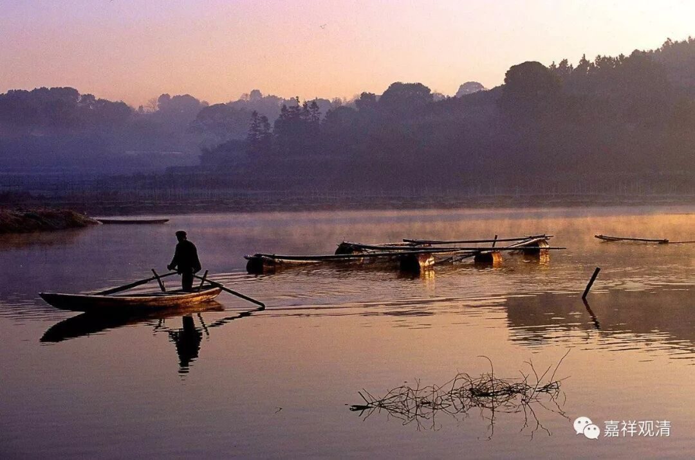

**《菩提速道》讲记078（上）**

对于其他人，那肯定是再说了，先把自己解决就算了。也有人曾经问我：“观清师，既然所有的阿罗汉都会回小向大，那我就成就阿罗汉好了，这样大家也比较能够保证嘛，不是挺好的吗？以后再发起大乘的心嘛。”

那么，我是这么和他说的：“你这么想呢，固然也是一种想法。但是，很明显的就是，你最初的动机就是为了自己啊。所以你这个绝对不是修大乘的方法，你的发心其实是小乘的或者说是求个人解脱的，这肯定不是修大乘的方法。你以为这是修大乘的无上方便法，其实这个跟修大乘一点关系都没有！”

所以菩萨还是很了不起的啊！越想到基础的基础，就越觉得菩萨很了不起。

** “在自己的内心上，已经积聚的尚未净治的、能引生地狱痛苦的大力恶业，多得不可思议。而这些恶业在自己死前看来无法得到净治，这可以通过我们现在的能力状况得知。若带着这些恶业明日或后日突然死去，除了生入地狱还有别的去处吗？一旦生入其中，我能不能受得了这样的大苦？”**

** **

这个其实通过我们现在的能力状况就可以得知了，我们受不了这样的苦，我们连野外生存都很难做到，蚊虫叮咬都觉得苦不堪言，我们对地狱的苦是不堪忍受的。

** “如是思惟修习，直至内心生起惶恐不安的感受。”**

** **

这个时候生起“惶恐不安的感受”，然后你就想，要赶快、赶快地消除障碍……修上师甘露降净。

** “如果内心生起了真实的怖畏之心，除了维持生命必须的衣食等顺缘外，理应当摒弃一切的尘劳杂务，昼夜精勤于净治罪堕的最佳方便——四力忏悔与防护。”**

** **

这里就是忏悔罪障了，是吧？而平时的时候是防护罪障。

修行上路的时候，你也不会去做其他的事情，基本除了专注的修行内容外也没有什么其他的事情了。今天也有兄弟就讲，真的修到这里的时候，大概连剪指甲的时间都没有了。

