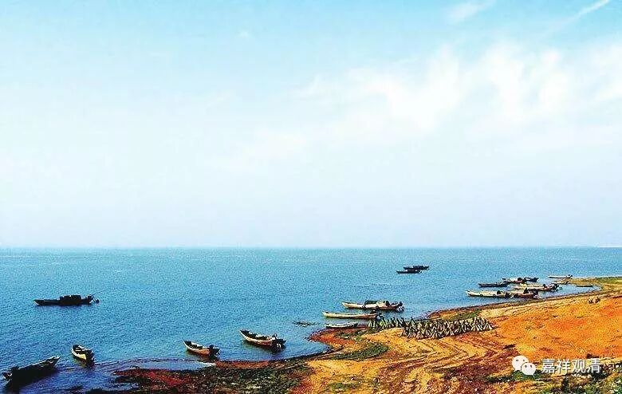

**《菩提速道》078（中）**

比如说，在很苦的地方（比如地狱）等了三年，佛菩萨还不来，就是很长很长的时间佛菩萨都不来，那这个时候的心就生起了：“肯定是我错了。对不起！对不起！佛菩萨赶快来吧！我错了，我真心忏悔，赶快出来吧！谢谢你！谢谢你！”

这时候另外的心，就再也不见了嘛。他之前可能会生起另外的心，但是这个时候他会忏悔，会讲：“哟，我前段时间那样说，那样指责你，是错的！我指责你，所以你再也不现了。我错了！我错了！请你在我面前出现，赶快救救我吧！”如果这时候佛菩萨突然出现在你面前了：“哎呀！我错了，我错了，把我救出去吧！”你肯定是哭得要命：“我以前都错了。”然后，被救出来以后，又故态复萌。

如果怎么求，都不出现呢，那就继续求下去嘛，你还能怎么样呢？这中间你可能会有另外一种想法出现，但是佛菩萨一直都不出现，到最后你还是会忏悔：“我前面不应该这么说，我怎么能说你的错呢？你的慈悲一定是伟大无比的，只是因为我的恶业而不显现，请你马上在我面前出现吧！”就是这样。

你看看我们世间上的情况就是这样的：战争就像地狱一样，真的是像地狱一样，自己都不知道自己的命在哪一颗炮弹下就结束了。即使你是躲在哪个战壕里面，或者躲在什么地方，可现在的科技这么先进，哪怕你躲在地下三米，卫星都能找得到。

你看海湾战争的纪录片里面，伊拉克的部队，在这战争里边，都不知道什么时候死，就一直祈祷啊祈祷。这个时候，突然之间美军出现了，那感觉就是：“这个是救怙主啊！”然后就跑过去，抱着美军的手在那里亲，抱着他的大腿在那里亲。美军被搞得很糊涂：“怎么回事？这不是我们的敌人吗？”

你们去看看海湾战争的片子，就是这样的。你看到他们出来的时候，看到美军感觉就想像看到亲爹一样，跑过去直接跪在地上。这个时候安拉没用的，他们直接拉着美军的手，就在那里亲啊。因为他们知道，美军能救他们了，知道美军在身边的话，导弹肯定不会再过来了，而且知道下一顿就有吃的了。结果呢，美军听不懂他们那些话，不过一看这样子就知道，打服了。

所以你想像一下，如果这个时候是佛菩萨出现在你面前，那你不知道会怎么样了。你哪怕是看到狱卒，都会觉得亲密无比：“我错了啊！”然后肯定是，抱着他的腿在那里亲。

