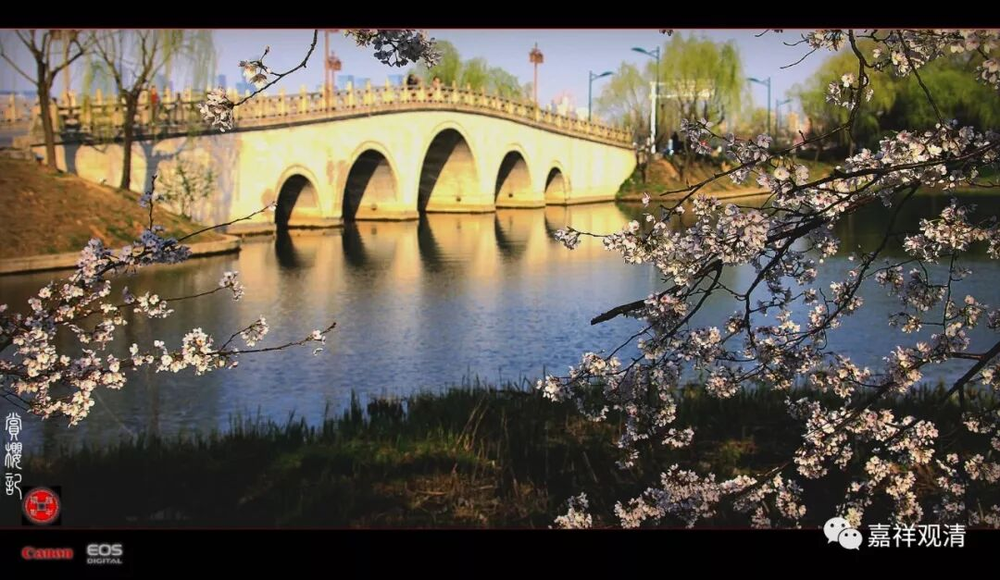

**《菩提速道》082（中）**

** “从嬉戏乃至舍命之间，随遇何缘，不舍三宝。这些都应当善加修学。”**

** **

那么，从这个角度上来说，又出现了一个问题，就是净土宗的人随作什么事情都念“阿弥陀佛”也是有道理的。人家一直在念“阿弥陀佛”，一直在想嘛。你问他什么事情，他开口的第一句话就是“阿弥陀佛”，这个也是有道理的。

** “庚四、生起对于业果的深忍信心，分三：”**

** **

这是第四科，其实可以再进行分段的，更加明显一点。在共下士道的背景下，第四大科就是对业果生起坚固的信心——“深忍信”。这个“深忍”就是胜解的意思，就是很难动摇的心。

** “辛一、思惟业果总相。**

** 辛二、思惟业果别相。**

** 辛三、思已如何进退之理。 **

** 初者，分二：**

** 壬一、正明总相。**

** 壬二、分别思惟。**

** 壬一、正明总相：**

** **

** 在顶上观想上师天的状态中，这样思惟： **

** **

** （一）业决定理：**

** **

** 佛经中说，由修善因唯生乐果，绝不会出生痛苦；由不善因唯能生出苦果，不会出生安乐。乃至一个被酷热所苦的人，突然一阵凉风吹来，由此所生起的快乐，也是从过去所集的善业中产生的；即使不慎被一根刺，刺中所生起的痛苦，也是从过去所集的不善业中产生的。因而业果是决定的。”**

** **

老实说，这个算不算是因啊？对于因果这件事情，我在一次坐飞机以后，就找到了自己的认知方法，基本上我就不再用其他的方法，而只用这种方式去思维因果了。

当时我坐在飞机上，作为一名很无聊的理科男，就在那里想：“云层这么厚，光到底是怎么照到地上的呢？”我就坐在飞机上一直想。这么厚的云层，太阳光怎么才能透过这个云层照到地上呢？……反正，我最后在下飞机前找到了答案，而且从此以后，我就把这种思维方式植入了平时生活当中的很多事情，包括对业果的思维。

其实，我们应该倒过来想，而不是正着想。就是不论云层有多么厚，我都不考虑云层厚到多少程度，哪怕厚到二万公里都无所谓，关键是照到地上的那个光，它就是穿破了云层的。也就是说，我们应该从果上来看，果已经产生了。比如说，这个光子去到那个地方，那它一定有因。不管它是怎么穿透这个云层的，反正它穿透了云层。至于其他的，我就不管了，它们是怎么穿透云层的，我就不考虑了。所有这些事情，我都从果上来考虑。

