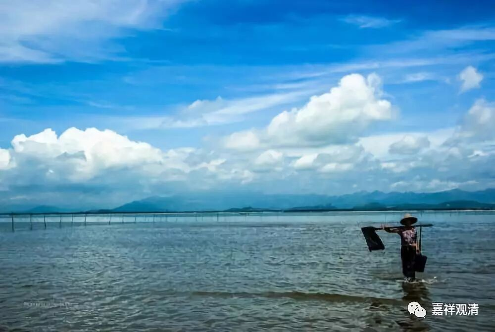

**《菩提速道》088（下）**

再后来，他差一点被自己人干掉，被人家追杀。因为他们当时那一批运动员都被称作“贺龙的红小鬼”，贺龙在那个时候是担任体委主任的，他们都是贺龙带出来的，所以称作“贺龙的红小鬼”。文革期间贺龙被打倒了，也要把他们那批人干掉，他们武术水平又高，结果他就是被一路追杀。

像他这样地看电影、看纪录片，然后在心中生起怒火，那可能就有点麻烦了。这个倒可能是真的生起那种心了，看到日本人都真想把对方“撕掉”了。而我们呢，大概是看完了电影之后，出来再去吃个日本料理什么的，是吧？

** “二、不与取：**

** 事：他所主宰的物品。**

** **

** “他所主宰”，**就是别人的，别人可以自由处置的。

** **

** 意乐分三：想、烦恼如前；动机为未经他人许可，希望令他永失此物。**

** **

没经过别人同意，同样，逼着别人同意，骗别人同意……这些都不行。这段文字稍微简单了点，领会精神。

** 加行：以强夺、暗窃或其他行骗等方法来非法获取。**

** **

不论是巧取或是豪夺，最后到手，或者对方失去此物。总之，属于“不予取”。

** **

** 究竟：指自己生起获得此物的心。”**

** **

最后，对方认为自己失去了，你认为自己得到了。其实也不一定自己得到，劫富济贫，同样是不予取。

** **

所以这一段是“不与取”的内容。仔细看的话，没有这么简单。法律条文如果只有这么两页的话，肯定会错杀很多，也会放过很多。不过意思大家都大概了解——不予取。

