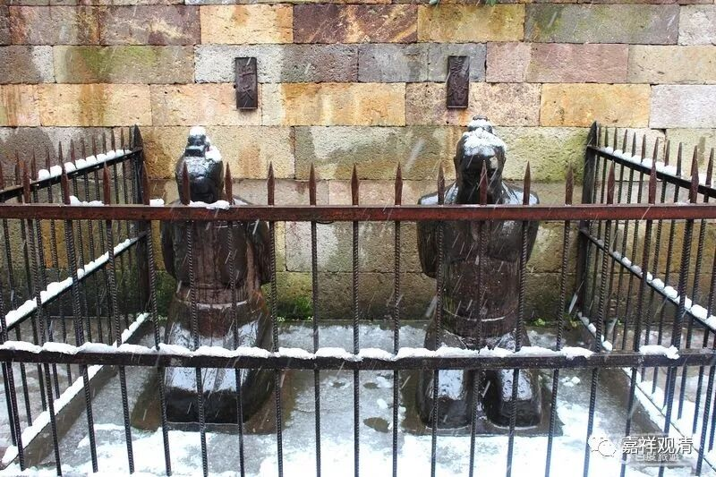
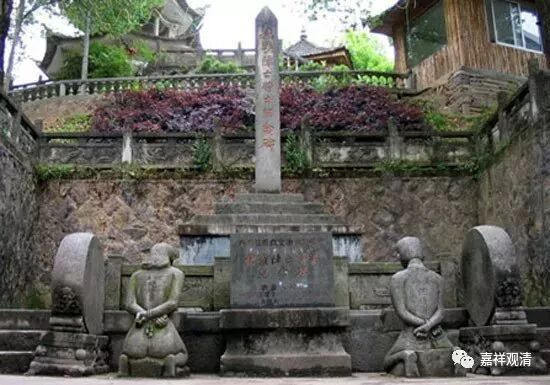

**《菩提速道》090（三）**

关于贪呢，就是你觉得这东西很好，特别是看到它正面的部分，你觉得很好，那你才会贪嘛。如果你看到了它的负面的东西，你真正想多了它的负面的东西，那你肯定不要了。比如说我的某个朋友就是，他非常喜欢吃生鱼片，在他喜欢吃的时候就觉得“非常好吃”，对吧？等到你跟他讲吃生鱼片会有多少对健康有害的情况（比如寄生虫），他突然之间就断除了吃生鱼片的习惯。贪，就是你觉得它的某一个方面特别好，你就想要……一旦拥有，慢慢你发现了它的负面的地方，越来越发觉负面的地方难以接受，慢慢你就会不想要了……从贪爱走向了反面。

** “九、嗔恚：**

** 事、想、烦恼如恶语，动机希望殴打等。”**

** **

就是你想要殴打啊、骂啊等等，都是希望让他受到伤害。这部分和前面的“粗恶语”是一致的，所以说“** 如粗恶语”**。

** **

** “加行：继续努力作嗔的思惟（令其强烈）。”**

** **

加行、造作、方便（我也不知道用现代汉语怎么表达这里的“加行”，原意是“加功用行”）呢，就是不断地恨他，在思维层面不断地加强。从“忿忿不平”到“恨之入骨”到“恼羞成怒”……

** “究竟：指决定打杀缚等。”**

圆满的嗔，就是在心里面想“我明天把他抓起来”，或者“我明天给他一拳”。你甚至还想过这一拳是怎样的组合拳，是先打左拳还是先打右拳，然后再一个勾拳。总之就是确定了要怎么伤害对方。

嗔心是不是一定是针对有情的呢？单纯看这里的“** 决定打杀缚等**”似乎必须是有情而言的，但我们可以说，“等”字里面包含了非情。比如看着村口碍事的大树就不满意，看着岳坟前面跪着的那俩铁像就想动手砸……大学时候我去岳坟，就捡了块砖头……（不算破坏文物吧），去南京中山陵在山上看到汪精卫的跪像也扔了俩石子……（现在已经挪走了。不知道是不是因为被我砸过，所以算是特别的文物而被保护起来了？）

（岳坟前秦桧夫妇跪像，都已经是第好几版了）

（挪走的汪精卫夫妇像）

