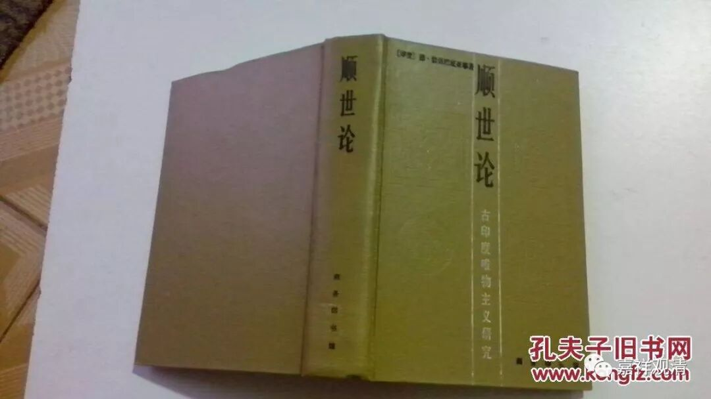

**《菩提速道》090（三）**

** “十、邪见：**

** 事：确实存在的事物。**

** **

邪见，就是三宝、四谛、因果、“人是爹妈生的”这些确实存在的情况，不做承认，“舍弃”这些真实、正确的道理，所以经常在这里用到“谤”字，这个“谤”是谤舍、弃舍的意思，理解为“诽谤”的话，略有些远了。

比如常用的例子，就是印度的顺世外道、自然外道，认为没有因果，没有来世，一切都是偶然发生的。佛教里面，一般把这类归为邪见，而且是邪见中最最不堪的，因为完全不讲道理了。不讲理，则不堪教化……

放眼周围，这类邪见者、这类观点，至少在今天的某些地域，是占主流的……

** **

** 意乐分三：想，谓对所谤义作谛实想；烦恼，为三毒中任何一种；动机，为希望诽谤。”**

** **

“对所谤义作谛实想”，比如说，他谤说没有因果，那么他对于没有因果这个事情是真正地这么想的，那就叫做“对所谤义作谛实想”。

就是自认为“没有因果”这些都是对的，执着不舍，还爱说。

** “加行：继续努力作邪见的思惟（令其强烈）。”**

** **

对这样的邪见，还去巩固它。用各种歪理邪说去坚固这种邪见。

因为邪见者是不接受正确的推理的（如顺世论者只承认有现量，只承认直观的感知，不承认比量，不接受推理），所以他们也只能通过歪理邪说来坚固自己的妄想执着，甚至，仅仅类似地运用思辨，也会导致他们学说的内在矛盾——不是不接受推理吗？

** “究竟：指决定诽谤。”**

** **

就是你已经定下来了——我要舍弃某个观点，比如舍弃对因果的认知，或者舍弃对缘起的认知。这个叫邪见。

十不善业当中，“邪见”是其中最可怕的，有此一项，便可无恶不作——因为没有因果、没有约束。既然一切不过是偶然发生或者自然发生，那便没有善恶业果了……

