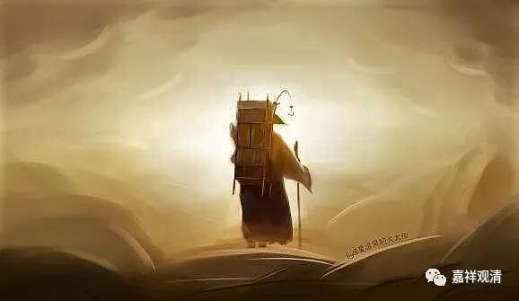
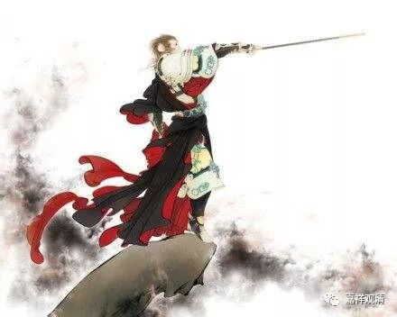

**《菩提速道》092（中）**

** “乙三、结行，如前所说。**

** 戊二、座间如何行：此当参阅开示共下士道的经论及注释等如前。**

** **

** 由如此修心于共下士道次，生起的心量者：过去主要是追求今生的利益，为了后世的利益而修法，仅是顺带而行。”**

** **

这个是对我们来说的，这句话讲的其实就是我们。我们都是看现实的利益，今天病了，念药师佛；明天高考了求文殊，后天生孩子了求观音……将来？谁知道呢！我们要的都是现在！《速道》说了，我们追求的只是今生的利益，后世的利益？那只是顺带修修的。

《悟空传》里的玄奘就和我们不同，他那几句话真是荡气回肠，好有感觉：

** 我要这天，它再不遮我眼；**

** 我要这地，再埋不了我心；**

** 我要这众生，都明白我意；**

** 我要这神魔，都烟消云散！**

我们的追求，就这么一点点眼前的东西……所以我们还要修行啊！

（同样上面这几句话，让悟空说出来，感觉又不一样，那是一种至阳至刚的桀骜不驯！）

** “现在反过来，今世的利益成为次要的副产品，而主要是寻求后世的利益，这就是生起了合格的心量。**

** **

我们应该怎么做呢，就是反过来：把未来看得要比今天重要，把别人看得要比自己重要……

** **

** 如果虽作修习，然而我们对很快将死、死后生入恶趣将长时间领受剧烈大苦的状况，心中却一点也没有怖畏之心，这是由于过去世中法的习气太过微薄，或在这一生中虽作闻思修，却未至扼要，心反而因法而变得油滑所导致的。这有着非常大的过患。”**

** **

这个就是没有得到它真正的内容吧。就像打拳一样，你光会比划，不知道里面的力道怎么运用，是吧？你还以为自己是在打拳，但是内行一看，只要一个动作就知道你打得不对了。这里说修行的情况也是一样，自己认为自己是在修行，而真正的修行人一看，就知道这个叫比划。练习太极拳也是嘛，看你会不会打，只要看你第一个金刚捣碓打得好不好就可以了，只要看你第一式就知道了。你练习肯定要花很长时间的，你的协调性要很强，如果这个脚跺下去了手还没到，或者手下去了脚还没到，那就知道不对了。

总的来说，就是修得太少、实践得太少。

