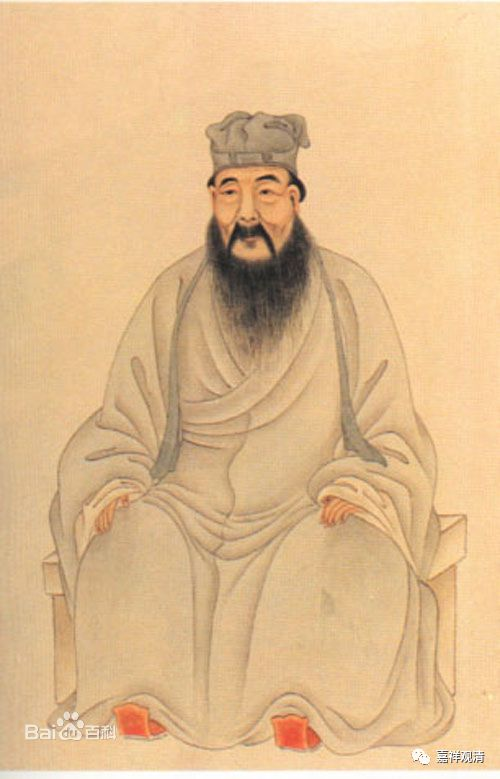
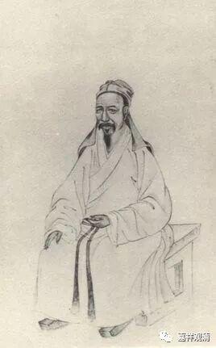

**《菩提速道》092（四）**

** “有诸先哲善知识说：‘攀缘外境的心是最粗硬的呀！’”**

** **

《西游记》每一回的回目，大家有空可以看看玩玩，这里面很有意思的，有点像指导你修行的意思哦。就像我们今天的文章都要取个好的题目来耸动人心，是吧？这里面确实有很多的文字都像修行的话哦。孙悟空叫“心猿”，白龙马叫“意马”，猪八戒叫“木母”，是吧？

** “因此较之先前未作闻思修，心变油滑过失更大。”**

** **

所以，有时候对那些已经了解了很多佛教内容的人，你再教他学佛，反而很难。当然这要看对佛教了解很多是什么样的了解，这是个问题。但是如果他之前已经被前面提到过的那几位水平很差的法师教育过了，你再来教的话，基本上是改不过来了，太难了。（这个我深有体会，但凡外面认为学得好的，在我们这里基本就就没戏了，学不下去了……他永远是那一套思路，拧不过来的。所以佛教的启蒙老师很重要。）

** “因此，宗喀巴大师在道次第中说：‘于闻解后，尚须修习，随自力能，修所闻法，是为至要。’”**

** **

就是听闻了之后要去实践。这句话不就是“学而时习之”吗？学习了以后是要去实践的。清代儒学里有个颜李学派，就是发挥这一句话“学而时习之”，把“习”解释为实践——学了并付诸实践！（我们小时候学的标准答案，说“习”是复习——那应该是误读啦。）

（颜习斋）

（李恕谷）

** “所以，我们应经常地发誓修习正法，不再迷恋外在虚妄的亲友、自己的这副臭皮囊以及虚幻的资财受用等尘缘。**

** **

亲友们“为了你好”的名头下，留你在轮回受各种苦；为了自己的这副臭皮囊和虚幻的数字，我们也是恶行累累……该看破放下啦！你看不破，终归有人教你看破的！

** **

** （宗喀巴大师）又说：**

** ‘以是此心，纵觉难生，然是道基，故应励力。’”**

这个心要生起来，的确是很难的，但再难也要生起来，他是修行的基础。

** “修习了这些下士道的教法，如果现在心中仍未能生起，我们应当强烈地祈求上师三宝加持令得生起。还要努力积资净障，对所缘行相应比以前更加勤奋地修习，并发愿在未来的生世中能够生起。”**

** **

修不起来怎么办？自利未逮时，别忘了求加持！

