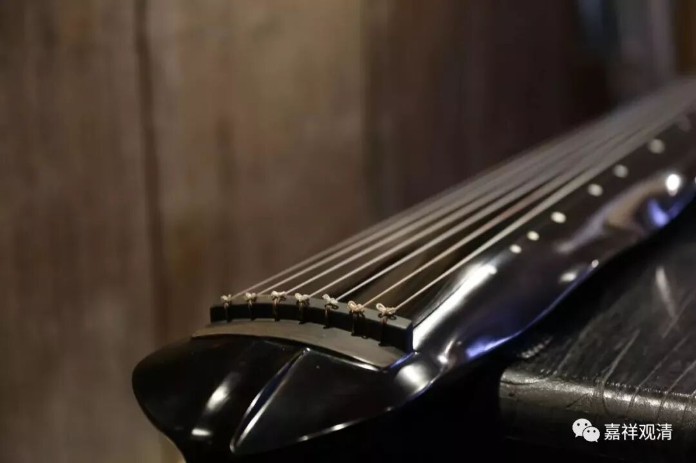
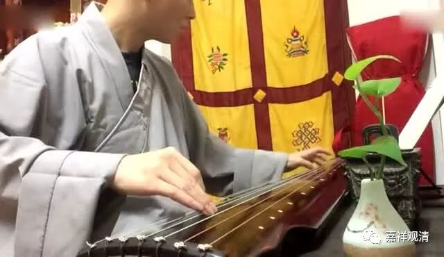
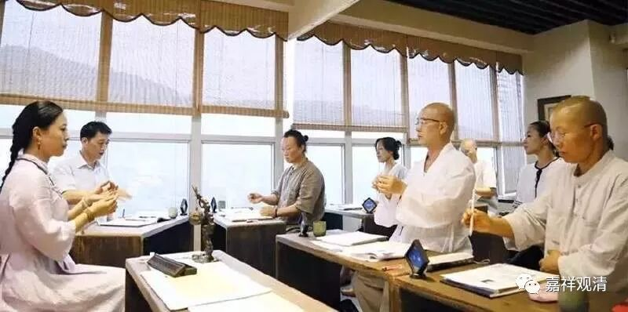

**《菩提速道》讲记093（上）**

修习了这些教法，都是应该在心中生起的。我们修行人聚在一起，应该相互比比蒲团被磨破了几个，或者家里的地板因为嗑头而被磨出多少槽印。这才是修行人应该互相攀比的，是吧？可是现在呢，“修行人”都在比的是：“我已经能谈三支曲子了。”或者说：“哎呀，我今天买了二两沉香。”“我这儿有几饼好的普洱茶”唉……比的东西都不对。

我们真正应当祈求的是在心中生起这些教法，还要自己去做，如果做不到呢，就请上师三宝加持，希望自己能够早早地生起。否则的话，若没有下士道、中士道的这些扎实的基础，纵然把自己说得很高——“一切都是为利众生”，自以为发起了菩提心，实际上却是像能海法师说的那样，叫“鸡毛菩萨”，都是嘴上的功夫！

甚至有些法师已经自己给自己授记了：“我将在XXX世界XXX地方成佛，这个佛的名字叫XXX。”还跟大家约好了：“老和尚我就要死了，我的净土在XXX地方，我们净土见吧。”这些都是空话。这种人就叫“鸡毛菩萨”，什么意思呢？风一吹，“呼”地就上去了，飘得很高。风一停，就落下来了，因为没基础的。（这还是往好了说，往糟了讲，难免大妄语啊！）

元代曾经有一位禅师，愚庵智及禅师，学问也不错，在南京一直和一些名流士大夫们在一起诗赋往还、流连游戏。结果他的师兄找到他，给他说了一句话，他就去闭关了。他的师兄说：“当记取黄叶飘飘。”你想想看，秋天的那个叶子，也是风一刮就飘得很高，实际上自己是没有根基的，还会落下来。他也算听懂了，就立即去闭关了。后来水平怎么样不知道，反正是闭关了三五年才出来，最后是明初的十大德之一。

** “如宗喀巴大师说：**

** ‘彼所开示教授中，暇满义大及难得，**

** 速坏复受恶趣苦，救此皈依业果等，**

** 善思而获坚固解，是为已摄正道本。’”**

** **

这些“暇满义大难得”“恶趣苦”“皈依”“业果”等等，在这上面生起定解、生起相应的觉受，才是佛法修学之根本。

