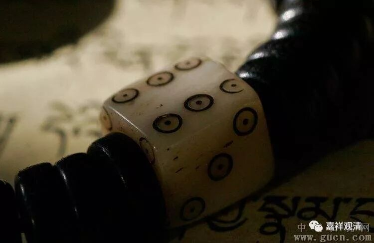

**《菩提速道》093（中）**

** “也有人虽修习这些道次第，然而出于懈怠，反而希求通达共通的文化；或者作些相似的念诵，祈求语言的功能；有些希望见到本尊；或稍修持住心之法就看有没有些许的神通出来；还有的人专事念诵。”**

** **

有些人呢，不求解脱，却奔着现实的利益去了寺院学习，为了求一些世间的小果、一些相似的“成就”……

这些呢，虽然是对藏人讲的，其实也是对我们讲的。在藏区的确有这种情况：出家是因为家里的生活条件不好，然后呢，就专门去学念诵，或者专门到药学院去学习，单纯地希望成为名医，还有些人就是文化知识不怎么学，专门去学诗学啊、辞藻学等等。

这些情况都是有的，为什么呢？他们中间有些人是为了衣食，他们认为把诗学、辞藻学等等学好了以后，就可以做上仁宝哲的秘书。藏区的情况大家知道吗？就是转世的仁宝哲会有他的班底，里面也会有他的秘书处。因为大部分的和尚是不多学辞藻学的，所以有些人就认为自己把辞藻学等等学好了以后，就可以做仁宝哲的秘书，那么生活条件也会更好——有些人是这样想的。所以这里也是在提醒这些人。

还有一些人也是一样，希望获得打卦的成就，然后回到世间可以有好的“营生”。我刚到某某寺学习的时候，师父们就对我说：“藏医和打卦，你就不要学了，这些都是很容易的，没必要学。等你学习完成了以后可以再学。”我当时回答说：“我没准备来学这些。”师父们说了，其实很多人出家或者到藏地的寺院来学习，就是冲着这两个来学的——打卦和藏医，什么原因大家也知道了啊。

没办法，现实情况就是这样。我见过一个黄帽出家人，做过某寺院住持，是寺管会主任，为了建寺院，靠打卦……来见他的人很多，都说打卦准。他不讲经的，建寺可比我们厉害多了……

