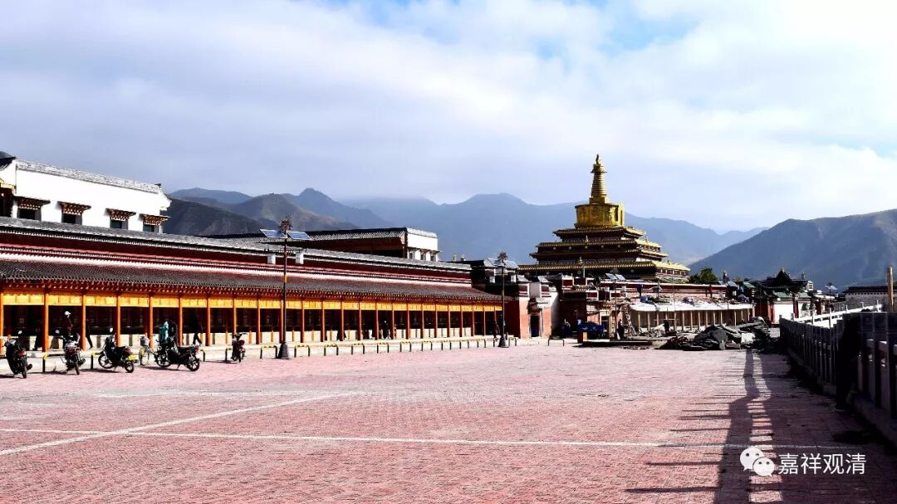

**《菩提速道》093（下）**

** “专事念诵”**是什么意思呢？光会念经了。比如专门给人家超度的经忏和尚。我以前认识一个小朋友，他好像是六岁出家的，他爹的情况实在是太惨了。他爹差不多从五几年开始做和尚，后来二十年间就一直是东躲西藏的。当时的有人为了躲呢，就在他们帐篷的毯子下面再挖一个洞。他爹在文革的时候还是一个和尚，到人家家里去念经，流窜于各个帐篷之间。有人来查的时候呢，就躲到帐篷当中毯子下面的洞里面去，就这样也都躲过去了，江湖上飘了二十年。

在这最艰难的时期，他爹至少还是以一个出家人的身份在江湖上飘的。但是那啥啥刚结束，他在八零年的时候……还俗了！！后来因此他自己也哭得很厉害，就坐在我们的房间里一直哭啊哭，哭得很惨的样子。但是哭也没用，他的习惯已经养成了（其实从后来的表现来看，我觉得他的痛哭背后还有一种底层人的特别的狡诘）。有时候一个还俗的人，除了极少数很特别的情况，他的心态呢，真的是破罐子破摔了。道理上他可能都知道，他也对我们讲：“哎呀，我以前的修行全都作废了，学习的这些内容都要扔到水里面去了。”

后来他有了一个孩子，作为一个还俗了的僧人，他想的是：“自己已经做错了，将来怎么办呢？这样吧，让我的孩子出家，让他替我忏悔。”那小孩六岁以后就出家了，然后他就成为了孩子的师父。他还是格鲁派的，就带着他的小孩到处念经，这是他按照之前二十年的习惯，还是到处念经，也挣了不少钱，因为很多经文他都完全能背下来。

再后来呢，他想想还是应该让这个孩子好好学习，就送到某莫某大寺院去了。哪个寺院也收下了，因为这个孩子已经在其他寺院出过家了，那么在寺里学习应该也没什么问题。这个小孩呢，可以背诵大量的经典，据说当时一年能挣一两万，这在当地已经很好了。

他还说去过西藏、去过拉萨等等，说是一路念经过去的，相对来说是属于很有钱的。但是我问到“阿底峡尊者”，他却一点都不知道，再把阿底峡尊者的故事讲给他听，他也不知道。就是他什么都不懂，根本不知道还有这些内容。那么，他就是那种** “专事念诵”**。文法也没学过。

我觉得太可惜了，于是对他说：“这样吧，你去学习道次第，我就给你一千块钱。”然后他就去学了……这才知道阿底峡尊者是谁，道次第是什么内容，终于明白了自己以前所做的全都是错的。再后来他被送去佛学院，应该快了，这两年就要考出格西来了。

他以前是根本不知道，就是念经挣钱，所以你要先“以欲勾牵”，给他一千块钱去吸引他。能够转念是很不容易的，你看他的问题实际上是因为他碰到了一个恶知识——他爹，根本没教他正统的内容，就是专门带着他到处念经，所以真正的佛法他根本不知道。

其实三大寺或者其他有名的寺院也一样，很多刚来的和尚根本不知道这些经典还需要修行的，他们就当作知识，有些新人也认为是谋生的手段，即使是在读书，还是一样当作谋生的手段。也许某一天他在某一位像帕绷喀仁波切这样的大德面前，把以前他所学的内容重新讲一遍，他就会突然之间反应过来。

这就是为什么很多人碰到帕绷喀大师后都觉得他很了不起，他们以前是不能够反应过来的，其实帕绷喀大师并没有给他们讲更多的知识，甚至从辩论的角度来看，帕绷喀大师都不见得能够赢他们，但是道次第的实践是一些人之前没有想到过的。

