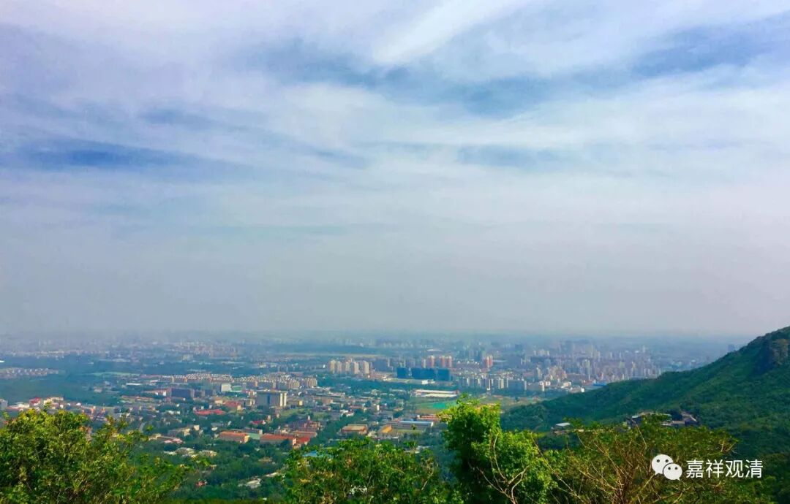

**《菩提速道》讲记094（上）**

** “普琼瓦曾问京俄瓦：‘获得五神通，通达五明，拥有八大悉地，或者是尊者的道次第在心中生起，你会选择哪一个呢？’”**

** **

我们会选择哪一个呢？我们现在这里的人肯定心里想选其他的，但是又不好意思，就说“道次第在心中生起比较重要”。

** “京俄瓦答道：‘不要说道次第在心中生起，就算只是心中能生起“道次第确实如此”的胜解，也应当选这个。过去我们曾无数次地获得五通、通达五明、拥有八大悉地，然而都没有脱离生死轮回、没有超越轮回。如果获得了对道次第的定解，就必定能从轮回中解脱出来！’”**

** **

所以对于学习道次第的人来说，至少在嘴巴上怎么选择，大家都知道的啊，而实际上怎么选择，谁也不知道。

昨天我看到有一篇微信上的文章，具体内容没有看，题目好像是“在房子和孩子当中，选择哪一个”。我看到好几个人都在转发。那么，你的选择就代表了你到底想干嘛，是吧？（好像有一个人转发了以后，后面还跟了一句评论指责男人的，大概意思是说男人都选房子，女人都选孩子。）那么这里也是一样，获得五神通、通达五明和道次第在心中生起，我们到底会选择哪一个呢？哪个是你真正认为重要的？

** “我们应当知道，有前面那些想法的人都没有明白这些话的扼要，也清楚地证明了他们尚未对道次第获得定解呀！”**

** **

有没有人觉得道次第很重要。我们现在去灌顶的现场问问看就知道了，不管在哪里的灌顶现场，道次第的内容包括前行的学修和最后灌顶的内容，哪个更重要呢？无疑对于大部分人来说，都是觉得灌顶最重要。有些人对密宗如数家珍，对道次第却一窍不通。他们肯定觉得背诵、学习道次第、学习基础都是多余的。

所以，我们的国人们在很多情况下还是没有摆脱自己的思维定式，总是觉得要学修的话就要学修最高、最妙的法，如果要学“藏通别圆”的话，那肯定要选“圆教”，而不选“藏教”。实际上呢，下面没打好基础的话，上面的学修都是假的、空的、没有根基的！

