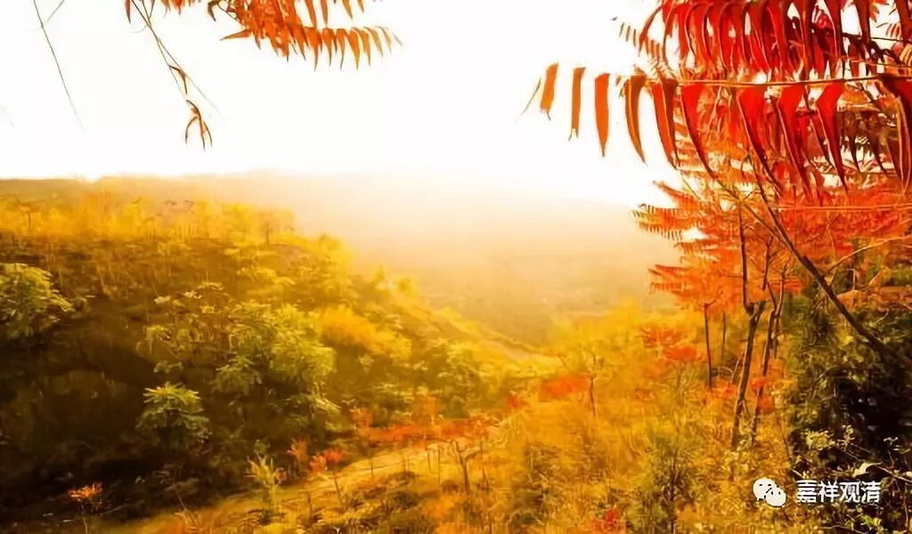

**《菩提速道》讲记 095（上）**

轮回无可保信。父亲去世以后，可能又变成你们家的狗了，仇人变成你们家孩子了……这些都是不知道的事情，也保不定就在发生。

** “自己前世之父亲却成了今世之子。前世之母成了今世之妻。前世中的亲人成了此世的仇人，甚至上半生的仇人却成了下半生的亲人、上半生的亲人在下半生变成仇人……，这个轮回中实在没有丝毫的决定。**

** **

因为轮回的不停止，所以亲友变换无常，仿佛不停地演戏，角色不断的转换……

** **

** 如《妙臂请问经》中说：**

** ‘时尔仇为友，时尔亲成仇，**

** 亦或为陌路，陌人成亲仇。**

** 见此故有智，何时亦莫著，**

** 遮恋亲分别，唯住于善法。’”**

** **

仇人变亲人，亲人反成仇人，素不相识的人和亲人、仇人之间也可以变换角色。所以，智者看透了冤亲的分别，把这种分别都放在一边，而专注于正法、系心于解脱。

** **

现在我们很流行小学中学同学聚会，是吧？很多时候我都听别人讲，这些同学如果是走在马路上的话，大家都是不认识的。以前曾经是非常相熟的，比如同学期间一起讲相声的，现在都不熟悉了，甚至有些人都不认识了，走在马路上也不敢认了。前两天我在马路上看见一个人，就很像我的小学同学，但是不敢认，怕被人以为不怀好意。（这也说明我没有正念，是吧？在马路上老看人家脸。）

所以修行人和一般人不一样，“昼夜取坚实”，白天黑夜都在舍弃现世的利益，而追求真实不退转的解脱。

