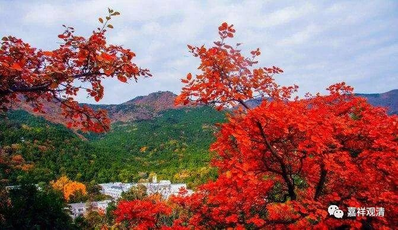
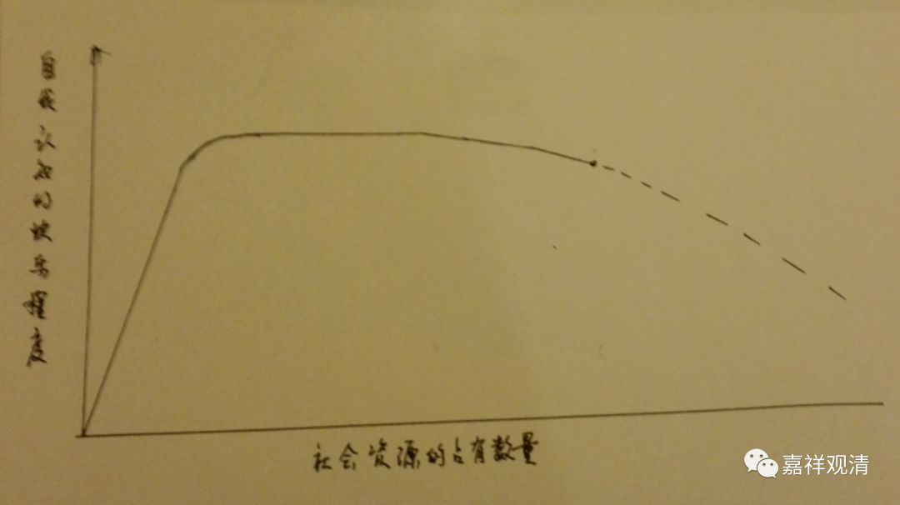

**《菩提速道》095（二）**

** “（二）无饱足过患：**

** 任如何受用轮回的安乐，都没有满足的时候。”**

** **

轮回的安乐永远没有满足的时候，我们总是不断不断地去想，不断不断地想要往上。到底应该说这是社会进步的因呢，还是应该说社会的进步是建立在我们的贪念之上的呢？好像真的有可能是后者哦。

我们就是在不断不断地往上追求——所谓的进步、“自我实现”，是吧？我们希望明天比现在更好，但我们不知道什么叫“更好”——更方便？更舒适？更自由？更安逸？我们要求更安逸，肯定是我们对未来的追求的其中的一个动力。我还记得小时候学发明的时候，老师就说：“科技的进步，懒是一个动力。”（所以很多科学家都是男的，是吧？因为懒。）有些内容就不多说了，不断不断地追求，到最后一下子就崩盘了。因为预设的前提是错的，总会出现机构性的崩盘！

** “如《广大游戏经》中说：**

** ‘大王即令天之乐，及与人中妙乐欲，**

** 诸乐令此一人得，彼亦无足仍求觅。’”**

** **

你把再多的东西给他，他还是贪心很重——大部分人都是这样哦。这背后有其心理原因——世间人的快乐，人们对快乐的自我感知度，和占有资源的数量积累，是线性分布的吗？我觉得假如做一个统计的话，最初会是一个快速上升曲线，以后是有一段略微平缓的曲线。大概在一个极端之后还会下降如下图，因为当物质占有到一定程度，没有其他人可以做对比，那种因对比而来的幸福感绝对会降低。不是有一句话吗——幸福感来源于对比。（有机会的话我们可以编一个心理测验。）

（图示1.0版，2.0版稍后推出）

那么，他们无饱足地求觅，是求的外在的物质吗？我觉得不是，其实人们求的是幸福、快乐，只是，大家都不真正知道什么是幸福、快乐，一直误以为（被社会催眠为）占有是幸福的必要条件。所以佛陀说：你们走错路了！那些都是苦！

那么，少部分的人呢，看起来贪心不那么重的呢？可能需要帮他去做一个甲状腺的测试（甲减的症状是对什么都觉得无趣，和甲亢的兴奋相反——开个玩笑）。

