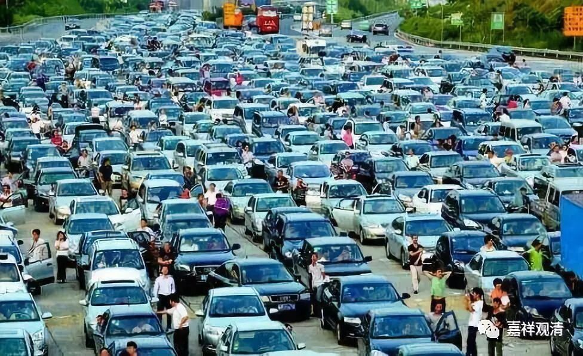

（国庆扎堆旅游，也是一种从众。其实轮回也是一样……）

**《菩提速道》095（四）**

** “如马鸣菩萨说：**

** ‘已获诸欲乐，日日陈眼前，**

** 多积仍无厌，病重岂逾此！’”**

** **

这个就是我们最重最重的病——** “多积仍无厌”**。还有能超过这个的吗？这有点像我们医学里面讲的，痛阈在不断提高，是吧？就是你疼痛了一段时间以后，你的痛阈就提高了。比如说，别人可能被刺激到30就觉得疼了，而你却被刺激到50之前，都不觉得疼。等你经常受到50的刺激之后，你的痛阈又提高了，要被刺激到70才会觉得疼。这里说的贪欲也是一样，你本来以为贪一点点就可以了，就会觉得满足了。但是当你得到了以后，你的满足感又不够了，又一定要得到更多的才会满足。

** “（三）数数舍身过患：**

** 无论获得何等善妙的身体，终须数数弃舍，这个已获得的身体也不可凭赖。”**

** **

我们的身体，不知道随便什么时候就没了，是吧？没了之后呢，又结下一生，下一生以后再结下一生……不断不断地结生。当然，不断结生的同时也就在不断舍生，一个是正面，一个是负面。

就是再好的身体，终究会失去，无法保持。

** “《亲友书》中说：**

** ‘既成帝释世应供，由业力故复堕地，**

** 纵使身成转轮王，复于轮回为奴婢。’**

** ‘虽得天界大欲乐，及诸梵天离欲乐，**

** 后堕无间为火薪，忍受众苦无间绝。’”**

** **

即使你投生到了上界，你还得堕下来。上去以后又下来，一辈子一辈子地上去下来，想躲都躲不掉。

** “（四）数数结生过患：”**

** **

那么，数数舍生以后，就是数数结生，就是不断不断地再有下一辈子。以前的都换掉，重启，再来……

** “无始以来数数地结生，仍见不到生的边际。”**

** **

没有一个结束的时候。有些外道说轮回是有边际的，我们佛教是说如果不修行的话，这个“生”是无有边际的。

** “如龙树菩萨说：**

** ‘一一曾饮诸乳汁，过四海水而今后，**

** 随异生性流转者，所饮远当逾于此。’”**

** **

我们将来所要喝的乳汁，要远远地超过我们之前所喝的。而我们之前所喝的乳汁，要远远超过四大海水——其实连四大海水都不够比喻哦。

** “是说一般诸异生在生死中互相为母，所饮的母乳多于四大海水，若还不精勤修道，在轮回中，相互所饮的乳汁将远甚于前，”**

** **

前两天我们讲过，从无限的概念来说，应该是一样的，是吧？但从直观来说，未来的未来还有未来，觉得会多一些……

** “而且依然看不见轮回中受生的边际。如是相互为仇，相杀的头颅，堆积起来超过梵天世间。互为亲人，因亲人的死亡而流的悲伤眼泪，积聚起来超过大海的水量，却仍不见轮回中受生的边际。**

** **

** 如《除忧经》中说：**

** ‘数于地狱中，所饮诸烊铜，**

** 虽复大海水，亦无如许量。’”**

** **

所受的饮啖之苦，从量上来说，要超过大海水的数量。

** “‘生于犬豕中，所食诸不净，**

** 较须弥山王，其量极高广。**

** 又于生死中，离别诸亲友，**

** 所泣诸泪滴，大海亦难容。**

** 由相互诤斗，所截诸头颅，**

** 积之高若是，梵世亦超过。’”**

** **

这些在经典当中都有的，《阿含经》当中也都是这几个比喻。

