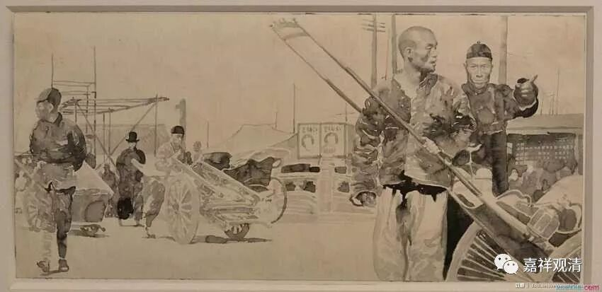
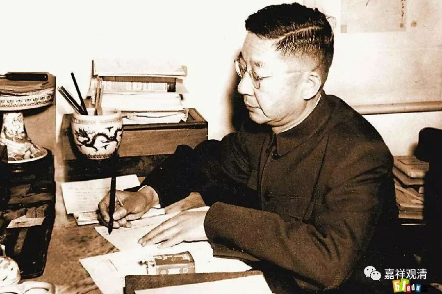
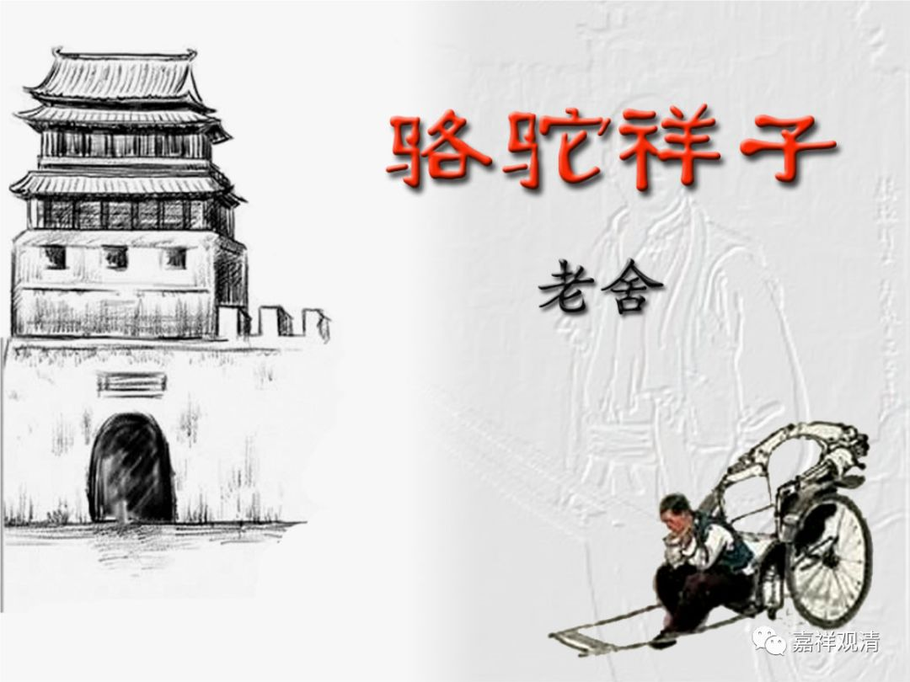

**《菩提速道》096（中）**

** “（六）无伴过患：”**

** **

你还要准备在自己走的时候有个伴吗？当然历史上各个民族都出现过——殉葬，殉人或者殉马等等。

** “自己终须独赴他世，友伴也不可凭赖。”**

** **

他们根本不会跟你一起去的，你就别想了。最多你幽默地道个别：“兄弟我先走一步！……”

** “如《入行论》中说：**

** ‘独生此一身，俱生诸骨肉。**

** 坏时尚各散，何况余亲友？**

** 生时独自生，死时还独死，**

** 他不取苦份，何需作障亲！’”**

** **

你的这一生，就是一直和你在一起的这个身体骨肉，在你死的时候，还是你归你走，它归它走，对吧？** “何况余亲友”**，更何况其他人呢？** “生时独自生”**，生的时候都是各自生的。** “死时还独死”**，死的时候还是你一个人走。** “他不取苦份”**，他人没有办法取你的苦的一份。** “何需作障亲”**。

我们现在微信上、微博上每过几天就可以看到一些感情的宣泄：“唉，又不相信爱情了。连安吉丽娜·朱莉和布拉德·皮特也离婚了，又不相信爱情了。”过几天，谁谁谁又结婚了：“我又相信爱情了！”然后再过几天又可以看到谁谁谁离婚了：“又不相信爱情了。”

这些都是悲剧。你看我们大家是多么脆弱啊，只要有一个观点不一致——比如说对孩子的教育意见不合，就可以使婚姻关系瓦解，实在是太脆弱了。现在的婚姻关系太脆弱了，真的是需要努力才可以维护下去。而以前之所以不怎么努力也可以维护，是因为大家那时候的生活都太苦了，根本离不开对方。我真的是这样认为的哦。

** （老舍先生）**

我以前很喜欢老舍，你看老舍写的那些关于老北京的作品里面，都是“相依为命”的。以前的那些家庭，是社会的最小单位。这个最小单位需要家庭中的这两个人或者三个人、四个人相依为命，少了其中的任何一个人，这个最小单位就很难再维持下去，真是很苦的。老舍的很多作品都是描写北京平民的生活，就是这样平平淡淡的相依为命的情况，所以家庭反而很稳固。今天呢，不需要互相依靠了，每个人都可以自己独立生活，所以家庭很不稳固。

同样的，寺院也是一样情况。以前你离开了寺院，作为一个出家人基本上很难在世间上独立生活。但今天这个寺院的模式肯定要被打破了，因为大家不需要在这样大型的寺院当中也能够自己活下去。经济状况已经发生了很大的变化，其他的情况一定会跟随产生相应的变化。所以将来这个寺院的模式可能会被大量的精舍所替代。

