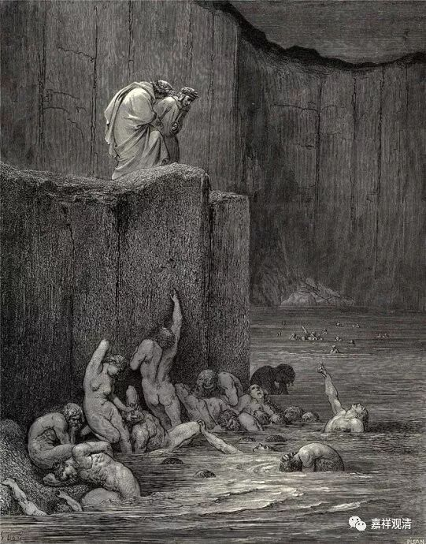

**《菩提速道》096（下）**

对于婚姻关系，基于刚才的分析，我已经不太相信今天大家在结婚时候的互相承诺了，因为社会情况和以前不一样了。以前真的是，只有不离不弃，两个人才能活下去。现在，离了弃了，又怎么样呢？经济基础也决定了下层意识。（我有时候就是想得太多了。）当时安吉丽娜·朱莉不是还给布拉德·皮特送了一座心形的小岛嘛。（当然我有另外的想法哦，这不是像鸡心嘛？那和爱心完全是两回事儿啊！）

（当年安吉丽娜朱莉花了1.2亿送给布拉德皮特的心形海岛）

** “因此，这次我偶一获得极为难得且具有重大意义的暇满之身，在此时，无论如何应当依之断除一切轮回的痛苦，”**

** **

好不容易获得，又这么不可保信啊！别白白地“浪掷”了生命！

** “证得殊胜解脱——正等正觉的圆满佛陀宝位。惟愿上师天加持令我能如是而行！”**

** **

希望师长的帮助，而自己也要努力啊。外因和内因都很重要。

** “由于这样的祈祷，观想顶上上师天身分中降下五彩光明甘露，注入自他一切有情身心之中，自他一切有情无始以来所集的一切罪障皆得以净除，尤其净化了如是如是的障碍，……，自他一切有情心中皆生起如是如是的殊胜证悟。”**

** **

这个轮回当中的总苦，你们自己也可以写哦，自己想一想轮回的总苦是些什么。其实轮回的本身就是苦。你就想这个轮回图好了，上去下来，上去下来……永远没有出来的时候。真的，拿今天的话讲就是有点无奈又无力，单纯以自己的力量没有办法去挣脱它。

如果完全没有办法挣脱，那真的是太痛苦了！还好是有办法可以挣脱的。突然之间，你就在这无奈当中看到有一根绳子被放下来，如果马上抓住的话，就可以出去了，就像但丁《神曲》里面的插画一样，是吧？突然有一个人过来了，马上就往上爬，希望他能够救你呀。

 ** “辛二、思惟轮回别苦，分二：**

** 壬一、思恶趣苦。**

** 壬二、思善趣苦。**

** **

** 在顶上修习上师天的状态中，如是思惟：**

** **

** 壬一、思恶趣苦：**

** 只要是成就了取蕴，就无法超出苦的本性，何况三恶趣呢？”**

** **

“取蕴”，简单说就是由我们的烦恼感召来的这个身心的结合体。

恶趣苦在前面已经讲过了，这里再讲一遍，再想一想。

我们现在有很多人会觉得恶趣不苦，特别是那些养小猫小狗的人，都觉得恶趣并不苦。不过，这还是要看小猫小狗养在谁的手里，如果在我们某某师的手里，那小猫小狗还是蛮苦的。看起来好像是为了它们好，还是以利益它们为出发点，实际上却是以这样的想法在折磨对方。从一些小镜头你们就可以发现了，只要某法师一出现，她动过手的这些小猫小狗全都老实了。可见它们之前受过多大的心理摧残啊！生理问题已经解决了，但是心理方面再也改不了了。总的来说恶趣苦，别的来说，被她折磨过的尤其苦……

