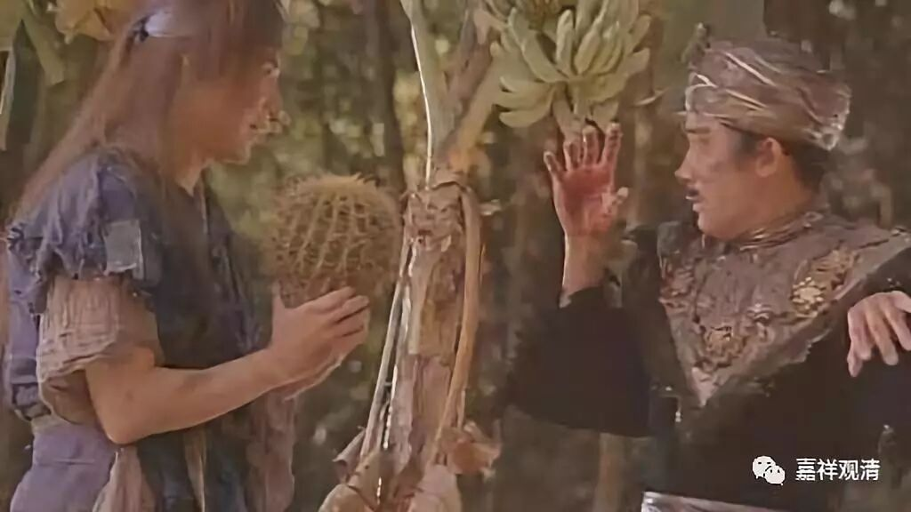
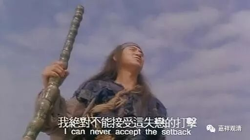

**《菩提速道》097（三）**

** “（一）爱别离苦：离开了自己的亲人、眷属、朋友、贤善的上师阿阇黎或者主公等，心生悲痛，语出哀音，以手拔发等，身体饱受痛苦。”**

** **

这就是你们家那条小狗，被送走了，对它来说就是爱别离苦，是吧？贤善的主公走了，“心生悲痛，语出哀音”，在那里嗷嗷地叫。爱别离苦，这个在电影里面看到的太多了。

合得来的同事、领导也是这样，被调走了，或者分开了——爱别离苦。

 （洪七公失恋，应该也算爱别离，吧……）

** “（二）怨憎会苦：一旦与仇人相见，”**

** **

那就分外眼红，是吧？

**
**

** “就如同一切都被黑暗笼罩着一样。仇人离开，就仿佛天亮见到光明。”**

** **

文字很美哦。

仇人相见，分外眼红——那今天的鸡汤话来说：这是用他人来惩罚自己哦。仇人或者怨敌远去的时候，就分外的轻松——功课不好的时候，看到老师大概也是这样吧。某某咒（著名长咒）还背不出来的时候，看到师父的时候心里就特别不对劲儿……

哎，那条小狗看见你离开的时候就高兴，是不是因为这个啊？——** 仇人离开，就仿佛天亮见到光明。**

** （欧阳锋一定非常想离开洪七）**

** “承受着仇怨的加害，或者提防仇怨的报复等……承受着这些痛苦。”**

** **

怨憎会苦：想要在一起的呢，总要分开（爱别离），；不该在一起的吧，又总在一起（怨憎会）。恐怕我们大部分人的家庭都是这样，是吧？和自己的初恋，总是分开了——爱别离苦。在一起的呢，总是自己不喜欢的——怨憎会苦。

也许这里有个社会心理学的因素——因为离开，我总是记得那些美好；因为老在眼前，所以对“美好”已经麻木，转而盯着那些烦心的负面内容。因为说起来，大多数事情正负面应该五五开，不应该表现得像“爱别离”、“怨憎会”这么一边倒。

所以，表面的“爱别离”、“怨憎会”，背后的动机可能还是贪爱与嗔恚——并不是事件本身是“爱别离”或者“怨憎会”，而是类似的“别离”和“合会”事件激发起我们的贪爱和怨憎。我们以为“爱别离”、“怨憎会”是客观的呈现，实际却是主观情感的投射。

