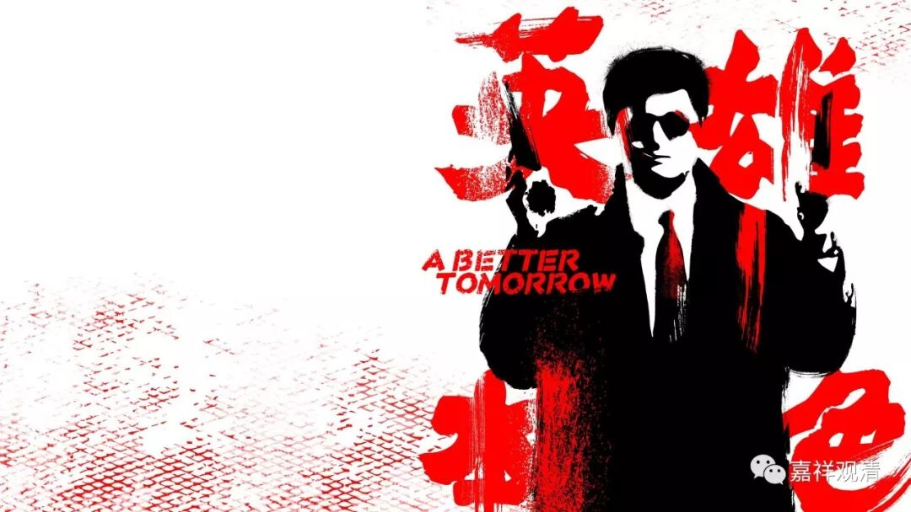
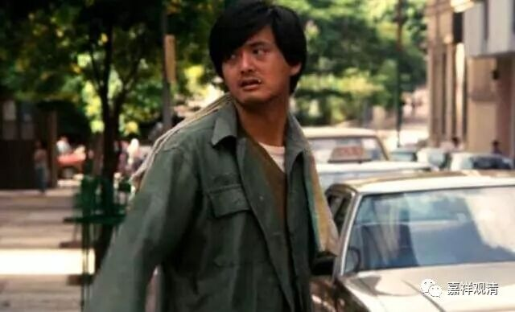
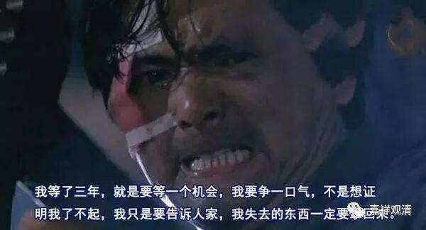

**《菩提速道》097（四）**

** “（三）希望的东西求不得苦：”**

** **

求不得苦，希求的东西求不到。

** “由于过去生中没有积下福德，这一生感得贫困交迫，缺衣少食，流离失所，稼穑却颗粒无收，营商终血本无归，畜牧但疫情横行，借贷无门，乞讨无方，一旦讨债者强行逼债，那时束手无策，”**

** **

借贷者求不到却是求不得苦，是吧？今天呢。表现在比如公司到银行贷款贷不出来，也是求不得苦。求好的收成、好的气候条件却下了冰雹、来了水灾，也是求不得苦。我们求事物可预测、可控制而事物往往不受控制、不被预测，走向了我们希望的反面，这都是求不得苦。求不得的原因是——没种下事事顺遂的因。

** “最后，不得不低声下气地作他人的奴仆，而这些人曾经比自己还低贱，”**

** **

大家还记得《英雄本色》第一集周润发饰演的角色吗？那个本来是自己的小弟，后来却做了自己的大哥，是吧？他还得去给这位大哥擦车，好像人家给他随便仍点钱撒到地上就走了。这就是“这些人曾经比自己还低贱”，今天却做了自己的大哥。

“** 以前还曾受过自己的恩惠，”**

** **

你想想小马哥的心里是多么地痛苦啊！（呵呵，我们现在好像变成了电影学院了？不过，通常电影里的剧情走向，一般都蛮符合因果的……可能这符合观众的心理预期吧。）

** “有着如是等不可思议的痛苦。”**

** **

所以当后来他的大哥出狱以后，小马哥说了一段话：“我等了三年，就是要等一个机会……”不过在生活当中遇不到这样的机会，所以只能靠看电影了。看看电影来满足自己，心里面一直在骂：“当年是……今天都爬到我头上去了。”

我们身边有些人，比如我的同班同学，留校了，有一次出去学习几个月，回来一看，原先的学弟、学妹突然间变自己上司了，（原来放出去学习是一个坑，）心情不好，辞职了……这也是求不得苦，希望得到的职位得不到，或者被人家阴了。这类情况还很多的，经常能够听说。

** **

** “厌恶的事情却不期而至之苦者，如被国王盗匪等杀害、绑架，以及担心为他们所绑架等的痛苦。”**

** **

正面的事情求之不得，负面的事情呢，躲都躲不掉。春风得意的时候，顺风顺水的时候，最希望不要出乱子，可是有“墨菲效应”，负面的事情常常会发生，躲都躲不掉——掉在地上的面包片总是酱料那一面着地，不祥的事情，不想什么却偏偏来什么，

** “（四）另外，生苦者：处在不净臭秽的母胎中，犹如蜷缩在不净燃烧的瓶中一般，需要住约九个月零十天的时间，而生时比起把身体从拉丝孔中拉出来，或者以手挤压疮核还要痛苦。生下后的第一个七天，四百零四种疾病侵入这个幻躯；第二个七天，八万魔类侵入；第三个七天，八万四千虫类进入身中，它们令未来之身羸弱饥渴，心不安适，并且作为诸种病魔之因。因此，生实为盛载一切众苦之容器。”**

** **

这个生苦，是指出胎苦，不是投生苦。这里谈的也不仅仅是出胎的一刹那，而是出胎及以后的的一段时间。

