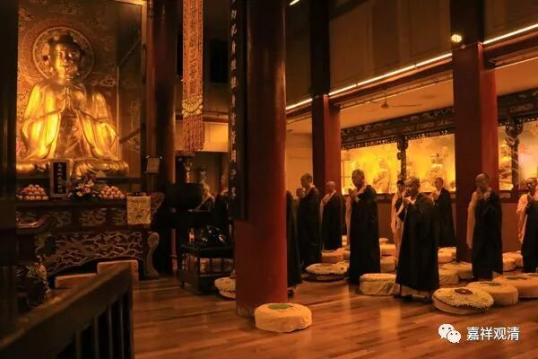
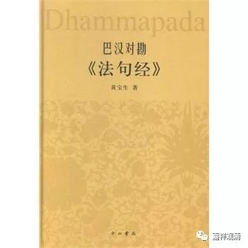

**《菩提速道》讲记098（上）**

我们这个身体就是盛载众苦的容器。这个就是生苦，生下来的苦，最前面讲的是住母胎的苦，我们一般都是要在母胎中住“九个月零十天的时间”，很苦。有些人就没那么多苦，只住了七个月就出来了，而我呢，还多受了差不多一个月的住胎的苦。

** “如《亲友书》中说：**

** ‘轮回如此於天人，或地狱鬼畜中生，**

** 皆无善妙故当知，此生实为大苦器。’”**

** **

我们的这个身体就像是盛载苦的容器一样。不论是在六道当中那一处，作为受苦的容器这一点没有差别。

** “‘纵使头燃衣着火，亦可置之而弗顾，**

** 精勤励力断后有，最极切要无过此。’”**

** **

就是你修行的时候，哪怕是头上着火了，衣服上都着火了，都让它去，别管它，还是应该继续为断除后有（不再陷溺于轮回）而修行——不顾头燃，这个也太厉害了啊！这是比喻哦。

汉传的早晚功课里每天也这样策励大家：

** “是日已过，命亦随减，**

** 如少水鱼，斯有何乐? **

** 大众，**

** 当勤精进，如救头然，**

** 但念无常，慎勿放逸。”**

“如救头燃”，这是佛门常用的典故，汉地的早晚功课的这一段，汉地称为“普贤菩萨警众偈”，实际语出《法句经·无常品》：

《法句经·无常品》：

** “如河驶流，往而不返，**

** 人命如是，逝者不还。……**

** 是日已过，命亦随减，**

** 如少水鱼，斯有何乐！**

** 当勤精进，如救头燃，**

** 但念无常，慎勿放逸！”**

人命就像流水一样逝而不返，故当精勤于熏修出世之法。

那么，“生苦”实际上讲的是生下来的时候的苦，前后再稍微多一点点的话，就包括了住胎时候的苦以及生出来之后的这头几个七天的苦。这个“生”不是生灭的“生”的意思，也不是十二缘起里的“生”的意思。

