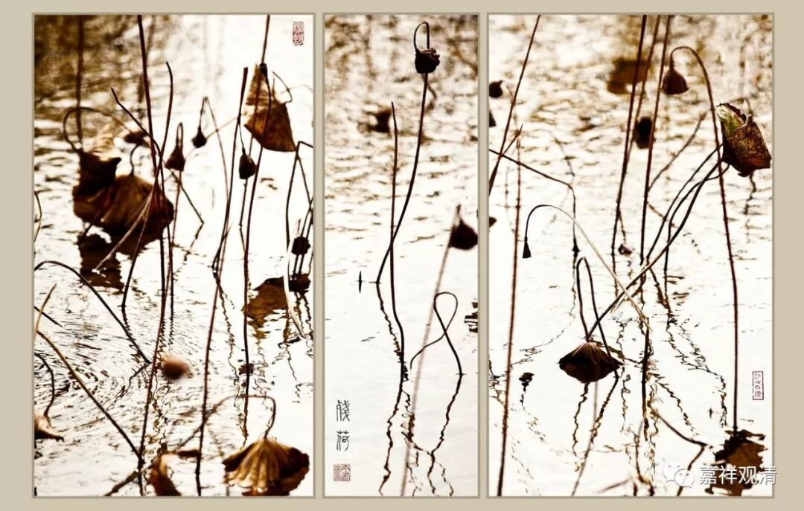

**《菩提速道》098（中）**

** “（五）老苦：腰弯得像弓一般；”**

** **

这个我非常能够体会，稍微多坐一会儿，这个腰就直不起来了。现在我都站立办公了。寺院里很多老和尚也是，行走时都是躬着背的。拿我们骨科的话来说，二十岁以后，人的骨骼就开始处于退行性变化中了，二十岁时是你一生中骨骼发育、健康的顶点了……可是我们一般都认为骨关节病是老了才有的，其实，“其所由来者，渐矣！”，早就慢慢地在退变了。

** “头发洁白如艾绒花；额头被皱纹充满，犹如砧板；”**

** **

意思就是皱纹像皮肤被切得一刀一刀似的。有一张很有名的写实油画，“父亲”，想想那个，就是。

心理学说，概念性的、距离远的描述，对我们的心里引起不了什么触动，而具体的事件、具体的、活生生的个人，会更容易引起你的关注……一想起这部油画，你就对“老”“父亲”这些就有了直观的认识了。

其实“观想”的意思也差不多——让理论变得更具体！

** “身力衰弱，行住坐卧都非常困难；”**

** **

我们想想自己生病的时候，就有这种情况，老了以后更加是一样，在我们周围都能够看得到。

而且，你们身边应该有过老人吧，人老了以后，身体的味道也不一样了，很难闻的。我有一次在无锡，住在一个钢材老板的家里面，中午的时候想要午睡，就在他老丈人的床上躺了一会儿，发现实在是不能睡，就逃走了。因为这床上的味道太重了。但是，恐怕将来我自己就是这样的。

** “眼等诸根，渐渐模糊不清；”**

** **

眼睛慢慢地看不见了，这就是老的苦。(而今天我们的苦是拜我们的ipad、手机所赐，现在年轻的时候眼睛就不行了。)老，令诸根衰弱。

** “不能再受用妙欲功德；”**

** **

再好吃的东西，你连味道也尝不出来了，再好的声音听不清，再好的画面看不清。前段时间看见小朋友摔跤，爬起来一点是没有，当时就生起感触来：我们要是这样摔一下，骨头关节可能要出大问题了……老就是这样一点点积累的。

** “生命大半已逝，死亡眼看就要到来……”**

** **

这是很苦的。你看我们莲花山村里的那些老太太们，没事就拿把椅子坐在门口晒太阳，就是等死啊。她们也会打牌、搓麻将什么的。那大概不算娱乐，只算消磨时间……

不过还好，每过半个月，逢初一、十五的日子，她们至少会到我们山上来一次，进个香什么的。（说到这个，不得不说我们有时候要做利益众生的事情，实际上是不是利益众生还不知道。在我们山上的路修好之前，老太太们的身体都很好，她们每过半个月都会上山一次，也算是一次锻炼吧。在路修好以后呢，她们的身体直线下降了，因为没车就不上来了，少了锻炼的机会。所以啊，把路修好了，到底对她们是好事呢还是坏事呢，就不知道了。）

** “发生如是等不可思议的痛苦。”**

** **

这就是老苦。老苦可以观察的有很多，我们随便看看就有。比如老了，走路也就慢了，紧赶慢赶地，从绿灯才开始亮直到红灯起，还是没能在法定时间内走过横道线……

很多佛系小资家里挂一幅“禅茶一味”，呵呵，他们不敢挂“无常”！

