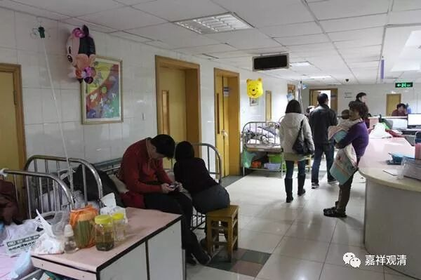
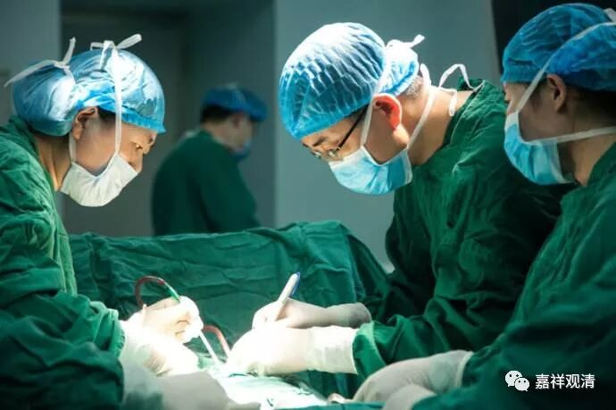
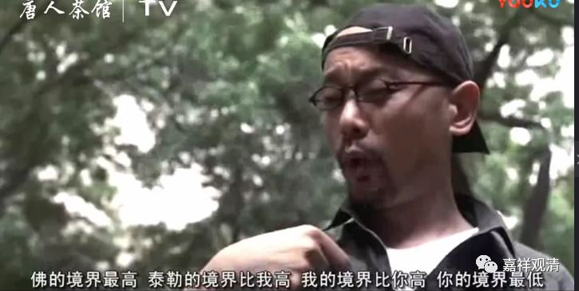
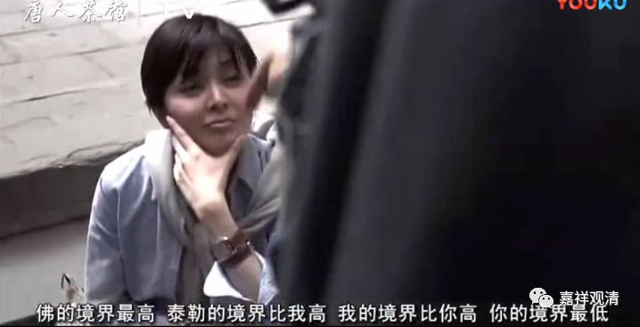

**《菩提速道》098（三）**

** “（六）病苦：身体皮肉干枯，”**

** **

病苦，这我们在医院里可以看到很多啊。“皮肉干枯”，皮肤都皱巴巴的。特别是重病之后、大手术以后，或者老年人，有些口干，只能用棉签蘸水抹抹嘴唇……

** “肤色暗淡，心中烦躁不安；”**

** **

皮肤没光泽了。中医说不管脸上青黄赤白，只要有光，就是阳气还在，病容易治；看到不管什么脸色，没光了，枯蒿暗淡，则属阴，病就难治了，病程也会长。

心中烦躁不安：生点大病被限制活动、限制饮食等等，呆在病房里等待检查报告、等待手术、等切片报告……心情也不愉快。

** **

** “平时喜爱的食物等却不能自在享用；”**

** **

想吃点什么好东西，医生却和你说“你有两个东西不能吃，这个也不能吃，那个也不能吃，”想吃的统统都不能吃。不想吃的东西呢，这个苦的药要吃，那个催吐的药也要吃。糖尿病人柜子里藏的零食，还要被医生护士没收……不能自在享用。

** “还要依靠猛厉的治疗法；”**

** **

然后我们还看到各种猛厉的治疗法——这个要切掉，那个也要割掉。你想要得到很温柔的治疗法，不给！在这里烫一块疤，又在那里扎上一排针，跟插秧似的……

中医里面现在很少用疤痕灸，特别是脸上基本上不用了，但藏医还很喜欢用，上次罗州大师要在我脸上烫疤，被我“喝”止了。（不过疤痕灸效果真是不错的，对有些病有特效，比如……好吧，其实我都忘了。）

** “提心吊胆地怀着死亡的恐惧之苦。”**

** **

你躺在病床上，看着边上的人：“哦哟，2床推出去了。啊？！5床也在抢救了。怎么我这个病房两天已经走了四个人了？那下一个会不会是我啊？传说我这张床上刚死过一个人，看样子我也逃不了了……哎呦，医生跟我儿子在走廊里说话呢……”总之，就是“提心吊胆地怀着死亡的恐惧之苦”。

不知道你们怎么样，我每次生点稍微大点的病会生起“苦啊，接下来要好好修行”的心，不过，好了伤疤忘了疼。

我有个师父说：生点慢性病挺好，一下子死不了，还可以借这个机会老是想着众生。这都是境界啊！

师父的境界比我高，我的境界比较低……

