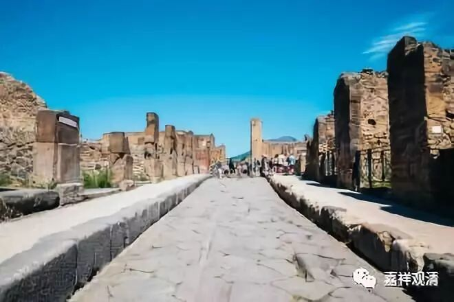

（庞贝城一夜之间变成废墟，一个城市的生命瞬间被凝固于历史。）

**《菩提速道》098（四）**

** “（七）死苦：有不得不舍离亲人、身体、家财、朋友等的痛苦。”**

** **

死的本身并不是苦，这里的死苦是指死亡的过程。通常我们会说“一了百了”，真的到最后“一了百了”的时候，倒是轻松的。就是在这个死亡的过程当中，是很苦的，因为舍不得，根本舍不得离不开嘛。

** “如《广大游戏经》中说：**

** ‘若死若殁死殁时，永离挚爱诸人众，**

** 无可回还重相遇，犹树落叶同逝水。’”**

** **

“落花流水春去也”，我们也“去也”。我们修行的话，至少将来要死得漂亮一点，死得潇洒一点吧。可以对着你爸爸说：“明天我就不来了啊。”走了，而且走得很有腔调的。

最作孽的就是收了不好的徒弟，你临死前连饭都吃不到，徒弟就把犄角旮旯找来的蔬菜榨成汁，给你喂下去。碰到这种徒弟真是倒霉啊！你想吃什么都吃不到，他还告诉你：“这是为了你好！”给你搞出各种名门秘方，你也拿他没办法啊。你自已经没有自主能力了，到时候就是徒弟说了算，他要给你打什么针，就给你打什么针。

问题在于，这个徒弟不是医生，他不是医生啊。比如我们都在吃石榴的籽，他却把石榴的皮榨汁给你喝，涩得要命。他还振振有词地说：“这个是为你好，这个皮能够调整血液的PH值。你的血液变成碱性的话，对于癌症的治疗会有帮助。”唉，收到这种徒弟，你可真是苦死了。

所以一定要谨慎收徒。这种徒弟也教不好的，他从来不认真学习的。可是一到师父病重的时候，这种徒弟就意气风发地冲到你房间里来了，要给你治病，要开始表现。他还会把其他人全部赶走，把医生也全部赶走，最后还说：“你看看你们，最后只有我在师父身边。”哎呀，要请佛菩萨降甘露啊，让我不要遇到收了这种徒弟的障碍，帮我消除这类障碍吧。

这里面就讲了七苦，还有一个“五蕴炽盛苦”没讲。最后这个“五蕴织盛苦”是最强烈、最真实的啊。

在《阿含经》当中，对于前面的爱别离苦、怨憎会苦还有另外一种说法。爱别离苦、怨憎会苦——这都是指我们的身体而言。爱别离苦，就是你死的时候要和这个身体再见；怨憎会苦，大概的解释就是这个身体里面的四大、六处相生相克，全是仇人，聚集在这个身体当中……《阿含经》中的这种说法就是指这些苦都是从身体上、从内部来讲的。（见《中阿含》卷七《分别圣谛经》。）

** “癸二、思惟非天苦：”**

** **

这个非天呢，在这里就是指阿修罗。

** “依于成办非天的取蕴，由于对天中富乐生起难忍的嫉妒，心中热恼痛苦，还会由此引发殃及身体的苦受。”**

** **

就是觉得对方抢了自己的东西，他会生起强烈的嫉妒心，心里面非常痛苦。这个是什么情况呢？就是他的福报是大的，但是他嫉妒别人，觉得自己的成果被别人抢了，别人对不起自己，要报复……

