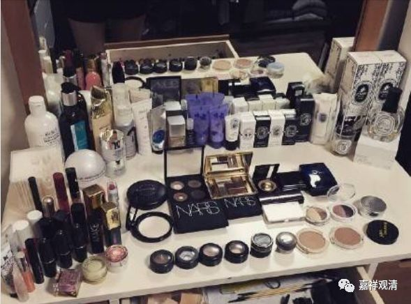
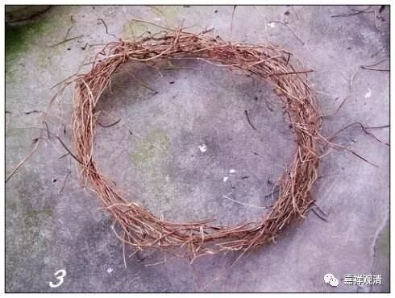

**《菩提速道》讲记099（上）**

** “癸三、思惟天苦：**

** **

** （一）依于成办欲界天的取蕴，则有着与非天战争、割截肢节、伤身丧命等的痛苦。虽非所愿，但也要无奈地遭受五衰相的显现，这时心中清楚地了知将要舍离天界的荣华而赴恶趣受苦，由此心生极大的痛苦。”**

** **

那么在天界呢，有些也是要打仗的，要和阿修罗打仗。平时呢也还好，打仗的时候也会死的。有时候天和阿修罗打仗也有输的时候，这个是有《华严经》的依据的，而且他们自己是会知道自己要输的。

有一次呢，他们知道自己要输了，就找某法师来帮忙，某就到天上去了。然后天和阿修罗就发生战争，结果天输了。怎么解救呢？就让他念《华严经》，他一念《华严经》，天的福报又增强了，然后就把阿修罗赶走了……所以天老是赢。

** “如《亲友书》中说：**

** ‘身色转变不可爱，不安本座花鬘萎，**

** 衣为垢染而其身，昔无汗出今汗出，**

** 天界报死五衰相，起于天界诸天中，**

** 犹如地上人将死，传报当死诸死相。’”**

** **

天界的这些死相（花冠枯萎）一旦出现以后呢，他就知道自己要死了。接下去的那段时间，是非常非常痛苦的。其实从这个角度来说，天比我们还要怕死——就像皇帝和大富豪比起赤贫的人要怕死得多。

首先，天的福报比我们要好。从层次上来说，上面的心至少比我们下面的心要安静一点，心的能量也比我们强一点，所以他们能够观察到自己的五衰相现。但是我们却根本不能够，根本察觉不到我们的五衰相现。

我们现在已经年纪大了，我们称呼那些小朋友，都叫“乳臭未干”，是吧？出的汗还有点味道，有点奶香，是吧？而我们呢，我们出了汗的时候，我们自己都觉得不行，时间长了还泛酸，要被人家说臭死了。

现在有一个网红法师，以前我跟他很熟。他以前，大热天的，半个月洗一次澡，说是戒律里面说的（其实戒律里面有开许的，不然印度的寺院还能进人吗？）。你可想而知，在他身边，那个酸爽……（现在人家白白胖胖的，很上镜呢。）

天人对自己的气味变化很敏感，我们似乎不敏感。这里可能还有个原因，昨天有个小伙儿在被采访时说了——都被化妆品腌渍久了。

